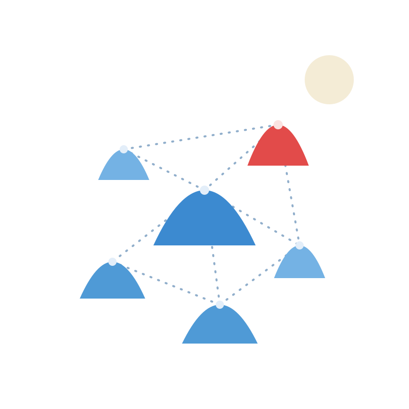

<div align="center">
  
  <h1>paros</h1>
  <p><strong>Paxos, in Rust.</strong> A learning implementation of the Paxos family of
  consensus algorithms, built and validated with deterministic simulation testing.</p>
</div>

> ⚠️ A learning project, work in progress. Not intended for production use.

## The name

`paros` is named after [Paros](https://en.wikipedia.org/wiki/Paros), my favorite Greek
island, and winks at [Paxos](https://en.wikipedia.org/wiki/Paxos), the (other) Greek island
Leslie Lamport set [the consensus algorithm](https://en.wikipedia.org/wiki/Paxos_(computer_science))
on. Two islands, one parliament.

## What it is

The design is **sans-IO**: [`paros-core`](crates/paros-core) is a pure synchronous state machine
(`step` / `tick` in, one `Ready` out, an `advance()` handshake) with no I/O, no clock, and no
randomness. An async driver built on [moonpool](https://github.com/PierreZ/moonpool) wraps it
and performs all side effects, honoring the persist-before-send rule at the heart of Paxos
safety.

The same code runs in production and in **deterministic simulation**: every seed replays
bit-for-bit, network chaos is injected, and an audit asserts on every transition that no two
acceptors ever choose different values.

👉 **[Read the book](https://pierrez.github.io/paros/)**

## At a glance

| Crate | Role |
|-------|------|
| [`paros-core`](crates/paros-core) | sans-IO Multi-Paxos state machine: std-only, wasm-safe, zero deps with `default-features = false` (only `tracing` spans on by default) |
| [`paros`](crates/paros) | the provider-generic node driver, default storage, and RPC contract |
| [`paros-sim`](crates/paros-sim) | the deterministic-simulation harness: the workload, the fault world, the audit |

Roadmap (filed as GitHub issues): **M1** safety kernel, **M2** Multi-Paxos, **M3**
storage-fault tolerance, **M4** online reconfiguration, **M5** scale-out and hardening.

## Learning Paxos with paros-core

Three small, deterministic, runnable examples drive the composable roles of
[`paros-core`](crates/paros-core) (`Proposer`, `Acceptor`, `Replica`, `Matchmaker`) by hand —
direct calls for the network, a `Vec` for the disk, a printed trace and assertions for the
property each one teaches. Read them in order:

1. [`single_decree.rs`](crates/paros-core/examples/single_decree.rs) — Phase 1, P2c, Phase 2:
   one value, and why a higher ballot must adopt a value it finds accepted.
2. [`multi_paxos.rs`](crates/paros-core/examples/multi_paxos.rs) — slots versus ballots, one
   Phase 1 amortized over many slots, and leader recovery as P2c applied slot by slot.
3. [`matchmaker.rs`](crates/paros-core/examples/matchmaker.rs) — configuration discovery
   through the matchmakers, a reconfiguration as a round change, and the matchmaker set
   itself chosen by the same single-decree Paxos over `Vec<MatchmakerId>`.

```sh
cargo run -p paros-core --example single_decree
cargo run -p paros-core --example multi_paxos
cargo run -p paros-core --example matchmaker
```

## Build and test

Enter the Nix dev shell (`nix develop`, or rely on direnv), then:

```sh
cargo build
cargo nextest run                  # or: cargo test
cargo fmt && cargo clippy -- -D warnings
cargo xtask sim run paros-chain             # coverage-guided (sancov) simulation sweep, the CI gate
cargo run --bin sim-paros-hunt -- main 2000 # raw seed hunt; a failing seed is its deliverable
cargo run --bin sim-paros-hunt -- canary 500 # every seed twice under moonpool's determinism canary; a diverging replay is its deliverable
```

## License

Licensed under the [Apache License, Version 2.0](LICENSE).
