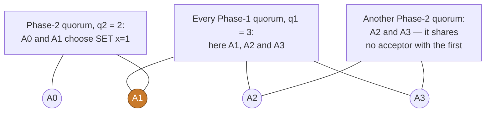

# Beyond Multi-Paxos

Everything up to here is one algorithm: a majority of acceptors, one elected
leader, a fixed membership, and disks that either work or stop. Each of those four
is a choice, and each one has a paper that takes it apart. This chapter is the
field guide to those papers as paros implements them.

Two rules govern the whole act. Plain Multi-Paxos is **permanent and
first-class**: a cluster with a fixed membership, no matchmakers and a majority
quorum system exchanges exactly the messages of the previous chapters. Every
mechanism below is **opt-in configuration data**, and the presence of its code
turns nothing on. The simulation draws that data per seed, so one campaign runs
the plain deployment and the extended one. The safety oracles hold in both.

> **Play it.** Act IV is ten levels, one for each mechanism below.
>
> - [`act4/flexible-quorums`](play/#act4/flexible-quorums) — choose the reach of
>   each phase over four acceptors, and try to dodge the overlap.
> - [`act4/the-grid`](play/#act4/the-grid) — decide two slots on two columns, then
>   send a stray `Accept` outside a slot's column and watch the tally ignore it.
> - [`act4/quorum-reads`](play/#act4/quorum-reads) — serve a read at a follower
>   from a row's vote watermarks, and hold one read that is not covered yet.
> - [`act4/the-handoff`](play/#act4/the-handoff) — hand the leadership on under the
>   same ballot, then try to hand it on a second time.
> - [`act4/matchmaking`](play/#act4/matchmaking) — register a campaign, read the
>   histories back, and close Phase 1 over every configuration in them.
> - [`act4/reconfigure`](play/#act4/reconfigure) — grow the acceptor set onto a
>   spare, and get a command chosen under the new configuration.
> - [`act4/garbage-collection`](play/#act4/garbage-collection) — raise the
>   watermark, then retire a removed acceptor with the evidence in hand.
> - [`act4/matchmaker-generations`](play/#act4/matchmaker-generations) — replace
>   the matchmaker set through stop, reconstruct, bootstrap, decide and publish.
> - [`act4/faulty-records`](play/#act4/faulty-records) — damage one accepted
>   record, then put each Promise that arrives into its CTRL case.
> - [`act4/the-wiped-node`](play/#act4/the-wiped-node) — erase a disk, take the
>   library's refusal, and keep the survivors deciding.

<!-- toc -->

## Flexible quorums

Act I derived safety from one fact: any two majorities share an acceptor. Read the
derivation again and something smaller is enough. Phase 1 must learn about every
value that Phase 2 may have chosen. Nothing needs two Phase-1 quorums to share an
acceptor, and nothing needs two Phase-2 quorums to share one either. **Only the
two phases must meet**, which as arithmetic is `q1 + q2 > n`.

That releases the steady state. With four acceptors, `q1 = 3` and `q2 = 2`, a
write needs two answers instead of three. The next election pays for that with
three promises. The picture below is what no single run shows: two Phase-2 quorums
that miss each other completely, beside a Phase-1 quorum that must meet both.

Three plus two is five and there are four acceptors, so no Phase-1 quorum can miss
both voters. paros asks every quorum question through one boundary, so this is
deployment data and not a rewrite. `QuorumSystem::Flexible { q1, q2 }` is one
variant, `QuorumSystem::cross_intersects` is the well-formedness rule, and no
tally changed when it landed.

**In the code.** `QuorumSystem::Flexible`, `QuorumSystem::cross_intersects`,
`AcceptorConfig::has_phase1_quorum`, `AcceptorConfig::has_phase2_quorum`
(`crates/paros-core/src/membership.rs`); the example
`paros-core/examples/flexible_quorums.rs`. Paper: Howard, Malkhi and Spiegelman,
*Flexible Paxos* (`docs/references/papers/flexible-paxos/`). Play it:
[`act4/flexible-quorums`](play/#act4/flexible-quorums).

## The acceptor grid

A quorum does not have to be a count. Lay six acceptors out in two rows of three,
call any whole **row** a Phase-1 quorum, and call any whole **column** a Phase-2
quorum. A row and a column of one grid always cross in exactly one cell. The two
phases therefore meet by geometry, and the safety argument does not change.

The grid buys throughput. Each slot goes to **one column**, so each acceptor sees
a third of the writes and the acceptor tier scales with the number of columns. It
costs availability of a new shape. Failure now depends on **which** acceptor is
down and not on how many, because one dead acceptor leaves its column short.

The column is `slot % cols`. That is a pure function of the slot, not a field on
the wire. A restarted leader and a handoff successor derive the same column. A
decision is judged by that column alone. An acceptor outside it may vote for a
stray copy, honestly and safely, and its vote still counts for nothing.

**In the code.** `QuorumSystem::Grid { rows, cols }`, `QuorumSystem::column_of`,
`QuorumSystem::row_of`, `AcceptorConfig::has_phase2_quorum_in`
(`membership.rs`); `ColocatedNode::propose_in` (`node.rs`); the example
`paros-core/examples/acceptor_grid.rs`. Paper: Whittaker et al.,
*Scaling Replicated State Machines with Compartmentalization* §3.2
(`docs/references/papers/scaling-rsm-compartmentalization/`). Play it:
[`act4/the-grid`](play/#act4/the-grid).

## Quorum reads

The grid takes the writes off the leader and leaves the reads on it, because
[read-index](linearizable-reads.md) asks the leader to prove that it still leads.
There is a better question, and it does not involve the leader at all.

Ask a **Phase-1 quorum** one thing each: what is the highest slot you have voted
in? The quorum is a row of the grid, or the membership under a majority. Take the
largest answer, and serve the read at any replica once that replica has applied
the slot. A write acknowledged before this read began was chosen by a Phase-2
quorum. The Phase-1 quorum you asked crosses that quorum, so the largest answer
sits at or above the write.

Two properties are worth naming. There is **no clock** anywhere in this path,
which is exactly what the paper's read leases give up. And an acceptor raises its
watermark when it **votes**, not when a slot is chosen. A read can therefore land
on a watermark that a half-finished slot raised, and it waits for that slot to
arrive. The wait costs the reader time, and it never costs the client a stale
answer.

The argument is single-configuration, so a read is bound to the configuration it
opened against. A `PreReadAck` carries the answerer's configuration ballot, and a
node abandons its open reads when it learns a newer configuration.

**In the code.** `QuorumRead`, `QuorumReads` (`quorum_read.rs`);
`ColocatedNode::quorum_read(ctx)` (`node/quorum_reads.rs`);
`Acceptor::vote_watermark` (`acceptor.rs`); `Message::PreRead`,
`Message::PreReadAck` (`message.rs`); `Replica::covers`, `Ready::read_states`.
Paper: Whittaker et al., *Compartmentalized Paxos* §3.4, *Paxos Quorum Reads*.
Play it: [`act4/quorum-reads`](play/#act4/quorum-reads).

## Cooperative leader handoff

Leadership changes hands for two reasons, and only one of them needs an election.
An election destroys the old authority and makes a successor rediscover the log
through Phase 1. That is right when the old leader is gone. It is waste when the
old leader is alive and wants to move. A rolling restart does that, and so does an
operator who moves the leadership closer to its clients.

So the sitting leader hands its Phase-2 authority over instead. It sends the
ballot, the allocator frontier, and the tail below that frontier. The tail is
split into the slots it knows are chosen and the slots whose Phase 2 is still
open. The two parts tile the range exactly, which is what lets the successor skip
Phase 1: it may re-propose what it was told about, and the range holds nothing
else. Gap filling stays **off**, because a `Noop` needs a promise quorum's report
to license it and this successor collected none.

Three rules carry the safety. Abdication is **synchronous with the decision**:
`relinquish_to` queues the message and becomes a follower in the same call, so
emitting the message without abdicating is not expressible. The successor is
**named inside the payload**, so a duplicate or a misroute cannot hand one
authority to a second node.

The third rule is **one hop only**: `can_relinquish` requires
`LeadershipOrigin::Elected`. A replayed message could otherwise reinstall an
authority at a node that has already handed it on, beside the successor that still
uses it. A second hop costs an ordinary election, and the general case would cost
a new durable fence.

**In the code.** `ColocatedNode::relinquish_to`, `ColocatedNode::can_relinquish`
(`node/handoff.rs`); `Message::Relinquish`, `LeadershipOrigin` (`message.rs`);
`RecoveryPolicy::Inherited` (`proposer/recovery.rs`). Paper: Nawab, Agrawal and
El Abbadi, *DPaxos*, SIGMOD 2018, the Relinquishment section; design note
`docs/analysis/consensus/dpaxos-leader-handoff.md`. Play it:
[`act4/the-handoff`](play/#act4/the-handoff).

## Matchmakers and reconfiguration

Every chapter before this one reads the membership once, at boot, and never
changes it. A real cluster replaces machines. The obvious method puts the new
membership through the log as a command, and it has a known hazard: the new
configuration must be in force for the very election that installs it.

*Matchmaker Paxos* moves that decision to a separate, tiny service. A candidate
first **registers** its ballot and the configuration it intends to use with a
matchmaker set. It sends no `Prepare` until a matchmaker quorum has answered. The
replies carry the registrations they hold, and the union of those above the
maximum watermark is the campaign's history `H_b`. Phase 1 then fans out to
`H_b ∪ C_b`, and it completes only with a promise quorum of **every**
configuration in `H_b`. It is never a quorum of the union, and the core's tests
pin that negative case.

The ledger distinguishes a **belief** from a **fact**. An ordinary campaign
registers the configuration it believes is in force, and a reconfiguration
campaign registers an operator's explicit change. The **effective configuration**
is the highest-ballot reconfiguration registration that a matchmaker quorum holds.
An ordinary campaign whose histories name a different one abandons, adopts it and
campaigns again. So a node that missed a completed reconfiguration cannot be
elected under the superseded one. Beliefs never trigger that abort, because two
candidates that adopt each other's beliefs flip-flop forever.

A reconfiguration is a **round change**. A configuration is bound to a ballot and
is never edited, so the leader moves to a fresh ballot registered with `C_new`. It
stalls new commands for one matchmaking round trip plus one Phase 1, and it
resigns afterwards if the change removed it. A joining node promises the new
ballot before Phase 2 reaches it, and it heals as a replica. A removed node keeps
answering Phase 1 for the ballots it took part in, because *removed* is not
*shut down*.

On a cluster with no matchmakers a reconfiguration request is **refused**, and it
is never quietly honored.

**In the code.** `Matchmaking`, `Registration`, `RegistrationKind`,
`MatchStep::StaleConfiguration` (`matchmaking.rs`, `matchmaker/state.rs`,
`node/matchmaking.rs`); `Matchmaker` (`matchmaker.rs`);
`ColocatedNode::reconfigure` (`node/reconfigure.rs`); `Ready::match_requests`,
`ColocatedNode::on_match_reply`. Paper: Whittaker et al.,
*Matchmaker Paxos: A Reconfigurable Consensus Protocol*
(`docs/references/papers/matchmaker-paxos/`). Play it:
[`act4/matchmaking`](play/#act4/matchmaking) and
[`act4/reconfigure`](play/#act4/reconfigure).

## The GC watermark and retirement

Registrations accumulate, so a matchmaker must be allowed to forget. The rule for
forgetting is the one place where a plausible answer is wrong. "The new
configuration is installed, so the old one is deletable" is the rule DPaxos uses.
*Matchmaker Paxos*'s Appendix D shows why it does not hold.

A configuration may be forgotten under one condition. No future leader may need
its Phase-1 quorum to learn a value that its Phase-2 quorum may have chosen. paros
has no replica tier, and what it does have is stronger for this purpose. A node
records a slot it learns chosen as its authoritative accepted record, before its
chosen index advances. A truncated member refuses a `Prepare` below its floor.

So the condition has two parts. The leadership is settled, with no recovery, probe
or repair open. And a Phase-2 quorum of `C_b` reports a chosen index at or past
the election fence. The leader then asks the matchmakers to raise the watermark to
its own ballot. Each matchmaker raises it **durably before it acks**, and refuses
campaigns below it. The floor is effective only once a matchmaker quorum has
acked, and only then does the leader name the **retirable** acceptors,
`members(H_b) \ C_b`.

Retirement itself is an operator act, and the request **carries the evidence**.
The operator reads the effective watermark from a leader's `Inspect`, beside the
retirable list, and sends it in the retire request. The node honors the request
under four conditions. It has matchmakers. It is not a member of the configuration
it believes in force, and it is not the leader. And the watermark sits strictly
above the highest ballot that any configuration naming it was bound to.

The first three conditions are beliefs, and the third is volatile across a reboot.
Without the fourth condition, "the cluster is done with me" would be the
operator's assumption rather than a protocol fact.

**In the code.** `GcStep::Effective` (`collector.rs`, `node/gc.rs`);
`ColocatedNode::may_retire` (`node/gc.rs`); `GcRequest`, `GcAck`,
`Inspect.retirable`, `RetireRequest.gc_watermark`. Design note:
`docs/analysis/consensus/matchmaker-gc-and-generations.md`. Play it:
[`act4/garbage-collection`](play/#act4/garbage-collection).

## Matchmaker-set generations

The matchmakers are now the thing that cannot be replaced, so the matchmaker set
is itself a chosen value. A set carries a **generation**, and every matchmaking
message is fenced by it. A matchmaker answers its own active generation. It
refuses every other generation with what it knows, and it never serves one.

The handover has five steps:

1. **Stop.** A quorum of `M_g` freezes durably. A frozen matchmaker registers
   nothing for `g` again, and it stays alive to vote and to point late proposers
   at its successor.
2. **Reconstruct.** Take the maximum watermark and the union above it.
3. **Bootstrap.** Every proposed member holds the successor durably, as pending.
4. **Decide.** Run single-decree Paxos over `M_g`.
5. **Publish.** `M_g` records the chain link, and `M_{g+1}` activates its pending
   bootstrap.

Step 4 is the reuse the architecture was built for. It is **not a second Paxos
kernel**. It runs the same `Proposer` and `Acceptor` roles over a one-slot log,
which is why the crate holds exactly one Phase-2 tally. Matchmaker quorums are
**majorities only**, and the safety argument for the handover is made under that
model alone.

Two liveness rules keep a frozen generation from wedging the cluster. Any node
that meets a `Stopped` reply with no successor finishes the handover itself. And
the driver abandons a phase that makes no progress, after a budget of election
timeouts.

A sans-IO **model checker** proves the handover, in place of an argument.
Concurrent reconfigurers run over the real types. Every message is dropped,
duplicated or reordered, every matchmaker crashes at each durability seam, and
every node reboots to its bootstrap belief.

The checker asserts three things after each step. At most one set is authoritative
per generation. A chosen set is what a majority durably voted at one ballot. And
every activated registry carries the complete reconstruction.

It bites. Publishing the bootstrapped proposal without the decree is red on its
first seed. The checker also found that a rebooted node's reconfigurer reused the
decree rounds of its earlier incarnation. That is why a `Stopped` reply carries
the matchmaker's decree promise, and why the decree opens strictly above the
maximum over the stop quorum.

**In the code.** `MatchmakerSet { generation, members }`,
`MatchmakerSet::has_quorum` (`membership.rs`); `MatchmakerReconfigurer`
(`matchmaker/reconfigurer.rs`); the decree (`matchmaker/decree.rs`); the checker
(`matchmaker/handover_model.rs`). Design notes:
`docs/analysis/consensus/matchmaker-gc-and-generations.md` and
`docs/analysis/consensus/matchmaker-interaction-verification.md`. Play it:
[`act4/matchmaker-generations`](play/#act4/matchmaker-generations).

## Faulty records

Disks lose data one block at a time. A node comes back and one accepted record no
longer reads: the value is gone, and the slot and the ballot survive beside it.
That node now has **three** honest answers about the slot, not two. It voted and
holds the value. It did not vote. Or it voted and no longer knows for what.

The third answer must stay its own answer. A node that reports it as "I did not
vote" lets a candidate hear silence from a whole quorum. The candidate concludes
that nothing was chosen there, and it decides something else. If the lost value
was already chosen, that slot then holds two values. So a damaged record is
reported as damaged, and a candidate that receives one cannot settle the slot from
that report alone.

More answers settle it, which is the protocol-aware recovery of the CTRL paper.
The leader keeps asking the acceptors that have not replied, and each reply puts
the slot in one of three cases:

- Some acceptor reports a value at a ballot at or above the damaged record. The
  leader re-proposes that value, and the damaged acceptor writes it back as it
  votes.
- A whole Phase-1 quorum reports nothing that could hide a chosen value. The
  leader decides a `Noop`.
- Neither case holds yet. The leader waits.

**In the code.** `Acceptor::faulty` (`acceptor.rs`); `Storage::faulty_entries`
(`storage.rs`); `Proposer::fold_probe_promise`, `Proposer::resolve_probe`
(`proposer/probe.rs`). Paper: Alagappan et al.,
*Protocol-Aware Recovery for Consensus-Based Distributed Storage*
(`docs/references/papers/protocol-aware-recovery/`); restatement
`docs/analysis/storage/ctrl-multipaxos-restatement.md`. Play it:
[`act4/faulty-records`](play/#act4/faulty-records).

## The wiped node

A crash costs a node everything it held in memory and nothing it wrote down. That
is why paros keeps leadership in memory and promises on disk. Losing the **disk**
is a different failure with a different answer.

A promise is the one thing a node may not take back. Having promised a ballot, it
told a proposer that every lower ballot was finished there. That proposer may have
chosen a value on the strength of the promise. A node that boots with an empty
disk has no memory of it. The node answers a lower ballot and votes for what that
ballot proposes. A quorum behind the older ballot then chooses a second value for
a slot that already holds one.

A snapshot does not help, because a snapshot restores the log and the sending peer
does not know what this node has sworn. So a node that lost its disk **does not
rejoin**, and the **library** enforces that rather than the harness or the
operator.

Every store carries a durable **format marker**. The driver takes the operator's
claim as data. It formats the store on a first boot, before the core reads a byte.
It refuses an existing member whose store carries no marker. It also refuses a
first boot on a formatted store, because that is two identities on one disk.

The marker is a store property and not protocol state, so the plain deployment
persists the same two scalars it always did. What heals the cluster is a change of
the acceptor set, which draws its successors from the live nodes.

**In the code.** `NodeStorage::is_formatted`, `NodeStorage::format`
(`crates/paros/src/storage.rs`); `BootKind::FirstBoot`,
`BootKind::ExistingMember`, `BootRefusal::Amnesia`
(`crates/paros/src/driver/config.rs`); `Audit::boot_refused`. Play it:
[`act4/the-wiped-node`](play/#act4/the-wiped-node).
