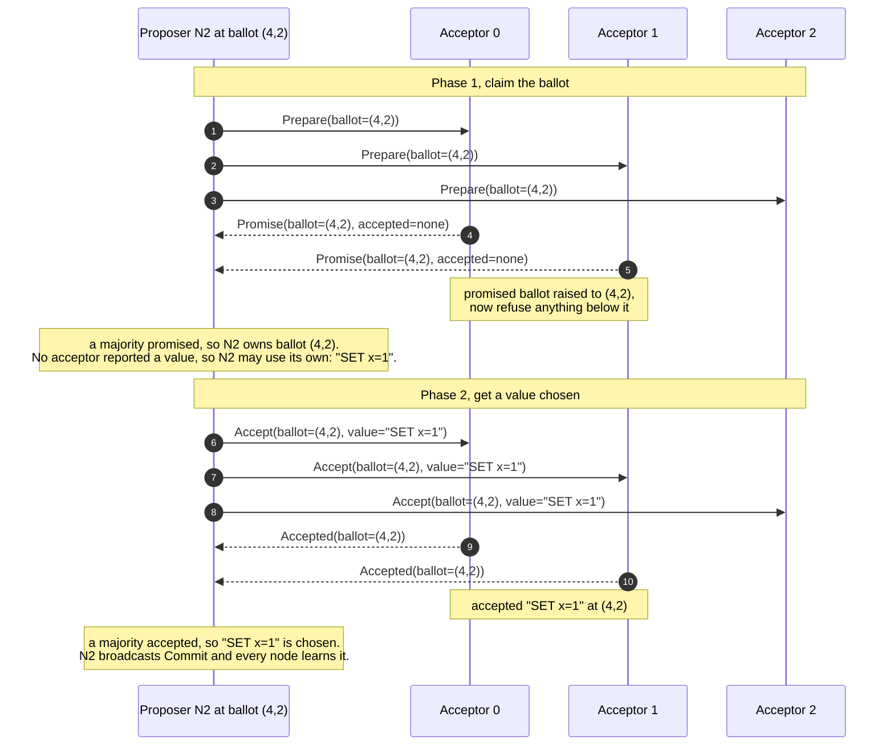
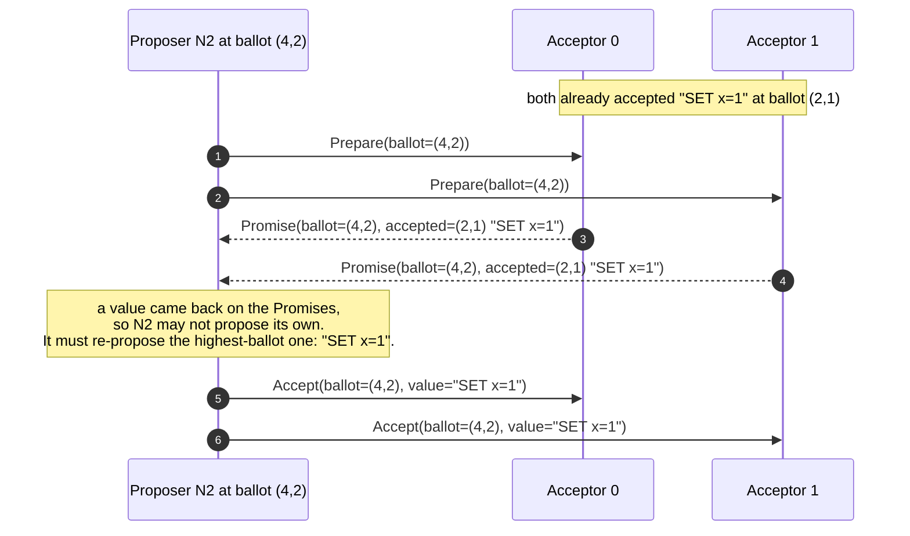
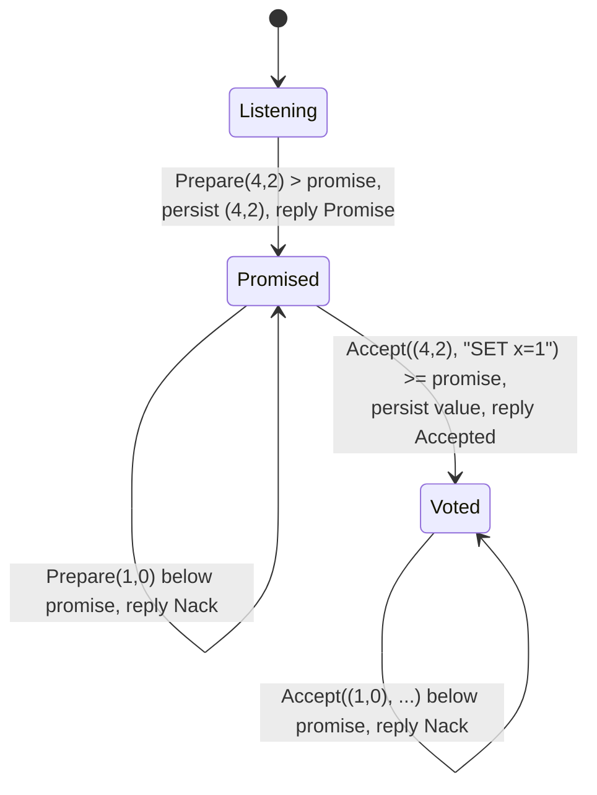

# How Paxos chooses one value

Single-decree Paxos answers one question: how can a cluster of acceptors agree on
a single value, and never disagree, even when the network drops, delays, and
reorders messages, and even when several proposers compete at once?

This chapter walks through how, step by step, with diagrams. To watch the very same
protocol run for real in your browser, open [Watch it live](single-decree.md).

## Ballots

A proposer never just announces a value. It first claims a **ballot**: a number
that gives it the right to propose. Ballots are totally ordered as `(round,
node)`, so a higher round always wins and ties are broken by the proposer's node
id (two proposers can therefore never hold the same ballot).

## Two phases

A proposer drives two round trips, each needing a **majority** (2 of 3) to make
progress:

1. **Phase 1, Prepare then Promise.** The proposer asks the acceptors to promise
   not to accept anything older than its ballot. An acceptor that promises also
   reports any value it has already accepted. Once a majority promise, the
   proposer owns the ballot.
2. **Phase 2, Accept then Accepted.** The proposer asks the acceptors to accept a
   value at its ballot. Once a majority accept, the value is **chosen**: every
   node then learns it (Commit).

Two round trips, two of three acceptors each time:

(Acceptor 2 never replies above: a majority is two of three, so the proposer
makes progress even while one acceptor is slow or unreachable.)

Why a majority? Any two majorities of three share at least one acceptor. That one
overlapping acceptor is what makes it impossible for two different values to both
be chosen. The next chapter, [Why one value is safe](safety.md), turns that
sentence into the actual argument.

## The value-selection rule

A proposer does not always get to propose its own value. If any acceptor's Promise
reports an already-accepted value, the proposer must **adopt the highest-ballot
value it saw** instead of its own. This is the rule that protects a value that may
already be chosen: a later proposer, forced to re-propose the same value, can
never change the choice.

The mechanism behind that rule has a name from the literature: **piggybacking**.
To piggyback is to attach extra information to a message that is already being
sent, so it travels at no extra cost (every Paxos paper uses the word, so it is
worth knowing). Here, a `Promise` is never just a bare "yes": it also carries any
value the acceptor has already accepted, together with the ballot it was accepted
at. The proposer reads those carried-along values, and if it sees any, it must drop
its own value and re-propose the one with the highest ballot:

In paros the piggybacked values are the `accepted` map inside `Message::Promise`
(`paros-core/src/message.rs`), which `on_prepare` fills with every entry the
acceptor has accepted. The same trick is how a proposer or learner that *missed* a
decision catches up: it proposes, the already-chosen value is piggybacked back to
it, and it is forced to adopt that value, learning the consensus in the act of
trying to overwrite it.

That duel really happens. Node 0 starts proposing at ballot `(1,0)`, node 1 interrupts
with a higher ballot `(2,1)`, node 0's late Accept is **nacked** (rejected), node
1's ballot wins, and a value is still chosen by all three acceptors. The duel
resolves; safety never bends. You can watch this exact run, it is seed 19, on the
[Watch it live](single-decree.md) page.

## What each acceptor remembers

An acceptor is tiny. It keeps just two facts in durable storage: the highest
ballot it has **promised**, and the value (and ballot) it has **accepted**. Two
rules govern every reply, and together they are the whole of Paxos safety:

In paros the promise lives in `max_promised_ballot` and the accepted value in the
per-slot `accepted` map (`paros-core/src/state.rs`). The promise rule is
`ballot > max_promised_ballot` (`on_prepare`); the vote rule is
`ballot >= max_promised_ballot` (`on_accept`). Everything else in the protocol
exists only to feed these two acceptors' rules a safe value.

## The one thing it will never do

The simulation will never show two acceptors choosing different values. That is
the single safety property the `SafetyOracle` asserts on every step of every seed,
in CI and in your browser alike (the [Watch it live](single-decree.md) page runs the very
same code). Seeds like **42** show proposers dueling without
ever converging, a livelock: every node has promised a different high ballot, so
no single ballot wins a promise quorum and nothing is chosen. Annoying, but never
*unsafe*. Randomized election timeouts cure the livelock once we elect a stable
leader (see [The stable leader](stable-leader.md)); they were never needed for
safety.
