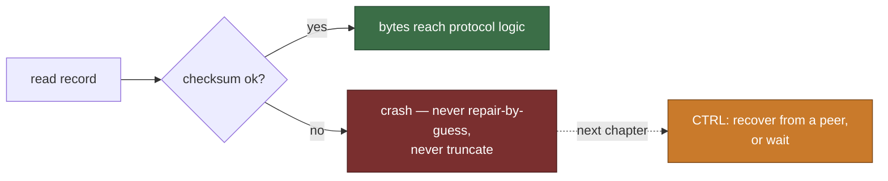

# Detecting silent corruption

The previous chapter handled the disk that admits failure. This one handles
the disk that lies: the write returned "ok", the read returns bytes — and they
are not the bytes that were written. No error code ever fires. If nothing
checks, those bytes flow straight into protocol logic as if they were the
node's durable state, and every safety argument built on "durable state
survives" silently rots with them.

<!-- toc -->

## How disks lie

The corruption families the simulation injects are the ones the storage
literature (and the CTRL paper's survey of real systems) documents:

- **Bit flip / latent sector error** — a record's bytes change in place.
- **Lost write** — the write was acknowledged and never hit the medium; a
  read returns stale data or zeros.
- **Misdirected write** — a correct block lands on the *wrong* record.
- **Torn tail** — a crash mid-batch leaves fresh appends half-written.
- **Read `EIO`** — the read path itself fails transiently.
- **Promise-copy rot** — the most safety-critical scalar of all, corrupted.
- **FS-metadata fault** — the filesystem loses a whole file's identity.

None of these announce themselves. The only defense is to make every read
falsifiable.

## Checksums, verified on every read

Every durable record paros writes carries a checksum, and every read verifies
it before the bytes are allowed to mean anything. A mismatch is a **detected**
corruption; equally, a record that is simply *absent* where one was durably
written (the lost write's zeros) fails the same verification. The load-bearing
property is total coverage of the read path: the boot scan runs **before**
`RawNode::new`, so a node cannot even construct its protocol state machine
from unverified bytes. Zero silent bad reads is not a statistic, it is a
structural guarantee — and the simulation's ledger cross-checks it by pairing
every injected corruption with its detection or its crash.

## Detect ⇒ crash — never guess, never truncate

At this stage the reaction to a detected mismatch is the same as the previous
chapter's: crash. But one alternative deserves its own tombstone, because real
systems shipped it: **truncate from the bad record onward** and move on.
`ZooKeeper` and `LogCabin` both did this (CTRL, Figure 2), and it is fatal in a
replicated log: the truncated records may be *chosen* — a node that silently
drops them can later win an election against lagging peers and erase committed
history cluster-wide. The paros simulation keeps a pinned **red demo** of
exactly this bug: flip the boot scan to truncate-on-mismatch and the
recovered-vs-persisted audit goes red on its witness seed; the shipped code
crashes instead.

One split matters for the crash decision: **user data vs FS metadata**. A
user-data mismatch is one bad record; an FS-metadata fault takes out a whole
file's worth. Both are detected, both crash — the classification is what the
next chapter's recovery machinery consumes.

## Watch it live

One seeded run with silent corruption injected. A red triangle marks each
injection (tagged with its family and the record it rotted) — at that moment
the node knows *nothing*. The magnifier is the moment a read's checksum
catches it; ⚡ is the crash that follows. The headline counter is the whole
contract: injected corruptions, zero silent bad reads.

<iframe
  src="wasm-demo/index.html?embed=1&mode=corrupt&seed=1"
  title="paros: silent corruption caught by checksums (seed 1)"
  style="width:100%;height:700px;border:1px solid #30363d;border-radius:12px"
  loading="lazy">
</iframe>

Same seed, same run, byte for byte, here and in CI: the demo replays
`run_seed(seed)` in your browser and draws the recorded `corruptions` and
`detections` streams of the `RunResult` — the simulator's ground truth beside
the node's own reactions; `?dump` shows the raw JSON.

## The cost of crashing on every mismatch

Detect ⇒ crash is *safe*, but it turns one rotted record into a whole dead
node — and a rotted record on a majority of nodes into a dead cluster, even
when every lost byte still has a correct copy on a peer. Fixing that without
reopening the truncation hole is precisely the protocol-aware recovery of the
next chapter.
