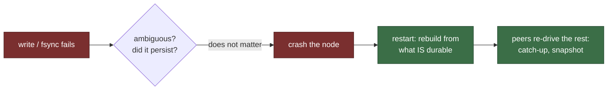

# When the disk dies

Everything so far assumed the disk does what it is told: a write that returns
"ok" is durable, an fsync that returns "ok" has flushed. Real disks break that
contract in two very different ways, and paros splits them deliberately. This
chapter is the *easy* half — **fail-stop** faults, where the disk at least has
the decency to report the failure: a write returns `EIO`, an fsync fails, a
device dies outright. The hard half — the disk lying silently — is the next
two chapters.

<!-- toc -->

## The only safe reaction is a crash

What should a node do when `append_accepted` returns `EIO`? It cannot retry
into the same failure forever. It cannot skip the write — the protocol just
promised that state would be durable. And it must not limp on with volatile
state ahead of durable state, because every safety argument in the previous
chapters leans on "what is on disk survives".

The failed-fsync case makes the trap concrete. fsync failure is famously
**ambiguous** (the "fsyncgate" bug class): depending on the kernel and
filesystem, the dirty pages may be gone, or may quietly land later. The
simulation models exactly that — an injected fsync failure flips a coin on
whether the batch actually persisted, and the node is only told "it failed".
A node that guessed either way would be wrong half the time.

So paros does what etcd, `LevelDB` and every serious storage system converged
on: **treat a fail-stop storage fault as a crash**. The driver's storage seam
returns a typed `StorageError`, the driver makes one deliberate decision —
crash — and the node dies at a clean boundary. Recovery is then the *ordinary*
Stage-4 restart path: reboot, rebuild volatile state from whatever is durable,
re-derive the rest from peers. No new machinery, and that is the point: a
fault class you can fold into an existing, already-proven recovery path is a
fault class that cannot mint new bugs.

## The cluster shrugs

A crash is safe for the node; the *cluster* barely notices. Consensus already
tolerates `f` failed nodes out of `2f + 1` — it cannot tell a disk-dead node
from a partitioned one, and does not need to. As long as at most `f` nodes are
down at once, a quorum keeps accepting, committing and acking clients; the
crashed node comes back (or does not) and is healed by catch-up or snapshot
like any other laggard.

## Watch it live

One seeded run under injected disk faults. A disk badge marks each injected
fault (tagged `EIO` or `fsync✗` with the record it hit), the ⚡ is the node's
crash decision, ↻ its restart through the ordinary recovery path. The strip at
the bottom is the availability claim made visible: green wherever a quorum was
up (at most `f` nodes down) and the cluster kept serving. Some seeds draw
enough overlapping faults to push *past* `f` for a stretch — that reads as a
red patch and an amber headline, and it is the other half of the lesson: the
service **pauses** until a node restarts, but safety holds (the oracle badges
stay green), and the moment a quorum is back the cluster resumes as if
nothing happened.

<iframe
  src="wasm-demo/index.html?embed=1&mode=disk&seed=3"
  title="paros: fail-stop disk faults degrade to a crash (seed 3)"
  style="width:100%;height:700px;border:1px solid #30363d;border-radius:12px"
  loading="lazy">
</iframe>

The digest chips split the fault families: write `EIO` vs fsync failures, and
— the fsyncgate detail — how many "failed" fsyncs had secretly persisted. The
oracle badges re-check, live from the run's data, that no promise was lowered
across any of those crash-recoveries and the log stayed gapless.

Same seed, same run, byte for byte, here and in CI: the demo replays
`run_seed(seed)` in your browser and draws the recorded `disk_faults` and
`storage_crashes` streams of the `RunResult`; `?dump` shows the raw JSON.

## What this stage deliberately does not handle

A disk that *lies* — returns "ok" and rots the bytes, loses a write silently,
writes to the wrong place — never reports an error, so there is nothing here
to crash on. That needs checksums on every read (next chapter), and then a
protocol-aware answer to "the checksum failed on a *committed* record" (the
chapter after). The amnesia case — a node that lost its whole disk including
its promise — stays out of scope for rejoin entirely: a naive rejoin can
renege a promise, which is a real safety violation, and the simulation keeps
a pinned red demo proving exactly that.
