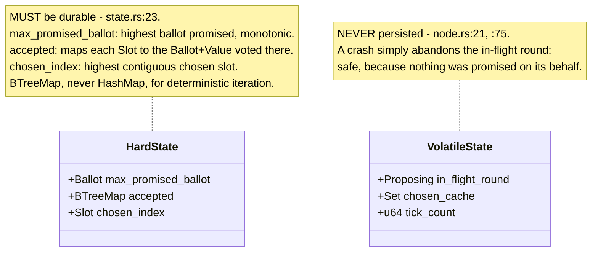
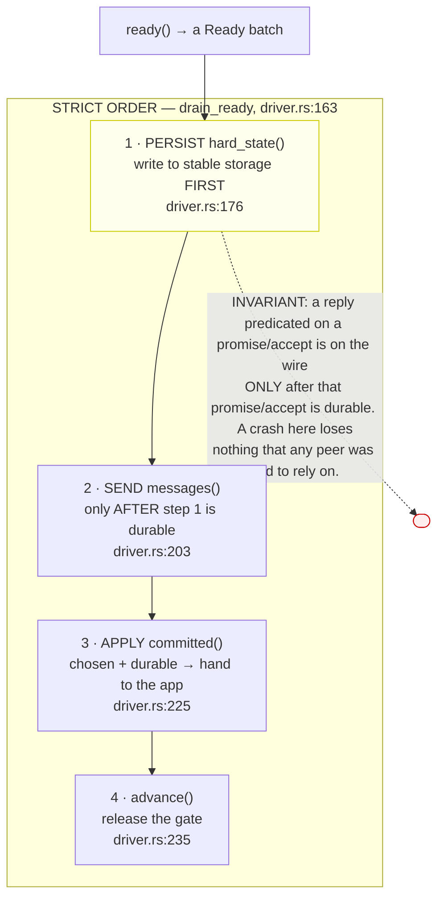
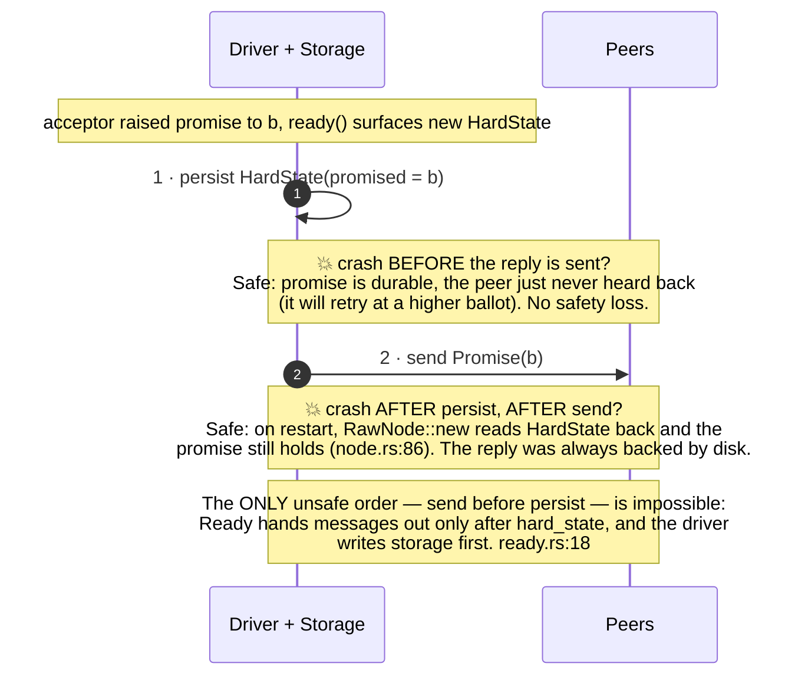
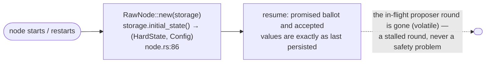

# Persist-before-send durability

Paxos safety rests on a promise being *kept*. If an acceptor tells a proposer
"I promise ballot `b`" or "I accepted `(b, v)`", that fact must survive a crash —
otherwise a reboot could un-promise or un-accept, and two different values could be
chosen for the same slot. The rule that prevents this is **persist-before-send**.

> **INVARIANT — persist-before-send.** Never send a message that depends on durable
> state until that state is actually on stable storage. A `Promise` or `Accepted`
> published before its `HardState` is durable is a safety violation.
> (`paros-core/src/state.rs:9`, `paros-core/src/ready.rs:18`.)

## What must be durable: `HardState`

The core separates the *must-be-durable* state from everything volatile. Only three
things have to hit disk; everything else (the in-flight proposer round, learned-set
caches) is rebuilt after a crash.

## The ordering the driver must follow

When the driver drains a `Ready`, it must process the buckets in a fixed order.
This is the heart of `drain_ready` in `paros/src/driver.rs:163`.

### What a crash looks like at each point

## Crash recovery is just "read it back"

There is no special recovery path. A node boots — fresh or after a crash — by
reading its durable state and resuming. Bootstrap and restart share one code path.

> **Observability tie-in.** Each time the driver persists `HardState`, it emits an
> `EV_NODE_STATE` tracing event (`driver.rs:176`). The `SafetyOracle` reads that
> stream to check *monotonic promise* and *never-accept-below-promise* on every
> step — durability and safety-checking share the same boundary. See
> [deterministic simulation](simulation.md).

Next: how one driver runs this same core in [production and simulation](one-driver.md).
