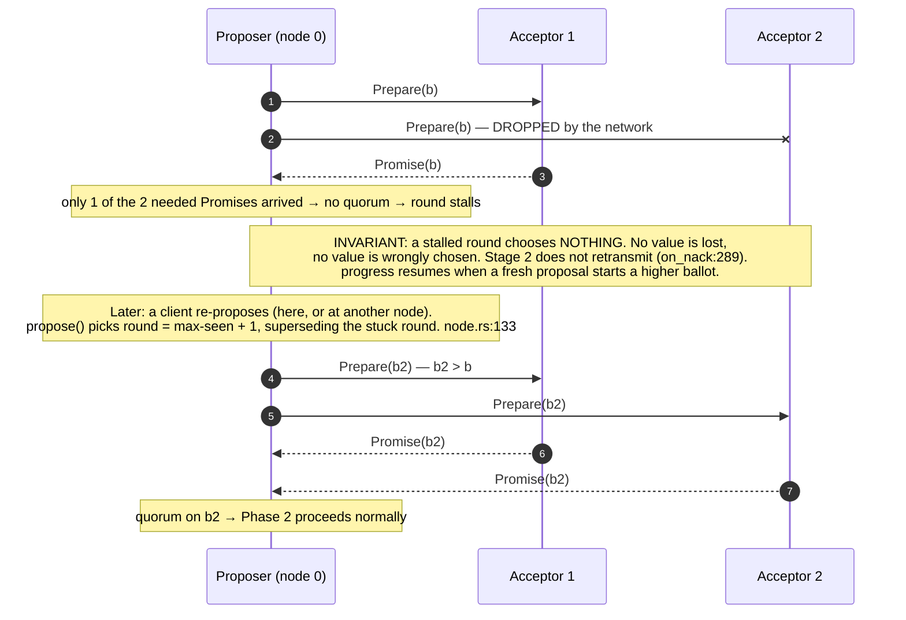
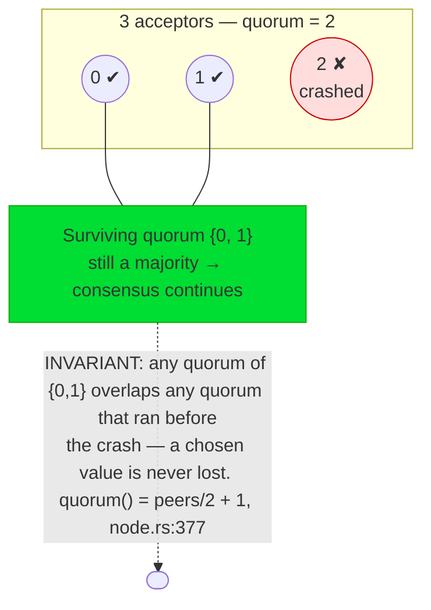
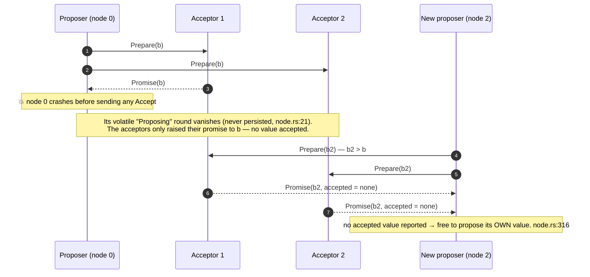
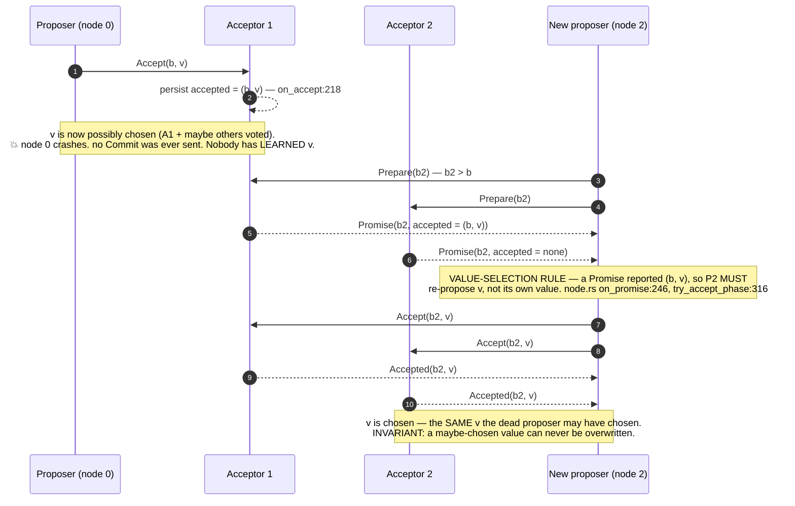
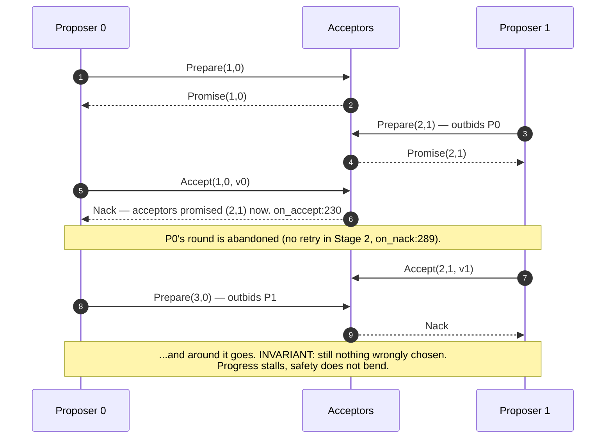
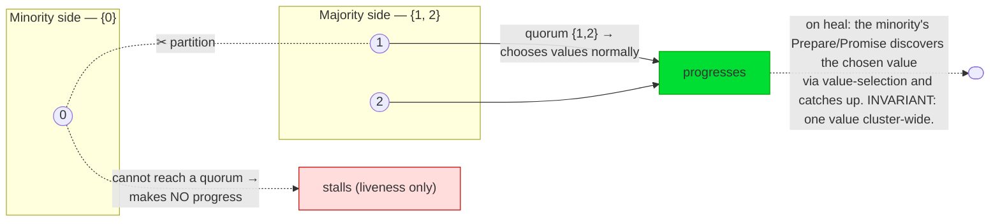

# Failures and failover

Paxos is only interesting because things break. This chapter is a gallery: each
diagram walks **one failure** and shows **why safety still holds** (and, where
relevant, how progress resumes). Every scenario here is reproducible in the
[browser demo](choose-one-value.md) and is exercised under swarm network chaos by
the `SafetyOracle` across thousands of seeds (`paros-sim/src/oracle.rs`,
`run_seed`/`explore` in `paros-sim/src/lib.rs`).

The golden rule to keep in mind throughout:

> **Any two majorities overlap.** Whatever crashes or gets dropped, the next
> proposer's Phase-1 quorum shares an acceptor with the quorum that may have chosen
> a value — so the value-selection rule always rediscovers it.

## 1. A message is dropped, delayed, or reordered

The network is unreliable by assumption. A lost `Promise` or `Accept` simply
stalls the in-flight round — **nothing is mis-chosen**.

> Reordering is handled the same way: each handler checks the ballot against
> `HardState`, so a late or out-of-order message that is no longer current is
> simply Nacked or ignored (`on_promise`/`on_accepted` guard on
> `p.ballot != ballot`).

## 2. An acceptor crashes (a minority)

A 3-node cluster tolerates **one** failure: the surviving two still form a
majority.

If a **second** acceptor crashes, the cluster cannot form a majority and **halts**
— a *liveness* loss, never a *safety* loss. It resumes the moment one returns.

## 3. A proposer crashes mid–Phase 1

Before a value is ever sent in an `Accept`, a proposer crash costs nothing: no
value was in play.

## 4. A proposer crashes mid–Phase 2 (the subtle one)

This is the case the whole value-selection machinery exists for. A proposer sends
some `Accept`s, a value becomes **partially accepted** (maybe even chosen), and
then the proposer dies before anyone learns the outcome.

This is precisely `value_selection_adopts_previously_accepted_value`
(`paros-core/src/node.rs:710`) and demo **seed 19**.

## 5. Dueling proposers — a livelock (but never unsafe)

Two proposers can keep leapfrogging each other's ballots, each invalidating the
other's Phase 1, so nothing is ever chosen. This is a **liveness** failure.

> **The cure is timing, not safety.** Demo **seed 42** shows this livelock.
> Randomized election timeouts (Stage 3) make one proposer back off and let the
> other win — a *liveness* fix. The Stage 2 safety kernel has **no timing logic at
> all** and is still always safe. This is the FLP split made concrete (see
> [Why consensus?](why-consensus.md)).

## 6. A network partition

Split the cluster and only the side with a **majority** can make progress.

When the partition heals, the minority node rejoins, and any new round it
participates in surfaces the already-accepted value — so it can only ever converge
on the one chosen value. The [multi-Paxos chapter](multipaxos-leaders.md) revisits
this as **leader failover** across a partition, where a new leader must re-run
Phase 1 across every open log slot.

## Summary: failure → what saves you

| Failure | Safety preserved by | Progress |
|---|---|---|
| Message dropped/delayed/reordered | ballot checks in every handler | resumes on a fresh higher ballot |
| Acceptor crash (minority) | quorum overlap | continues on the majority |
| Proposer crash, Phase 1 | nothing accepted yet | new proposer free to choose |
| Proposer crash, Phase 2 | **value-selection rule** | new proposer re-proposes the same value |
| Dueling proposers | monotonic promise + Nack | stalls; cured by Stage 3 timeouts |
| Network partition | only a majority can choose | majority proceeds; minority catches up on heal |
