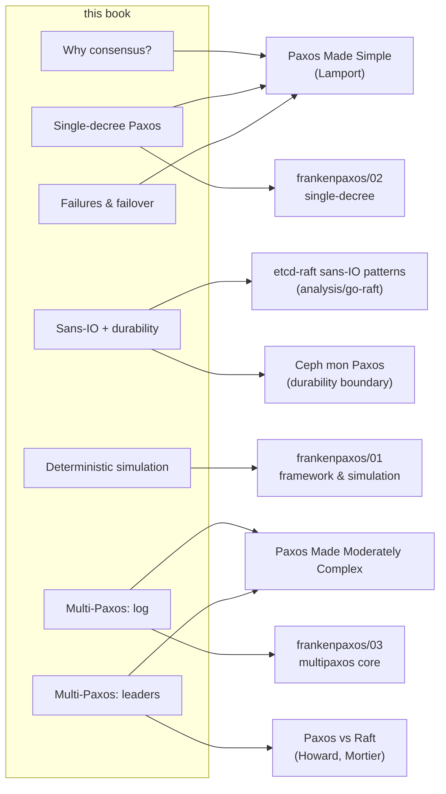
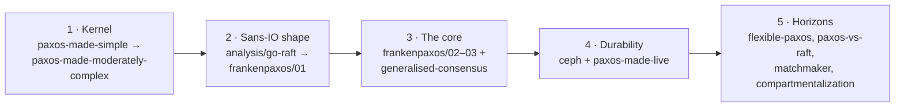

# Further reading

This book distills a corpus of papers and code studies that live in the repository
under `docs/references/` and `docs/analysis/`. Each entry there is a `paper.pdf`
plus a searchable, citable `transcript.md` (read the transcript first). This page
maps each chapter back to its sources so you can go deeper.

## The papers (`docs/references/papers/`)

### Foundations (Lamport)
- **Paxos Made Simple** — the single-decree Synod and the state-machine approach.
  The algorithmic kernel everything builds on. Backs
  [Why consensus?](why-consensus.md) and [Single-decree Paxos](single-decree.md).
- **Paxos Made Moderately Complex** (van Renesse & Altinbuken) — Multi-Paxos as you
  would actually engineer it: replicas, leaders, scouts/commanders, slots, the
  R1–R4 / A1–A5 invariants. Backs [Part III](multipaxos-log.md).
- **Paxos Made Live** (Chandra, Griesemer, Redstone) — Google's engineering reality:
  disk faults, master leases, snapshots, testing. Backs the durability discussion.

### Modern theory (Howard)
- **Flexible Paxos** — quorum intersection is required only *across* phases, enabling
  flexible/grid quorums. *(A later-stage horizon for paros.)*
- **A Generalised Solution to Distributed Consensus** — consensus as write-once
  registers + four rules; the cleanest mental model for a per-slot acceptor log.
- **Paxos vs Raft** — the two differ *only* in leader election; includes a
  persistent-vs-volatile state checklist. Backs [Leaders & failover](multipaxos-leaders.md).

### Variants & scaling (later horizons, out of current scope)
- **Matchmaker Paxos** — safe acceptor-set reconfiguration.
- **Scaling RSMs with Compartmentalization** — decouple the leader's roles for throughput.
- **Protocol-Aware Recovery** — recovering correctly from *corrupted* storage.

## Code studies (`docs/references/` and `docs/analysis/`)

- **`analysis/go-raft/etcd-raft-sans-io-patterns.md`** — the sans-IO architecture
  paros targets: `Step`/`Ready`/`Advance`, the durability handshake, `RawNode` vs
  `Node`. Backs [The sans-IO contract](sans-io.md) and [One driver](one-driver.md).
- **`references/frankenpaxos/`** — Whittaker's Scala research codebase: single-decree
  Paxos, the slot log, and (key for paros) a deterministic simulator. Backs
  [Deterministic simulation](simulation.md). Read for protocol content, not
  architecture (it is actor/transport-based, the opposite of sans-IO).
- **`references/ceph/mon-paxos-patterns.md`** — production Paxos with an explicit
  durability/persistence boundary and lease-based reads; a deliberate contrast to
  paros's sans-IO shape.

## The suggested path (from `docs/references/CLAUDE.md`)

To connect any term here to the implementation, use the [glossary](glossary.md).
