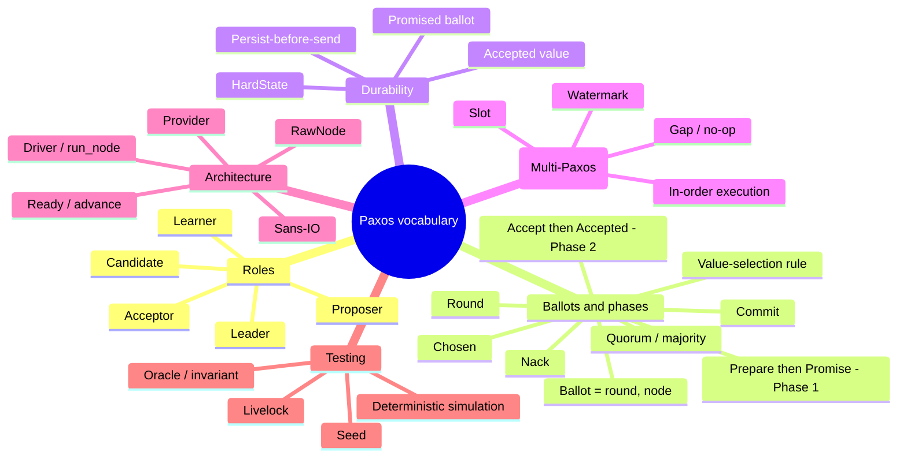

# Glossary

The vocabulary of Paxos and of paros, clustered by theme. Each term links to the
chapter that teaches it and, where it exists, the code symbol that implements it.

## Core algorithm

| Term | Definition | In paros |
|---|---|---|
| **Proposer** | The role that proposes a value and drives the two phases. | `RawNode::propose`, `node.rs:133` |
| **Acceptor** | The role that votes on proposals and durably remembers its votes. The guardian of safety. | `on_prepare`/`on_accept`, `node.rs:187`,`:216` |
| **Learner** | The role that finds out which value was chosen. | `on_commit`, `node.rs:299` |
| **Ballot** | A proposer's numbered "right to propose": `(round, node-id)`, **totally ordered** (higher round wins; ties broken by node-id). | `Ballot`, `types.rs:46` |
| **Round** | The integer part of a ballot. A proposer bumps it above anything it has seen to claim a fresh ballot. | `propose`, `node.rs:140` |
| **Quorum / majority** | Any majority of nodes. **Any two quorums overlap** — the fact that makes disagreement impossible. | `quorum()`, `node.rs:377` |
| **Prepare → Promise** | Phase 1: a proposer asks acceptors to promise its ballot; promisers report any value already accepted. | `Message::Prepare`/`Promise`, `message.rs` |
| **Promise** | An acceptor's commitment not to accept anything below a ballot `b`. | `on_prepare`, `node.rs:189` |
| **Accept → Accepted** | Phase 2: a proposer asks acceptors to accept a value at its ballot; a quorum of Accepted means *chosen*. | `Message::Accept`/`Accepted`, `message.rs` |
| **Nack** | A rejection reporting the higher ballot the acceptor already promised. (Stage 2 abandons the round; no retry yet.) | `on_nack`, `node.rs:289` |
| **Commit** | A message announcing that a value is chosen, so learners record it. | `on_commit`, `node.rs:299` |
| **Value-selection rule** | If any Promise reports an accepted value, the proposer must re-propose the **highest-ballot** such value instead of its own. Protects a maybe-chosen value. | `try_accept_phase`, `node.rs:316` |
| **Chosen** | A value a quorum has accepted at the same ballot. Once chosen, it can never change. | `try_decide`/`mark_chosen`, `node.rs:352`,`:405` |

## Durability

| Term | Definition | In paros |
|---|---|---|
| **HardState** | The must-be-durable triple: highest promised ballot, per-slot accepted `(ballot, value)`, and the chosen index. | `HardState`, `state.rs:23` |
| **Persist-before-send** | The rule that durable state must hit storage **before** any message predicated on it is sent. | `Ready` docs `ready.rs:18`; `drain_ready`, `driver.rs:163` |
| **Promised ballot** | The highest ballot a node has promised; monotonically non-decreasing. | `HardState.max_promised_ballot`, `state.rs:26` |
| **Accepted value** | The `(ballot, value)` a node has voted for in a slot. | `HardState.accepted`, `state.rs:29` |

## Log (Multi-Paxos — planned)

| Term | Definition | In paros |
|---|---|---|
| **Slot** | One index in the replicated log; each slot runs its own single-decree Paxos. | `Slot`, `types.rs:13` (slot 0 only today) |
| **Watermark** | A boundary index in the log: `executed_watermark` (applied), `commit_index`/`chosen_index` (highest contiguous chosen). | `HardState.chosen_index`, `state.rs:32` |
| **Gap / no-op** | An unfilled slot below the commit point; the leader fills it with a no-op so execution can continue. | planned (Stage 3+) |
| **In-order execution** | Applying chosen commands strictly in slot order, so every node's state machine matches. | planned (Stage 3+) |

## Architecture

| Term | Definition | In paros |
|---|---|---|
| **Sans-IO** | A design where the protocol is a pure state machine doing no I/O, no clock, no RNG; a driver performs all side effects. | `paros-core` (whole crate) |
| **RawNode** | The sans-IO state machine object: `step`/`tick`/`propose` in, `ready`/`advance` out. | `RawNode`, `node.rs:55` |
| **Ready / advance** | One batch of side effects (persist/send/apply); `advance()` acknowledges it. The unique borrow makes a second `ready()` a compile error. | `Ready`, `ready.rs:36` |
| **Driver / run_node** | The provider-generic loop that owns the `RawNode` and performs I/O — the same code in production and simulation. | `run_node`, `driver.rs:254` |
| **Provider** | moonpool's abstraction over time/network/spawning; the only thing that differs between prod and sim. | `P: Providers`, `driver.rs:254` |

## Testing

| Term | Definition | In paros |
|---|---|---|
| **Deterministic simulation (DST)** | Running the real code against a simulated, seed-driven network so every run is reproducible. | `run_seed`, `paros-sim/src/lib.rs:58` |
| **Seed** | The `u64` that determines a run; the same seed always replays identically. | `run_seed(seed)`, `lib.rs:58` |
| **Oracle / invariant** | An observer that reads the run's trace and asserts a property on every step. | `SafetyOracle`, `paros-sim/src/oracle.rs` |
| **Livelock** | Progress stalls forever (e.g. dueling proposers) though safety is never violated; cured by randomized timeouts (Stage 3). | demo seed 42; `on_nack`, `node.rs:289` |

> Line numbers track the code at the time of writing and will drift; the **symbol
> names** are stable. When in doubt, search for the function or type name.
