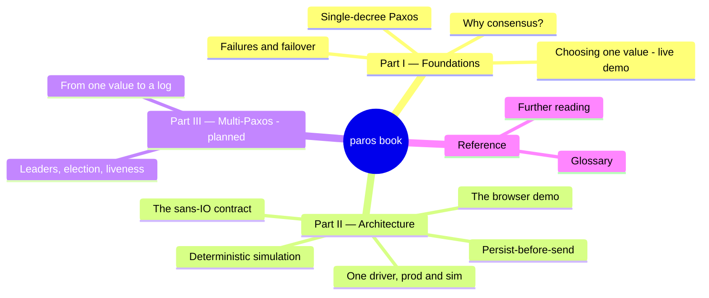

  

# paros

**paros** is a learning project: an implementation of the Paxos family of
consensus algorithms in Rust, built and validated with
[deterministic simulation testing](https://pierrez.github.io/moonpool/) (DST).
It is a work in progress and not for production.

The name is a nod to two Greek islands:
[Paros](https://en.wikipedia.org/wiki/Paros) (a favorite) and
[Paxos](https://en.wikipedia.org/wiki/Paxos), the island Leslie Lamport set the
consensus algorithm on.

The design is **sans-IO**: `paros-core` is a pure synchronous state machine —
`step`/`tick` in, one `Ready` out, an `advance()` handshake — with no I/O, no
clock, and no randomness. An async driver (built on
[moonpool](https://github.com/PierreZ/moonpool)) wraps the core and performs all
side effects in the order the `Ready` documents, honoring the persist-before-send
durability rule at the heart of Paxos safety.

Because the core is portable to WebAssembly, the *same* simulation that runs in
CI runs in your browser tab. The next chapter embeds it live.

> **Where we are.** This book is built from Stage 2, the single-decree safety
> kernel: three acceptors run Prepare/Promise/Accept/Accepted under a chaotic
> network, and a safety oracle proves that at most one value is ever chosen.
> Leader election, a replicated log, and storage faults arrive in later stages and
> will extend this same demo.

## How to read this book

This book is meant to be read **before** you open the code. It teaches Paxos
**through diagrams**: each chapter is built around a large annotated schema where
every term is defined inline (look for `TERM …`) and every safety rule is called
out exactly where it bites (`INVARIANT …`). Where a concept exists in the code,
the diagram is labelled with its `file:line` so you can jump straight to it.

Read it top to bottom: Part I is the algorithm, Part II is the *shape* paros gives
it (a pure core plus a driver), and Part III sketches where the codebase is going.
New to consensus? Start at [Why consensus?](why-consensus.md). Want to see it run
right now? Jump to [How Paxos chooses one value](choose-one-value.md).
