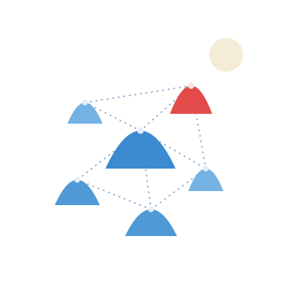

  

# paros

**paros** is a learning project: an implementation of the Paxos family of
consensus algorithms in Rust, built and validated with
[deterministic simulation testing](https://pierrez.github.io/moonpool/) (DST).
It is a work in progress and not for production.

The name is a nod to two Greek islands:
[Paros](https://en.wikipedia.org/wiki/Paros) (a favorite) and
[Paxos](https://en.wikipedia.org/wiki/Paxos), the island Leslie Lamport set the
consensus algorithm on.

The design is **sans-IO**: `paros-core` is a pure synchronous state machine —
`step`/`tick` in, one `Ready` out, an `advance()` handshake — with no I/O, no
clock, and no randomness. An async driver (built on
[moonpool](https://github.com/PierreZ/moonpool)) wraps the core and performs all
side effects in the order the `Ready` documents, honoring the persist-before-send
durability rule at the heart of Paxos safety.

> **How to play, then read.** [**paros play**](play.md) teaches the mechanism. It
> is an interactive game at [`/play/`](play/) that runs this repository's
> `paros-core` in your browser. You control the network, the clock, and every role
> that must answer, until you earn the right to automate that role. Start there:
> deliver the messages by hand, play the acceptor, adopt a value you did not want,
> and wedge a log and repair it.
>
> The chapters are the **field guide** beside the levels. Each chapter states its
> mechanism in a paragraph and links to the levels that make you do it. It then
> gives you what a level cannot: the paper the rule comes from, the derivation
> behind it, the doctrine paros holds itself to, and a map onto the real code.
>
> Part one, *Single-decree Paxos*, covers
> [how a value is chosen](choose-one-value.md) and
> [why that choice is safe](safety.md). Part two, *Multi-Paxos*, builds the
> [replicated log](replicated-log.md), elects a [stable leader](stable-leader.md),
> survives [crash and restart](restart-safety.md),
> [truncates the log](truncation-and-snapshots.md) and asks
> [what a read costs](linearizable-reads.md). Part three,
> [*Beyond Multi-Paxos*](beyond-multi-paxos.md), takes the majority, the leader,
> the fixed membership and the working disk apart, one paper at a time.
