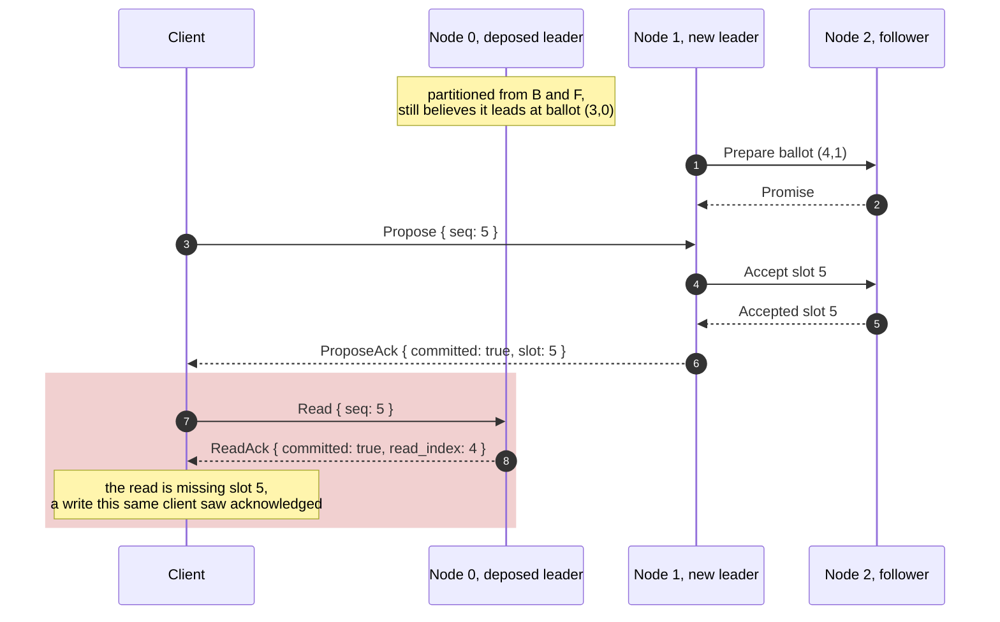
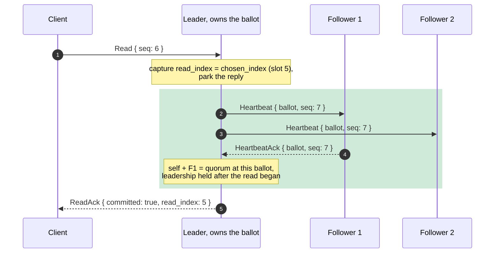
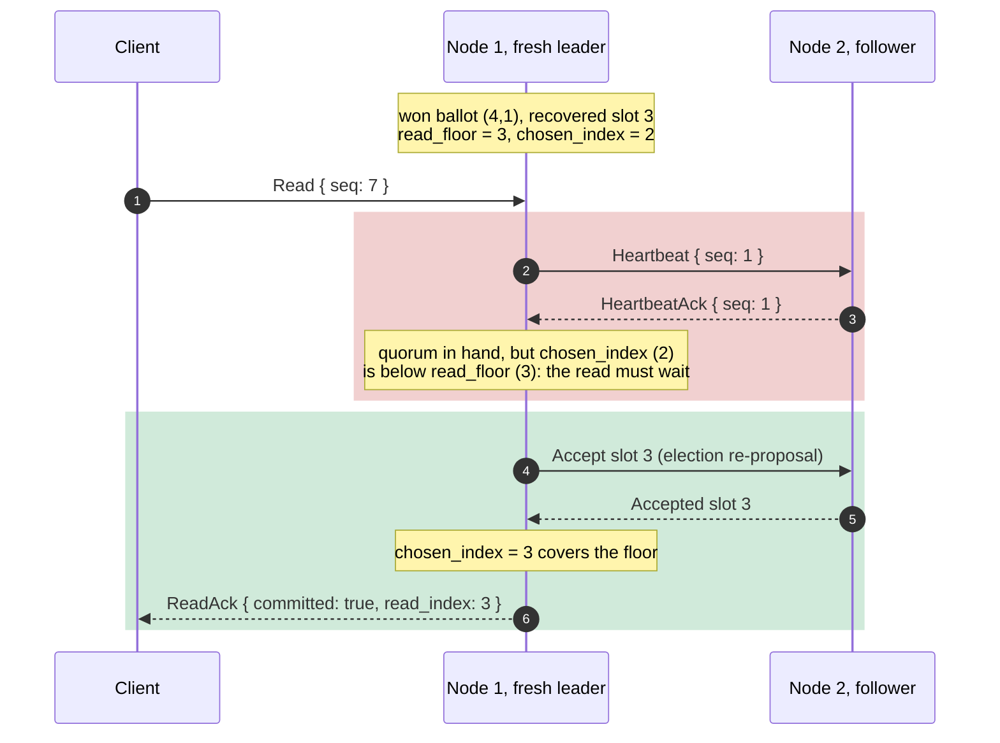

# Why reads are not free

Writes go through consensus, so it is tempting to believe reads are the easy
half: the leader already has the whole log, surely it can just answer. It
cannot, and the reason is the single most misunderstood thing about consensus
systems. "I am the leader" is a **belief** about the past, not a fact about the
present. A leader that answers a read from local state alone may have been
deposed milliseconds ago, and the value it serves may already have been
overwritten by a successor it has never heard of. This chapter builds the
baseline correct read path, the **read-index** protocol, and the oracle that
keeps it honest forever: a client-history **linearizability** checker.

<!-- toc -->

## The read that lies

Here is the failure, concretely. Node 0 leads, then a partition cuts it off
from its peers but not from the client. Node 1 gets elected, commits a new
write, and acks it. The client then reads, and its first try lands on node 0,
which still believes it leads:



Step 9 is a linearizability violation: an operation that completed *before* the
read began (the write at slot 5, acknowledged at step 6) is invisible to it.
No crash, no data loss, no Byzantine behavior, just a node answering from a
stale belief. The same lie has a second form that needs no partition at all:
a *freshly elected* leader whose local chosen prefix still lags writes the old
leader acknowledged. We will meet that one below, it is sneakier.

## The strawman: write a no-op to read

There is a correct read that needs no new protocol at all. The frankenpaxos
notes in this repo put it plainly:

> paros v1 can serve a linearizable read the dumb way — propose a no-op and
> read at its slot — long before a dedicated, scalable read path is worth
> building.

Propose a command through ordinary consensus, wait for its slot to commit, and
serve the state at that slot. Correct, because the no-op's commit proves the
proposer was leader *now*, at a quorum. But it costs a log slot, an fsync on
every acceptor, and a full Phase-2 round trip, per read. Read-heavy workloads
would spend their disks appending nothing.

## Read-index: confirm, don't write

The read-index protocol (the seam etcd-raft exposes as `ReadIndex`/`ReadState`)
keeps the proof and drops the log write. The insight: the no-op's slot never
mattered, only the *evidence of current leadership* did. A heartbeat round can
carry that evidence for free.

The leader answers a read in three moves:

1. **Capture.** Record the current applied watermark, `chosen_index`, as the
   read index.
2. **Confirm.** Broadcast a heartbeat and collect acks from a quorum. Paxos
   quorum intersection does the rest: if a higher ballot had committed a newer
   write before the read began, a quorum promised that ballot, and at least one
   member of *any* quorum we hear from would have refused our older one. A
   quorum of fresh acks at our ballot proves no such commit preceded us.
3. **Wait and serve.** Once the applied state covers the read index, reply
   from local state. No log write, no fsync, one message round.



Two details carry the safety, and both live in `paros-core`:

**Acks are matched to beats.** `Heartbeat` now carries a monotone per-ballot
`seq`, and followers answer with a new message:

```rust
HeartbeatAck {
    /// The acknowledging follower.
    from: NodeId,
    /// The heartbeat's ballot, echoed.
    ballot: Ballot,
    /// The heartbeat's beat sequence number, echoed.
    seq: u64,
}
```

An ack only credits a read round if it echoes the leader's *current* ballot and
a `seq` at or after the beat broadcast when the round began. An ack to an
earlier beat proves nothing: the follower may have sent it before promising a
higher ballot elsewhere. Monotone seqs also batch for free, since an ack to a
later beat confirms every older pending round at once.

**A follower acks only what its promise allows.** The ack is sent from the same
guard that adopts a heartbeat's ballot, `ballot >= max_promised_ballot`. A
deposed leader keeps beating into the partition, but any follower that promised
the new ballot refuses to ack the old one. Its read rounds starve, its parked
replies time out, and the client retries elsewhere. That is the whole fix for
the diagram above: step 9 can no longer happen, because node 0 can never again
collect a quorum of acks at ballot (3,0).

In the sans-IO core this follows the etcd-raft shape: `RawNode::read_index(ctx)`
starts a round, and the confirmation surfaces through the `Ready` handshake as
a consume-once `ReadState`, after the batch's committed entries are applied:

```rust
pub struct ReadState {
    /// The driver-supplied correlation token from `RawNode::read_index`.
    pub ctx: u64,
    /// The read index: the applied watermark the read observes.
    pub index: Option<Slot>,
}
```

The driver parks the client's reply promise keyed by `ctx` and answers when the
`ReadState` arrives, exactly the deferred-reply pattern it already uses to ack
writes on commit. What does it answer *with*? paros never interprets entry
bytes and holds no application state machine, so the state a read serves is the
**applied log prefix itself**: `ReadAck.read_index` is the watermark, with
`None` for the empty prefix. An application layered on paros would serve its
own state at that watermark; the protocol work, and everything the oracle needs,
is in the index.

## The fresh-leader trap

The quorum round alone is not enough, and this is the sneaky half of the
chapter. A leader that *just* won an election holds a perfectly valid quorum,
yet its `chosen_index` can still lag writes the previous leader acknowledged:
election recovery re-proposes those slots, and until they re-decide, the new
leader's applied prefix is missing acknowledged data. Capture-and-confirm would
serve a stale watermark with a fresh quorum. Raft solves this by having a new
leader commit a no-op in its own term before serving reads; paros waits
instead:



At the moment it wins, a leader records `read_floor = next_slot - 1`, the
highest slot its prepare quorum reported. Quorum intersection (plus the
truncation floor guard from the [previous chapter](truncation-and-snapshots.md))
guarantees every write any earlier leader acknowledged sits at or below that
slot. A read round captures `max(chosen_index, read_floor)` as its index and
confirms only when **both** conditions hold: the ack quorum, and
`chosen_index >= index`. The second condition resolves inside
`advance_chosen_index`, the moment the recovered suffix finishes re-deciding.

## What "linearizable" means here

The word has a precise definition (Herlihy and Wing, quoted at length in the
compartmentalized-Paxos transcript under `docs/references/`): every operation
appears to take effect atomically at some instant between its invocation and
its response. For paros the register under observation is the applied log
prefix, writes append to it at their committed slot, and a read observes its
watermark. Because the log totally orders writes, checking a recorded history
needs no search at all, just three conditions over the sim client's program
order:

1. A committed read observes every write acknowledged before it began: its
   watermark is at or past each such write's slot.
2. Watermarks never move backwards across non-overlapping reads.
3. A write issued after a committed read lands *above* that read's watermark
   (nothing sneaks into a prefix somebody already observed).

Failed and timed-out operations constrain nothing, a timed-out write may still
commit later, and that is fine. Condition 1 is exactly what the deposed-leader
and fresh-leader reads violate.

## Proven, not asserted

The `LinearizabilityOracle` in `paros-sim` checks those three conditions over
the recorded trace of every run, and it is the king oracle of this project:
from here on, every later stage (storage faults, reconfiguration) inherits a
client's-eye definition of "nothing was lost". The workload interleaves a read
after every write, cycling across nodes on redirects, under the usual chaos:
swarm network faults, crash/restart attrition, and buggified seam crashes.

The red run came first, per the house rule. The read RPC was landed *naively*,
serving `chosen_index` whenever `role == Leader`, no confirmation round, no
floor. The sweep hunted until the interleaving fired: seed
`286172402316494352` records a read served from a stale leader's belief,
violating condition 1. That seed is pinned in `REGRESSION_SEEDS` and replays
clean now that the read-index protocol is in: the same sweep saturates with the
read reachables firing (a read commits, a read commits after a leader change, a
read retried across nodes), and the deterministic core test
`fresh_leader_read_waits_for_the_read_floor` pins the trap mechanism at the
state-machine level.

What read-index deliberately does not buy: locality. Every read still goes
through the leader and still costs a round trip. Leader leases (serve reads
locally for a clock-bounded period) and follower/quorum reads are performance
variants on top of this baseline, tracked for a later stage; the
[optimizations table](stable-leader.md#optimizations-at-a-glance) keeps the
score.

## The other half: the write ack

Condition 1 says a read observes every write *acknowledged* before it began.
That leans on the ack meaning something, and for one code path it did not.

A client retry is deduplicated by `(client, seq)`. If the command was already
applied here, there is nothing to propose: the leader answers immediately, and
the driver replies `committed: true`. The trouble was upstream of that reply.
`mark_chosen` — the "this slot is decided" bookkeeping — recorded a command as
*applied* the moment the slot was learned chosen, and chosen is not applied.
Two of its three callers hand it slots out of order: a learner takes whatever
slot the network delivers, and a leader streaming slots concurrently sees slot
6's accept quorum complete while slot 5 is still open. So with the applied
prefix stopped at 4 and slot 5 missing, a decision at slot 6 marked its command
applied, and a retry was told `committed: true` for a write that was in no
node's applied prefix. A read at that same leader, moments later, honestly
returned watermark 4 — the write the client had been promised, missing.

The fix is a definition, not a special case: `applied_seq` is written **only**
by the contiguous walk that advances the prefix, which is what the boot rebuild
in `RawNode::new` had always meant by it. Both dedup tables move together,
which matters more than it looks. Move the applied table alone and a retry
arriving in the chosen-but-not-yet-applied window misses *both* tables and
takes a fresh slot for a command already chosen — duplicate execution, strictly
worse than the early ack. So `mark_chosen` re-points the in-flight table at the
slot instead: between "chosen" and "applied" that mapping is the only record
the node has, a retry there gets `Duplicate(k)`, the reply parks on slot `k`,
and it fires from the apply loop — the ack arriving exactly when the write
enters the prefix it claims to be in.

The blindfold is worth naming, because it is why the sweep had never caught
this. The fast path acked with *no slot at all*, and both the workload and the
oracle were explicitly told to skip slotless acks. The exemption was exactly
the size of the bug. `ProposeResult::Chosen` now carries its slot, so the ack
is falsifiable: `AppliedAckOracle` joins every committed ack against the acking
node's own `log_applied` events and asserts the node had already applied the
slot it named. It went red on seed 11 (twelve seeds in the first two thousand),
which is now pinned, and the core tests
`a_slot_chosen_above_a_hole_is_deduped_in_flight_not_acked_as_applied` and
`a_commit_above_the_hole_holds_the_entry_in_flight_until_it_applies` pin the
mechanism on both call sites.

## Watch it live

The read path above, on one real seeded run. Each frame is one client read:
the request reaches the leader (grey), the leader runs its heartbeat-ack
**confirmation round** (cyan, out to the quorum and back), and the answer
(green) leaves only once the applied prefix covers the dashed amber **read
index** line — the commit barrier. The narration says how long each read
waited there.

<iframe
  src="wasm-demo/index.html?embed=1&mode=read&seed=0"
  title="paros: linearizable reads at the commit barrier (seed 0)"
  style="width:100%;height:720px;border:1px solid #30363d;border-radius:12px"
  loading="lazy">
</iframe>

A second embed with a different seed. Runs vary with the chaos drawn: under
leader churn a read may cycle through redirects for hundreds of milliseconds,
or time out entirely — returning *nothing* rather than something stale — and
the narration reports what each read in this run actually did:

<iframe
  src="wasm-demo/index.html?embed=1&mode=read&seed=183"
  title="paros: a read across a leader change (seed 183)"
  style="width:100%;height:720px;border:1px solid #30363d;border-radius:12px"
  loading="lazy">
</iframe>

Same seed, same run, byte for byte, here and in CI: the demo replays
`run_seed(seed)` in your browser and draws the recorded `reads` and
`read_confirms` streams of the `RunResult`; `?dump` shows the raw JSON.
