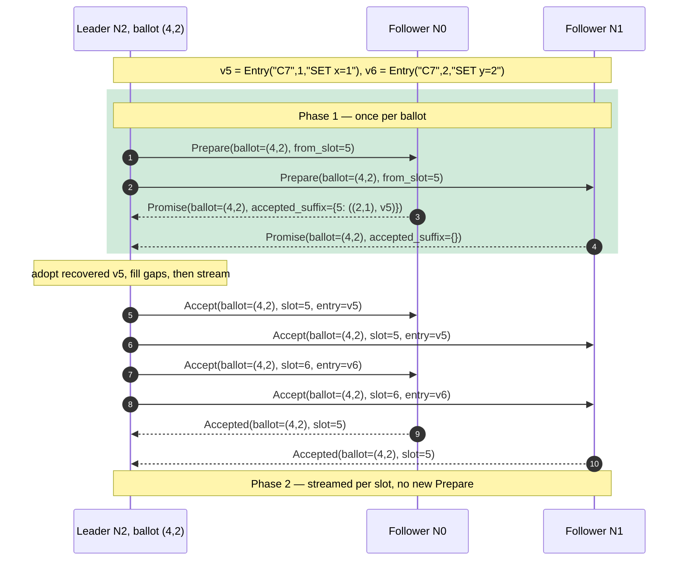

# Multi-Paxos: leader and log

The [previous page](single-decree.md) chose **one** value. This one runs the full
Multi-Paxos protocol live: a cluster elects a **leader**, the leader replicates a
**log** of values (one Paxos instance per slot), and the log stays in agreement
across nodes even as leadership turns over under chaos. Same seed, same run.

Unlike the single-decree page, nothing here is a curated, hand-picked seed. Each
run **describes itself**: the demo computes the whole timeline in your browser, then
derives a *scenario digest* (the chips under the canvas) and a step-by-step
*narration* (the status line) straight from that data. Type any seed, or hit
random, and read what actually happened.

## What to watch

- **Leader election.** A follower whose election clock fires (a randomized timeout
  in `[T, 2T)`, drawn in the driver by `draw_election_timeout`, never in the
  zero-dep core) bumps its ballot and broadcasts **Prepare**. Win a Promise quorum
  and it lights up with a **Leader** badge. The randomized timeout is what breaks
  the dueling-proposer livelock the single-decree page leaves observable.
- **One log per node.** Each column is a node; each cell is a slot. A filled cell is
  a *chosen* value, coloured by the value: **the same colour in the same slot across
  nodes is prefix agreement**, the property the safety oracle asserts. The green
  edge marks each node's committed (contiguous applied) prefix.
- **Phase 1 once, Phase 2 streamed.** The stable-leader win: the leader runs Phase 1
  a single time per ballot, then streams **Accept** per slot with no further
  Prepare. The digest counts these *piggybacked* slots; the narration calls them out
  as they stream.

This maps directly onto the core: `RawNode::on_check_leader` broadcasts the single
`Prepare{from_slot}`, `try_become_leader` adopts the recovered suffix on takeover,
and `start_accept_round` streams one `Accept` per slot. The demo reads it back from
`leader_elected` / `value_chosen` / `log_applied` events, surfaced as `LeaderShot`,
`ChosenShot`, and `AppliedShot` in `paros-sim/src/oracle.rs`.

## Run it

<iframe
  src="wasm-demo/index.html?embed=1&mode=multi&seed=0"
  title="paros: Multi-Paxos leader and log (seed 0)"
  style="width:100%;height:880px;border:1px solid #30363d;border-radius:12px"
  loading="lazy">
</iframe>

A second seed, for a different shape of run (a different election order, a different
log). The digest and narration adapt; the safety oracle holds either way.

<iframe
  src="wasm-demo/index.html?embed=1&mode=multi&seed=7"
  title="paros: Multi-Paxos leader and log (seed 7)"
  style="width:100%;height:880px;border:1px solid #30363d;border-radius:12px"
  loading="lazy">
</iframe>

## Reading the digest

The chips are all derived from the one computed run:

- **log committed / high** — how many slots reached agreement, and the highest slot
  the cluster worked on.
- **leader failovers** + **ballot trail** — how many times leadership changed hands,
  and the `N@r` sequence of leaders.
- **Phase 1 elections** vs **Phase 2 piggybacked** — full elections versus slots
  streamed under an already-elected leader: the Multi-Paxos optimization, counted.
- **dueling** — whether proposers competed (a Nack, or two ballots racing before the
  first value was chosen) and which leader resolved it.
- **network drops** — protocol messages the chaotic network dropped this run.

## Reproducibility

Same seed, same run, byte for byte, here and in CI (`?dump` shows the raw JSON
`runSeed(seed)` returns). `?seed=<n>` picks a seed; `?mode=multi` selects this view
(omit it for the single-decree court); `?still=<k>` freezes one frame. Because the UI
reads the data rather than a pinned narrative, these embeds stay correct as the
protocol evolves.
