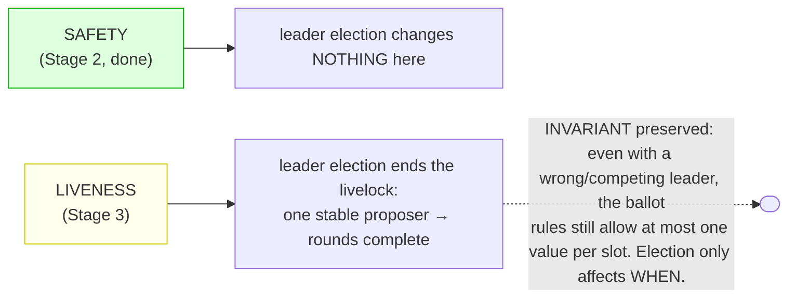
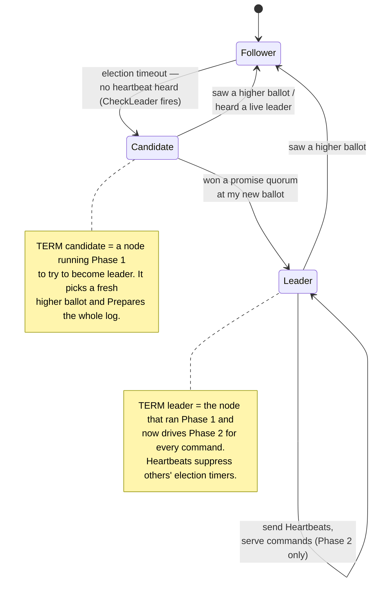
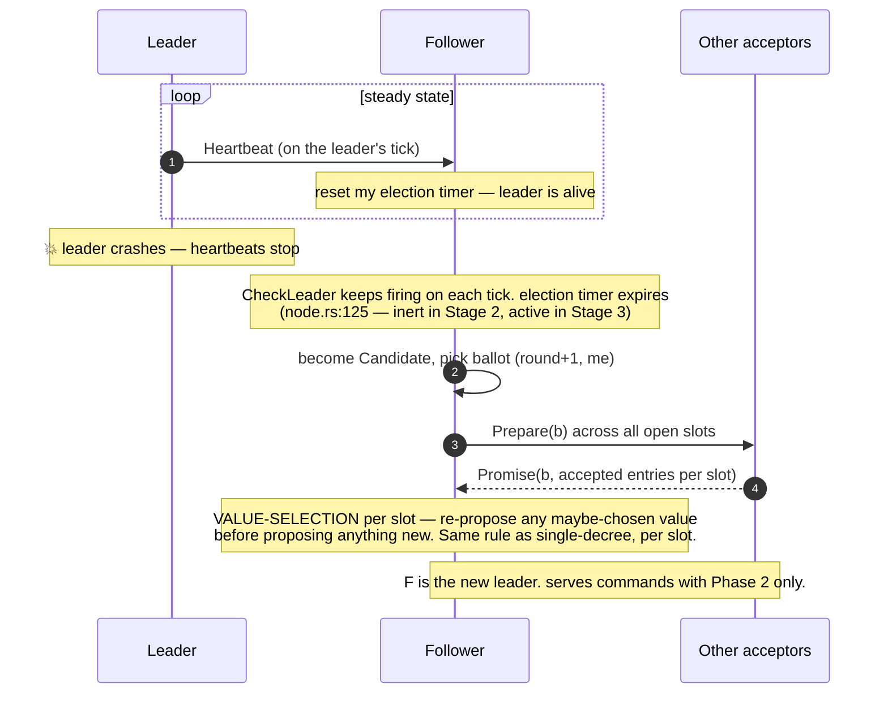
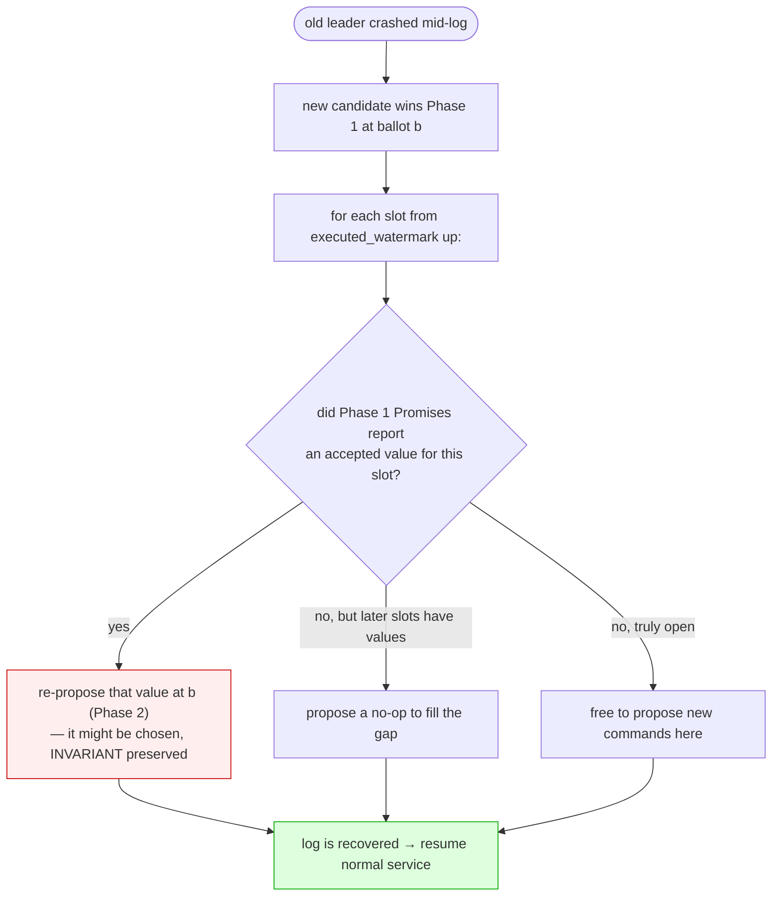
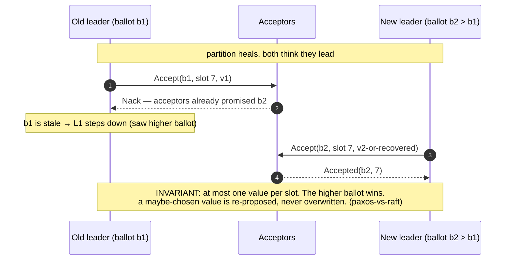

# Leaders, election, and liveness

> **Status: planned — not yet in code.** Stage 2 has *no* leader and *no* timing
> logic — it is a pure safety kernel, and that is deliberate. The message variants
> for this already exist but are inert: `CheckLeader` and `Heartbeat` are
> tick-injected self-events that Stage 2 ignores (`paros-core/src/node.rs:125`), and
> `tick()` is "a bare counter, no timeouts until Stage 3" (`node.rs:170`). This
> chapter is the roadmap, drawn from *Paxos Made Moderately Complex*,
> `references/frankenpaxos/02`, and `references/papers/paxos-vs-raft`.

Recall the [FLP split](why-consensus.md): safety is unconditional, but **liveness**
needs a timing assumption. The whole job of leader election is to recover liveness —
to make sure that, eventually, **one** proposer is in charge so the
[dueling-proposer livelock](failures.md) ends and progress resumes. It adds **zero**
new safety requirements.

## A node's three modes

With leadership, each node moves through three states, driven by a failure detector
(am I hearing heartbeats from a live leader?).

## The heartbeat / timeout loop

Liveness comes from two timers, both driven by the core's logical `tick()` (no wall
clock — the timing lives in tick counts, exactly as etcd-raft does it).

> **TERM — randomized timeout.** Election timeouts are randomized so two followers
> rarely become candidates at once — the same idea that breaks the dueling-proposer
> livelock. This is a *liveness* tuning knob; pick it wrong and you get slow
> elections, never an unsafe outcome.

## Leader failover across a slot log

When a leader dies, the new leader cannot just start appending — it must first
**recover every open slot**: run Phase 1, see what might already be chosen, and
re-propose those values (filling true gaps with no-ops). Only then is the log
consistent enough to extend.

### Two leaders during a partition

A partition can briefly produce two would-be leaders. Safety still holds, because
**ballots are totally ordered**: for any given slot, only the higher ballot can win
a quorum, and the value-selection rule ties the outcome back to anything already
chosen.

## Paxos vs Raft, in one line

This is where Paxos and Raft actually differ. Per
`references/papers/paxos-vs-raft`, the normal-operation log machinery is nearly
identical; **the only real difference is leader election** — how a new leader is
chosen and how it catches its log up. Everything in [Part I](single-decree.md) and
the log machinery above is common ground.

That closes the roadmap. For precise terminology, see the [glossary](glossary.md);
for the source papers behind each chapter, see [further reading](further-reading.md).
