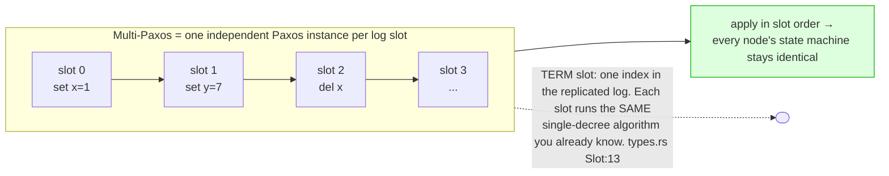
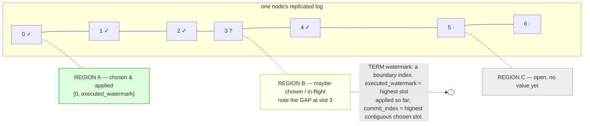
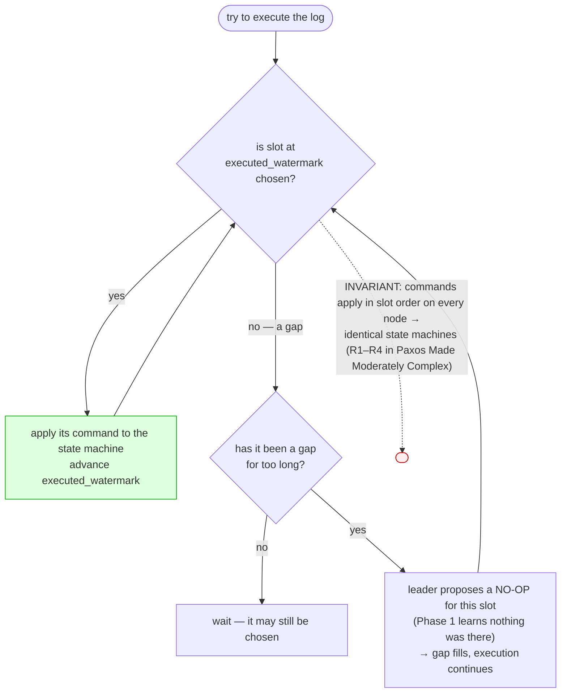
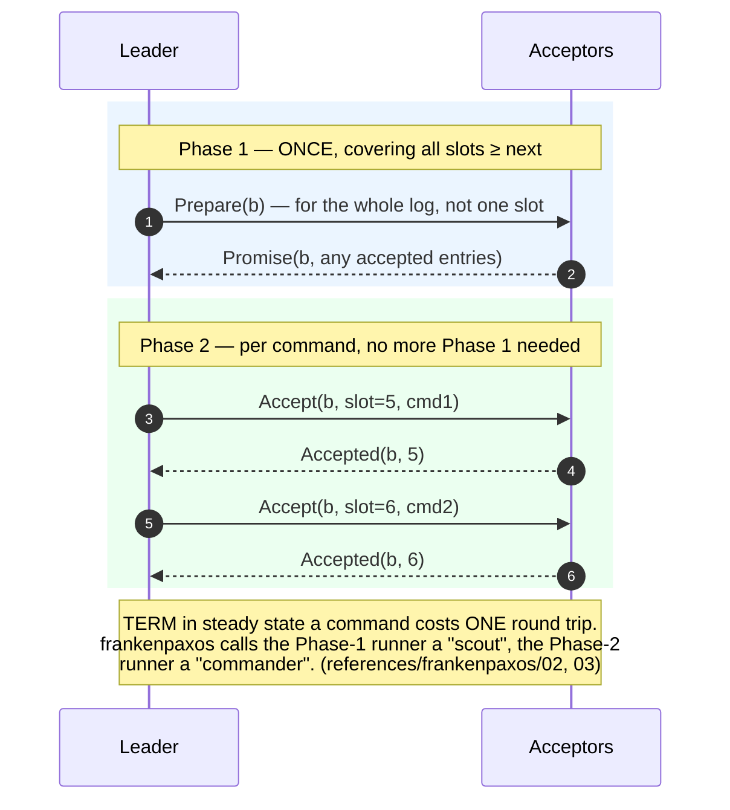
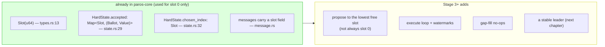

# From one value to a log

> **Status: planned — not yet in code.** Stage 2 is single-decree: it chooses one
> value, in slot `0`. This chapter sketches **Multi-Paxos**, the Stage 3+ roadmap,
> drawn from *Paxos Made Moderately Complex* and
> `docs/references/frankenpaxos/03-multipaxos-core.md`. The hooks already exist in
> the code — `Slot`, the per-slot `accepted` map, and `chosen_index` in
> `HardState` — but only slot 0 is used today.

A single chosen value is not very useful. A real system wants a **replicated log**:
an ever-growing, agreed-upon sequence of commands that every node applies in the
same order, turning a cluster into a fault-tolerant state machine.

## The log: three regions

A node's log is **sparse** — slots can be chosen out of order — and is best read as
three regions divided by two watermarks.

## In-order execution and gap-filling

The state machine must apply commands **in order**, with no holes. Slot 4 may be
chosen while slot 3 is still a gap — so execution stops at the first hole, and the
leader fills stubborn gaps with a **no-op** so the log can drain.

## The key optimization: Phase 1 once, Phase 2 per slot

Running full two-phase Paxos for every command would be wasteful. The Multi-Paxos
insight: a **stable leader runs Phase 1 just once** (for *all* slots, present and
future), then only needs Phase 2 per command. This is what makes Paxos fast in the
steady state.

## How it maps onto today's code

The single-decree kernel is the per-slot engine; Multi-Paxos is mostly bookkeeping
*around* it. The data model is already slot-shaped:

Next: who gets to be that stable leader, and what happens when it dies —
[leaders, election, and liveness](multipaxos-leaders.md).
