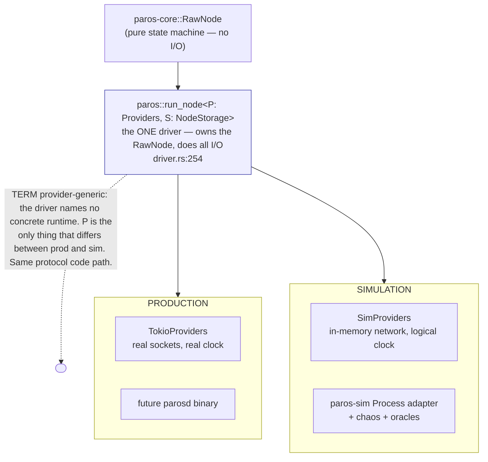
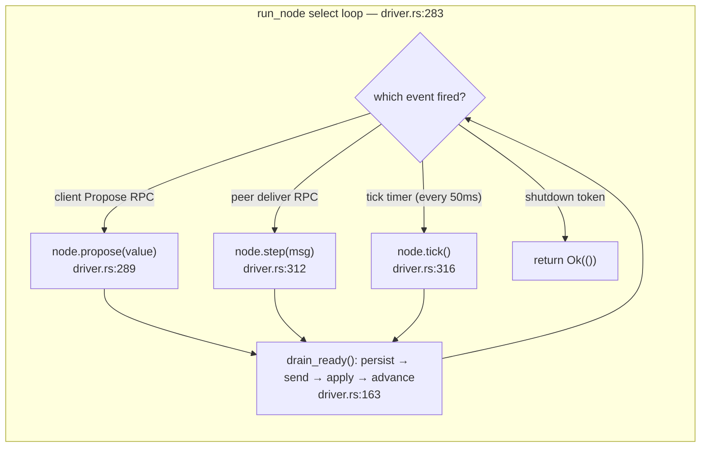
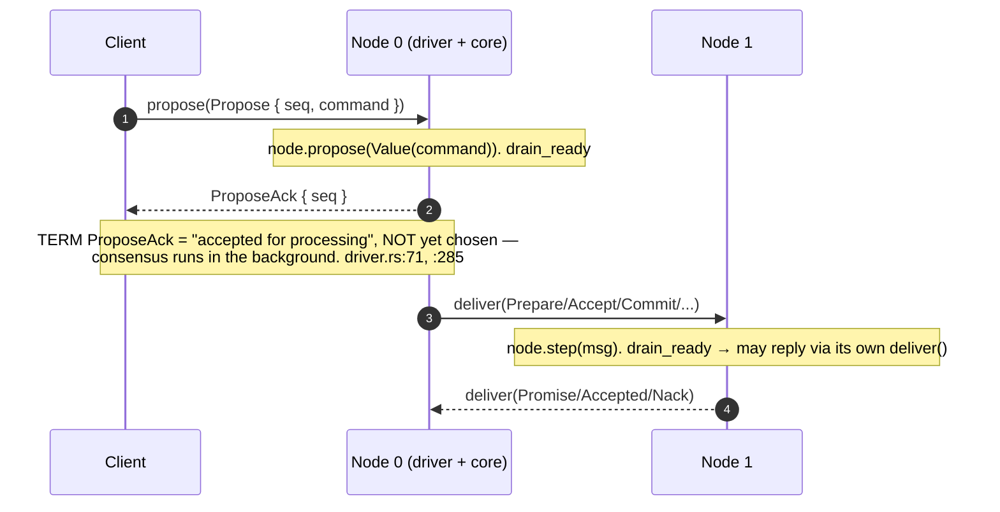
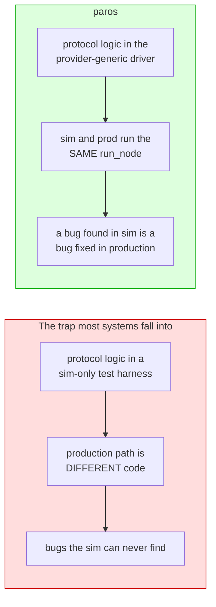

# One driver, production and simulation

The sans-IO core does no I/O — so something has to. That something is the
**driver**: `paros::run_node` (`paros/src/driver.rs:254`). The load-bearing design
decision is that there is **exactly one** driver, written generically over
moonpool's `P: Providers`, so the *same* code runs in production and in
deterministic simulation. You test the code you ship.

## What the driver does

It is a single `select` loop over four event sources, each feeding the core and
then draining the resulting `Ready` in [persist→send→apply→advance](durability.md)
order.

> **TERM — Providers.** moonpool's abstraction over time, networking, and task
> spawning. `TimeProvider::sleep` is a real timer in production and a logical-clock
> wait in simulation — the driver calls the same method either way
> (`driver.rs:316`).

## The node RPC contract

Nodes talk to clients and to each other over one small `#[service]` interface
(`paros/src/driver.rs:81`). The same `paros_core::Message` is sent and received —
no separate wire DTO.

## Why "test the code you ship" matters

This rule is why later protocol stages (leader election, the replicated log) must
land in `run_node` and the core — never in a sim-only path. The simulation harness
only adds the *environment* (a chaotic network) and *observers* (oracles), covered
next.

Next: [deterministic simulation and the safety oracle](simulation.md).
