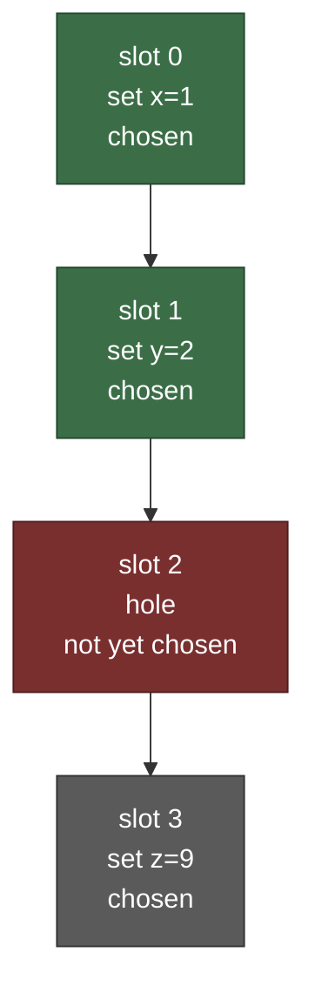

# From one value to a log

Single-decree Paxos agrees on **one** value. A real system needs to agree on a
*sequence*: command 1, then command 2, then command 3, applied in the same order
on every node so that every replica of a deterministic state machine ends up in
the same state. That sequence is the **replicated log**, and Multi-Paxos is how we
fill it.

<!-- toc -->

## A single decision never changes

A single Paxos instance agrees on one value, and that value is then frozen
forever. That is perfect for "what is slot 5", but useless on its own for anything
that changes over time. Picture a bank balance. You cannot agree once that "the
balance is 100" and be done, because the next deposit has to change it. The way
out is not to mutate the agreed value (you never can), but to agree *again*, on the
next slot:

- slot 0: account opened, balance 100
- slot 1: deposit 50
- slot 2: withdraw 20

Each slot is its own immutable single-decree decision. Replaying them in order
gives the current balance of 130. A value that changes over time becomes a **log
of decisions that never change**. That reframing, one consensus per log position,
is the whole idea behind real systems like Megastore, and it is what the rest of
this part builds.

## One Paxos instance per slot

The idea is almost embarrassingly direct. Lamport's
[Paxos Made Simple](https://lamport.azurewebsites.net/pubs/paxos-simple.pdf) puts
it in one sentence:

> run a separate instance of Paxos consensus per command slot. The value chosen
> by the `i`-th instance is the `i`-th command.

A **slot** is a numbered position in the log. Each slot runs its own independent
single-decree Paxos: its own Prepare/Promise/Accept/Accepted, its own "at most one
value chosen". In paros a slot is just `Slot(u64)`, and the value chosen for it is
an `Entry`:

```rust
pub struct Entry {
    pub client: ClientId,
    pub seq: ClientSeq,
    pub value: Value,
}
```

The `(client, seq)` tag rides along with every command so a node can recognise a
request it has already placed and never execute it twice, even across a leader
change or a restart. (More on that in [Crash and restart safety](restart-safety.md).)

## The log is a gapless prefix plus the future

A node's durable state holds, per slot, the value it has accepted, and a single
**commit index**:

```rust
pub struct HardState {
    pub max_promised_ballot: Ballot,
    pub accepted: BTreeMap<Slot, (Ballot, Entry)>,
    pub chosen_index: Option<Slot>,   // highest contiguous chosen slot
}
```

`chosen_index` is the highest slot such that **every** slot up to it is chosen. It
is the boundary between the part of the log that is safe to apply and the part
that is still being decided. This boundary matters because consensus can choose
slots out of order. A leader can get slot 3 chosen before slot 2, leaving a
**hole**:



Here slots 0 and 1 are chosen, slot 2 is still a hole, and slot 3 is already
chosen. The commit index is `Some(Slot(1))`: the application may apply slots 0 and
1, but it **must not** apply slot 3 yet, because applying slot 3 before slot 2
would execute commands out of order on this node but maybe in a different order on
another. The log advances only as a contiguous prefix. In paros,
`advance_chosen_index` walks that prefix forward one slot at a time and surfaces
each newly applied `(slot, entry)` in order (`node.rs`); a hole simply stops the
walk until it is filled.

The simulation pins this with the `NoGapsOracle`, which asserts that each node's
applied prefix **"advances one slot at a time (no gaps)"** and **"starts at slot
0"** (`paros-sim/src/oracle.rs`). A node can never reveal a value it skipped a
slot to reach.

## Five roles, collapsed into one node

[Paxos Made Moderately Complex](https://www.cs.cornell.edu/home/rvr/Paxos/)
(van Renesse and Altinbuken) is the canonical engineering account of Multi-Paxos.
It explains the protocol as five kinds of process:

- **clients** that submit commands,
- **replicas** that hold the log and apply it in slot order,
- **leaders** that drive consensus for a ballot (using **scouts** for Phase 1 and
  **commanders** for Phase 2),
- **acceptors**, the fault-tolerant memory that promises and votes.

paros does not run these as separate processes. A single `RawNode` plays all of
them at once: it is an acceptor (it promises and votes), a replica (it holds the
log and tracks `chosen_index`), and, when it wins an election, a leader. The
mapping is:

| Paxos Made Moderately Complex | paros |
|---|---|
| replica (log, `slot_num`) | the `RawNode` log + `chosen_index` (`node.rs`) |
| acceptor (`ballot_num`, accepted pvalues) | `HardState.max_promised_ballot` + `accepted` |
| pvalue `(b, s, c)` | an `accepted` entry `(Slot, (Ballot, Entry))` |
| leader / scout / commander | the `Candidate` and `Leader` roles in one node |
| invariant R1 (one command per slot) | `SafetyOracle`: at most one value chosen per slot |

PMMC's central correctness invariant is **R1**: "no two different commands decided
for the same slot." That is single-decree safety, applied per slot, which is
precisely what the previous two chapters built. The log adds no new safety
argument: it is many independent instances of the same one. What it *does* add is
the question of who proposes, and how a leader avoids paying for Phase 1 on every
single slot. That is the [stable leader](stable-leader.md), next.
