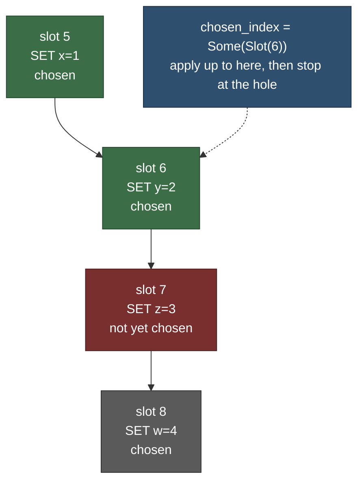

# From one value to a log

Single-decree Paxos agrees on **one** value; a real system needs a *sequence*,
applied in the same order on every node so every replica of a deterministic state
machine ends up in the same state. That sequence is the **replicated log**, and
Multi-Paxos fills it by running an independent single-decree instance **per slot**.
Safety does not change — a slot is still "at most one value chosen" — but two new
facts appear: slots can be decided out of order, and a log may only be *applied* as
a contiguous prefix.

> **Play it.**
>
> - [`act2/a-log-of-decisions`](play/#act2/a-log-of-decisions) — propose three
>   commands, deliver their Accepts and Accepteds by hand, and deliver slot 3's
>   Accepted before slot 2's. Then you answer the apply question: slot 4 is chosen
>   and `chosen_index` is 2 — may it apply? The level ends when you have watched a
>   hole stop the walk and then seen it filled.

<!-- toc -->

## A single decision never changes

A Paxos instance agrees on one value and freezes it forever — perfect for "what is
slot 5", useless for anything that changes over time. You cannot agree once that a
bank balance "is 100" and be done, because the next deposit has to change it. The way
out is not to mutate the agreed value (you never can) but to agree *again*, on the
next slot — opened at 100, deposit 50, withdraw 20 — and replay them in order for the
current balance of 130. A value that changes over time becomes a **log of decisions
that never change**: one consensus per log position, the idea behind real systems like
Megastore.

## One Paxos instance per slot

Lamport's [Paxos Made Simple](https://lamport.azurewebsites.net/pubs/paxos-simple.pdf)
puts it in one sentence:

> run a separate instance of Paxos consensus per command slot. The value chosen
> by the `i`-th instance is the `i`-th command.

A **slot** is a numbered log position, `Slot(u64)`, and the value chosen for it is a
`Command`: either a `User(Entry)` carrying opaque client bytes, or a `Control`
command the log itself needs (`Truncate`, `Noop`, `Snap`).

```rust
pub struct Entry {
    pub client: ClientId,
    pub seq: ClientSeq,
    pub value: Value,
}
```

The `(client, seq)` tag rides along with every command so a node can recognise a
request it has already placed and never execute it twice, even across a leader change
or a restart (see [Crash and restart safety](restart-safety.md)).

## The log is a gapless prefix plus the future

A node's durable state is two small scalars — the promised ballot and a single
**commit index** — persisted whole, plus a per-slot accepted log persisted one record
at a time (mirroring etcd-raft's `HardState`-vs-`entries` split):

```rust
pub struct HardState {
    pub max_promised_ballot: Ballot,
    pub chosen_index: Option<Slot>,   // highest contiguous chosen slot
}
// The accepted log — `Slot -> (Ballot, Command)` — is persisted separately, one
// record per `AcceptorWrite::AppendAccepted`, never as a blob.
```

`chosen_index` is the highest slot such that **every** slot up to it is chosen: the
boundary between the log that is safe to apply and the log still being decided. It
exists because consensus can choose slots out of order, leaving a **hole**:


```mermaid
flowchart TD
    s5["slot 5<br/>SET x=1<br/>chosen"]:::done
    s6["slot 6<br/>SET y=2<br/>chosen"]:::done
    s7["slot 7<br/>SET z=3<br/>not yet chosen"]:::gap
    s8["slot 8<br/>SET w=4<br/>chosen"]:::open
    s5 --> s6 --> s7 --> s8
    ci["chosen_index = Some(Slot(6))<br/>apply up to here, then stop at the hole"]:::ci
    ci -.-> s6
    classDef done fill:#3b6e47,stroke:#244730,color:#fff
    classDef gap fill:#7a2f2f,stroke:#4d1f1f,color:#fff
    classDef open fill:#5a5a5a,stroke:#333,color:#fff
    classDef ci fill:#2f4f6e,stroke:#1f3147,color:#fff
```

Slots 5 and 6 may apply; slot 8 **must not**, because applying it before slot 7 would
execute commands in an order no other node will reproduce. In paros the walk is the
`Replica` role (`crates/paros-core/src/replica.rs`): `advance_chosen_index` steps it
forward one slot at a time, surfacing each newly applied `(slot, command)` in order,
and a hole stops the walk until it is filled. A hole that *never* fills is a permanent
cluster-wide wedge — see [The stable leader](stable-leader.md). The audit pins the walk
from both ends: **"a node's applied prefix advances one slot at a time (a forward jump
only at the compaction floor or a snapshot install)"** and **"chain: applies are
contiguous per node"** (`crates/paros-sim/src/audit/`).

## Five roles, collapsed into one node

[Paxos Made Moderately Complex](https://www.cs.cornell.edu/home/rvr/Paxos/)
(van Renesse and Altinbuken) is the canonical engineering account of Multi-Paxos, and
explains the protocol as five kinds of process: **clients** that submit commands,
**replicas** that hold the log and apply it in slot order, **leaders** that drive
consensus for a ballot (**scouts** for Phase 1, **commanders** for Phase 2), and
**acceptors**, the fault-tolerant memory that promises and votes. paros keeps them as
separate *types* but runs them on one node: a `ColocatedNode` holds an `Acceptor`, a
`Replica` and a `Proposer`, and is nothing but the wiring between them.

| Paxos Made Moderately Complex | paros |
|---|---|
| replica (log, `slot_num`) | `Replica`: the chosen prefix, `chosen_index`, the apply walk (`replica.rs`) |
| acceptor (`ballot_num`, accepted pvalues) | `Acceptor`: `promised` + `records` (`acceptor.rs`) |
| pvalue `(b, s, c)` | one `Acceptor::records` entry, `Slot -> (Ballot, Command)` |
| scout (Phase 1) | `Election` inside `Proposer` (`proposer/election.rs`) |
| commander (Phase 2) | `proposer::Rounds`, the standalone Phase-2 tally (`proposer/rounds.rs`) |
| invariant R1 (one command per slot) | the audit's "at most one value is ever chosen for a slot" |

PMMC's central correctness invariant is **R1**: "no two different commands decided for
the same slot" — single-decree safety applied per slot, which is precisely what the
previous two chapters built. The log adds no new safety argument, only many independent
instances of the same one. What it *does* add is who proposes, and how a leader avoids
paying for Phase 1 on every slot: the [stable leader](stable-leader.md), next.
