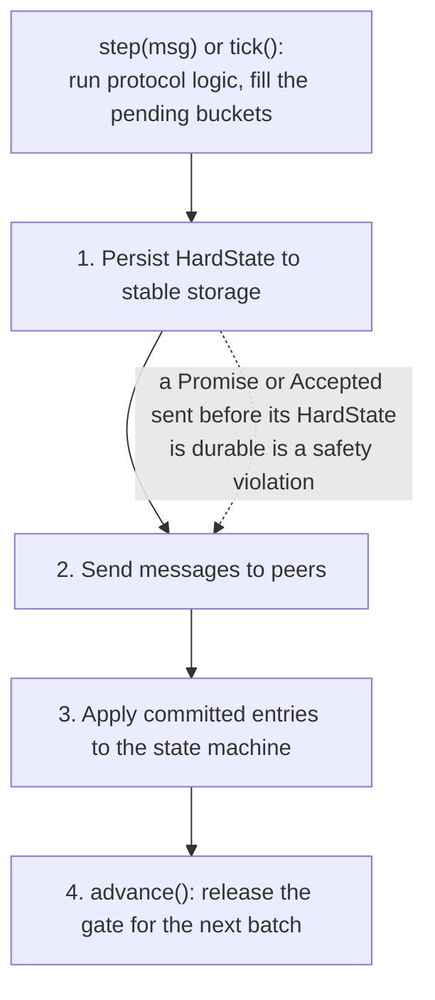
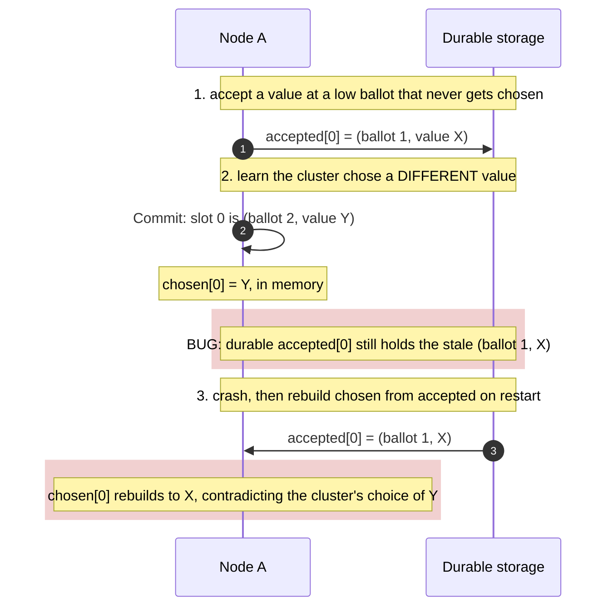
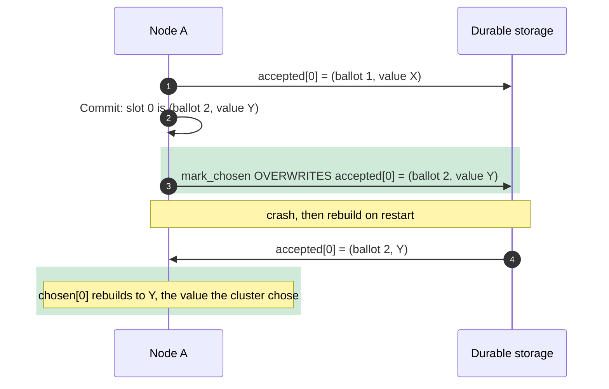

# Crash and restart safety

Paxos assumes nodes crash and come back. That is the whole point: a majority keeps
serving while a minority is down, and a recovered node rejoins. But "come back"
hides a subtle trap. A node's promises and votes are only safe if they **survive**
the crash exactly as they were. Get the durable state slightly wrong and a
restart can quietly un-make a decision the cluster already reached. paros hit this
edge, and the simulation caught it.

<!-- toc -->

## What must be durable, and when

Three things must reach stable storage, and the *order* in which they do is part
of the protocol. paros calls them the `HardState`:

```rust
pub struct HardState {
    pub max_promised_ballot: Ballot,
    pub accepted: BTreeMap<Slot, (Ballot, Entry)>,
    pub chosen_index: Option<Slot>,
}
```

The rule is **persist before send**. An acceptor must write a raised promise to
disk before it replies `Promise`, and write a new accepted value to disk before it
replies `Accepted`. The state lives in the code with the reason attached:

> Sending either reply before the corresponding field is durable violates Paxos
> safety: a crash could "un-promise" or "un-accept", letting two different values
> be chosen for one slot.

[Paxos Made Live](https://15799.courses.cs.cmu.edu/fall2013/static/papers/paxos_made_live.pdf)
states the same hazard from the other side:

> A corrupted disk losing persistent state lets a replica renege on past promises,
> violating a Paxos assumption.

paros enforces the ordering with a type. The `Ready` handshake hands the driver
four steps that must run in sequence, and the borrow checker makes a second batch
a **compile** error until the first is acknowledged:



## The bug: a restart that resurrects a dead value

Persist-before-send is necessary but not sufficient. There is a second, subtler
requirement: the durable state must not just be *written in order*, it must stay
*consistent with what was chosen*. Here is the interleaving that broke paros
(commit `608bb58`):



The node learned that slot 0 was chosen as `Y`, but it still had an old, never
chosen `X` sitting in its durable `accepted` map from a failed earlier ballot. In
memory that did not matter, because the volatile `chosen` map held `Y`. But on
restart, `RawNode::new` rebuilds the volatile state from the durable `accepted`
map (`node.rs`), and there it found `X`. The node came back believing slot 0 was
`X`. Two nodes, two different values for one slot: the exact thing
[Why one value is safe](safety.md) promised could never happen.

## The fix, and why one word matters

The repair is a single word. When a value is chosen, `mark_chosen` records it as
the **authoritative** accepted entry, overwriting any stale one:

```rust
// Record the *chosen* value as the authoritative accepted entry. Using
// `insert` (not `or_insert_with`) is load-bearing: a node may hold a stale
// lower-ballot accept it picked up from a failed earlier ballot, and
// `chosen` is rebuilt from `accepted` on restart. Keeping the stale entry
// would resurrect a value the cluster never chose for this slot. A chosen
// value is durable and safe to record at its choosing ballot.
self.hard_state.accepted.insert(slot, (ballot, entry.clone()));
```

`insert` overwrites; `or_insert_with` would have left the stale `X` in place. With
the overwrite, the durable `accepted` map and the chosen value can never disagree,
so the restart rebuilds the right answer:



## Proven, not asserted

The reason this chapter exists is *how* the bug was found. paros is built
simulation-first: a suspected safety problem is not patched on a hunch, it is
turned into a **failing simulation** first. The harness already had the
`SafetyOracle` watching that "at most one value is ever chosen for a slot." To
reach the bug it needed crash and restart, so the sweep injects
`Chaos::Attrition` (a node crashes and recovers, with `prob_wipe = 0.0` so durable
state survives, exactly modelling a clean restart). Under that chaos the oracle
went red on real seeds. The one-word fix turned it green, and the sweep ran clean
across thousands of seeds. A regression test,
`chosen_value_survives_restart_over_a_stale_accept`, pins it so it can never come
back.

This is the loop the project lives by: make the violation reproducible, watch it
fail, fix the core, watch it pass. A safety bug the simulation cannot reproduce is
treated as unproven. This one was very real, and the simulation is why we know the
fix works.
