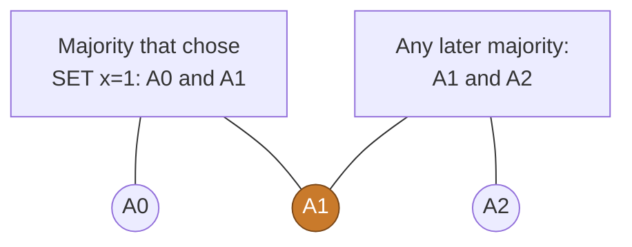
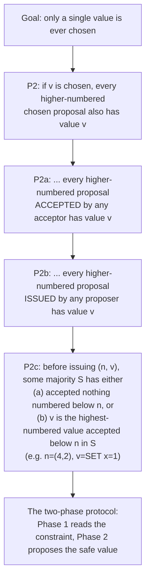

# Why one value is safe

The previous chapter showed *how* a value gets chosen. This one shows *why* the
choice can never be contradicted, even with lost messages, crashed nodes, and
several proposers competing at once. Single-decree Paxos is famous because the
algorithm is not really invented: it is **derived** from the safety properties it
must satisfy. Lamport's [Paxos Made Simple](https://lamport.azurewebsites.net/pubs/paxos-simple.pdf)
walks that derivation, and it is worth following once, because every line of
`paros-core` is a consequence of it.

<!-- toc -->

## The three properties

Consensus must guarantee three things:

> - Only a **proposed** value may be chosen.
> - Only a **single** value is chosen.
> - A process never learns a value as chosen unless it actually has been.

The middle one is the hard one, and everything below is about it.

## Start from majorities

A single acceptor would be enough for agreement, but its crash would freeze the
cluster forever. So Paxos uses several acceptors and declares a value **chosen**
when a **majority** accept it. That one decision carries the whole safety
argument, because:

> any two majorities intersect.

Take three acceptors. The majority that chose `SET x=1` is some set of two. Any later
majority is also a set of two. Two sets of two, drawn from three, must share at
least one acceptor:

That shared acceptor (A1) is the pivot. It saw `SET x=1` get chosen, and it
will be consulted by anyone who tries to choose later. If we can force every
later proposal to respect what that pivot remembers, two different values can
never both be chosen. The rest of the protocol exists to do exactly that.

## The invariant ladder

A value is chosen the moment a majority has accepted it, but no acceptor knows
when that instant arrives (the proposer might still be collecting replies). So we
cannot make a rule that triggers "on chosen". Lamport instead strengthens a
single invariant down a ladder until it becomes a rule a proposer can actually
follow before it acts:

Each step implies the one above it. `P2` is what we want. `P2a` makes it about
*accepted* (not just chosen) proposals, because an acceptor that never heard about
`v` would otherwise happily accept a conflicting value. `P2b` pushes the
constraint onto the *proposer*, since acceptors are passive and cannot be trusted
to police themselves. And `P2c` turns "issued by any proposer" into something
checkable with one round of messages:

> **P2c.** For any `v, n`: if a proposal `(n, v)` is issued, there is a majority
> set `S` of acceptors such that **either** (a) no acceptor in `S` has accepted
> any proposal numbered `< n`, **or** (b) `v` is the value of the
> **highest-numbered proposal `< n` accepted by the acceptors in `S`**.

`P2c` is the value-selection rule from the previous chapter, stated precisely. It
is the whole reason Phase 1 exists.

## How the two phases enforce P2c

A proposer cannot predict what acceptors will do, so it **controls** them with a
promise. That is Phase 1.

1. **Phase 1 (Prepare / Promise).** The proposer picks a ballot `n` and asks a
   majority to promise never to accept anything below `n`, and to report the
   highest-numbered proposal each has already accepted. The promise freezes the
   past: nothing numbered below `n` can be newly accepted by that majority from
   now on. The reports reveal whether `v` is already constrained.
2. **Phase 2 (Accept / Accepted).** With a majority of promises in hand, the
   proposer applies `P2c`: if any acceptor **piggybacked** an accepted value on
   its Promise, it must re-propose the **highest-numbered** one; only if the whole
   majority reported nothing is it free to propose its own value.

The pivot acceptor from the intersection picture is why this works. If `v` was
already chosen, the promise-majority overlaps the choosing-majority, so at least
one acceptor reports `v`, and the proposer is forced to re-propose it. A later
proposer, made to re-propose the same value, can never change the choice. That is
how a value, once chosen, stays chosen forever.

## Recovery, not catch-up

It is tempting to read this rule as a way to help slow acceptors catch up: the
proposer sees "SET x=1", so it spreads "SET x=1" to the others. That intuition is
half right, and the wrong half is the important one.

The literature calls this step **recovery**: a new leader, before it may lead,
recovers any value that might already be committed and re-commits it under its own
ballot. When "SET x=1" really was chosen, re-proposing it does heal acceptors that
missed it, so it looks like catch-up. But the rule **also fires when nothing was
chosen and no acceptor is behind**. If one acceptor accepted "SET x=1" at a low
ballot and it never reached a majority, the proposer must *still* re-propose
"SET x=1", because it cannot tell that world apart from the one where "SET x=1" is
already chosen.

| | Recovery (adopt the highest) | Catch-up (`Commit`, heartbeat resend) |
|---|---|---|
| Trigger | a value *might* be chosen | a value *is* chosen and a node lacks it |
| Runs when nothing was chosen? | yes, it must | no |
| Purpose | safety: never contradict a possible decision | liveness: help slow nodes converge |
| Value carried | the highest-ballot value seen in Phase 1 | the known-committed value |

So recovery repairs an **invariant**, not **data**. It does not heal a stale copy
back to a known-good value; it forces the future to agree with any decision the
past *might* have made, so that "at most one value chosen" can never break. And lag
is not even the hazard: with a perfect network and zero laggards, two proposers
racing at different ballots still need this rule. Catch-up addresses slowness;
recovery addresses concurrency.

> A new ballot inherits the unfinished business of every lower ballot. Phase 1
> reads that unfinished business; "adopt the highest" is the proposer agreeing to
> honor it.

paros's real catch-up mechanisms are separate: the `Commit` broadcast that tells a
learner a value is chosen, and, in Multi-Paxos, the leader resending un-acked
`Accept`s on each heartbeat (see [The stable leader](stable-leader.md)).

## Where this lives in paros

The single-decree safety rules map directly onto the acceptor code:

| Paxos Made Simple | paros |
|---|---|
| highest promised prepare number | `HardState.max_promised_ballot` (`state.rs`) |
| highest accepted proposal | `HardState.accepted: BTreeMap<Slot, (Ballot, Entry)>` |
| promise rule (P1a) | `ballot > max_promised_ballot` in `on_prepare` (`node.rs`) |
| vote rule | `ballot >= max_promised_ballot` in `on_accept` |
| value-selection rule (P2c) | adopt the highest `(ballot, entry)` from the `Promise` replies |
| "inform a rejected proposer" | the explicit `Message::Nack` |
| chosen by a majority | an `Accepted` quorum in `try_decide` |

paros never has to *prove* this safety property by hand. The deterministic
simulation asserts it directly: the `SafetyOracle` checks, on every step of every
seed, that **"at most one value is ever chosen for a slot"** (`paros-sim/src/oracle.rs`).
That is the same property `P2` names, watched live. The
[Watch it live](single-decree.md) page runs that oracle in your tab; the
[crash and restart safety](restart-safety.md) chapter shows it catching a real
bug.
