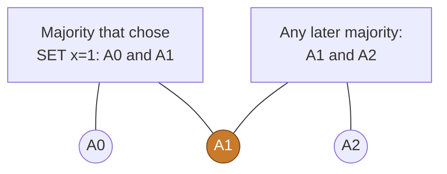
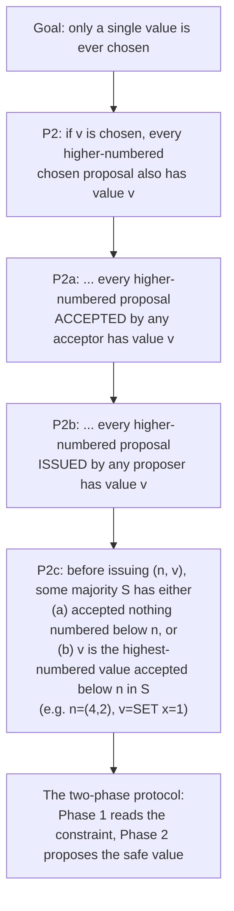

# Why one value is safe

The previous chapter showed *how* a value gets chosen; this one shows *why* the
choice can never be contradicted. Single-decree Paxos is famous because the
algorithm is not really invented — it is **derived** from the safety properties it
must satisfy. Lamport's [Paxos Made Simple](https://lamport.azurewebsites.net/pubs/paxos-simple.pdf)
walks that derivation, and it is worth following once, because every line of
`paros-core` is a consequence of it.

> **Play it.** Three Act I levels put you on the wrong side of this argument.
>
> - [`act1/adopt-the-value`](play/#act1/adopt-the-value) — a second proposer opens a
>   higher ballot after a value was accepted at a lower one, and you pick what goes
>   in its Accept. Picking your own gets the double-choose explanation.
> - [`act1/quorum-intersection`](play/#act1/quorum-intersection) — you pick the
>   Phase-1 and Phase-2 reach sets, and try to choose a value with a Phase-1 quorum
>   that misses the acceptor that voted. Unreachable by construction; the win is the
>   explanation of *why*.
> - [`act1/recovery-is-not-catch-up`](play/#act1/recovery-is-not-catch-up) — one
>   acceptor accepted a value, nothing was chosen, nobody is behind, and you must
>   still adopt it.

<!-- toc -->

## The three properties

Consensus must guarantee three things:

> - Only a **proposed** value may be chosen.
> - Only a **single** value is chosen.
> - A process never learns a value as chosen unless it actually has been.

The middle one is the hard one, and everything below is about it.

## Start from majorities

A single acceptor would be enough for agreement, but its crash would freeze the
cluster forever. So Paxos uses several acceptors and declares a value **chosen**
when a **majority** accept it. That one decision carries the whole safety
argument, because:

> any two majorities intersect.

Take three acceptors. The majority that chose `SET x=1` is a set of two; any later
majority is also a set of two; two sets of two drawn from three must share one:

```mermaid
flowchart TD
    M1["Majority that chose<br/>SET x=1: A0 and A1"]
    M2["Any later majority:<br/>A1 and A2"]
    A0((A0))
    A1((A1)):::shared
    A2((A2))
    M1 --- A0
    M1 --- A1
    M2 --- A1
    M2 --- A2
    classDef shared fill:#c97a2b,stroke:#7a4718,color:#fff
```

That shared acceptor (A1) is the pivot: it saw `SET x=1` get chosen, and it will be
consulted by anyone who tries to choose later. Force every later proposal to respect
what the pivot remembers and two different values can never both be chosen; the rest
of the protocol exists to do exactly that. A majority is only the simplest way to
guarantee the overlap — what safety actually needs is that every *Phase-1* quorum
meets every *Phase-2* quorum, `q1 + q2 > n`, which is why paros asks that question
through one boundary, `QuorumSystem` (`crates/paros-core/src/membership.rs`), and can
answer it with flexible or grid quorums instead.

## The invariant ladder

A value is chosen the moment a majority has accepted it, but no acceptor knows when
that instant arrives (the proposer might still be collecting replies), so no rule can
trigger "on chosen". Lamport instead strengthens a single invariant down a ladder
until it becomes a rule a proposer can follow *before* it acts:

```mermaid
flowchart TD
    SAFE["Goal: only a single value is ever chosen"]
    P2["P2: if v is chosen, every higher-numbered<br/>chosen proposal also has value v"]
    P2A["P2a: ... every higher-numbered proposal<br/>ACCEPTED by any acceptor has value v"]
    P2B["P2b: ... every higher-numbered proposal<br/>ISSUED by any proposer has value v"]
    P2C["P2c: before issuing (n, v), some majority S has either<br/>(a) accepted nothing numbered below n, or<br/>(b) v is the highest-numbered value accepted below n in S<br/>(e.g. n=(4,2), v=SET x=1)"]
    PROTO["The two-phase protocol:<br/>Phase 1 reads the constraint, Phase 2 proposes the safe value"]
    SAFE --> P2 --> P2A --> P2B --> P2C --> PROTO
```

Each step implies the one above it. `P2` is what we want. `P2a` makes it about
*accepted* (not just chosen) proposals, because an acceptor that never heard about `v`
would otherwise happily accept a conflicting value. `P2b` pushes the constraint onto the
*proposer*, since acceptors are passive and cannot police themselves. And `P2c` turns
"issued by any proposer" into something checkable with one round of messages:

> **P2c.** For any `v, n`: if a proposal `(n, v)` is issued, there is a majority
> set `S` of acceptors such that **either** (a) no acceptor in `S` has accepted
> any proposal numbered `< n`, **or** (b) `v` is the value of the
> **highest-numbered proposal `< n` accepted by the acceptors in `S`**.

The two phases are how a proposer satisfies it: Phase 1's promise freezes the past and
its reports reveal whether `v` is constrained, and Phase 2 re-proposes the
highest-numbered value any Promise piggybacked. The pivot is why that suffices — if `v`
was already chosen, the promise majority overlaps the choosing majority, so some Promise
reports `v` and the proposer is *forced* to re-propose it.

## Recovery, not catch-up

It is tempting to read this rule as helping slow acceptors catch up: the proposer sees
"SET x=1", so it spreads "SET x=1" to the others. That intuition is half right, and
the wrong half matters. The literature calls the step **recovery**: a new leader, before
it may lead, re-commits any value that *might* already be committed under its own
ballot. When the value really was chosen, re-proposing it does heal acceptors that
missed it — but the rule **also fires when nothing was chosen and no acceptor is
behind**, because the proposer cannot tell those two worlds apart.

| | Recovery (adopt the highest) | Catch-up (`Commit`, heartbeat resend) |
|---|---|---|
| Trigger | a value *might* be chosen | a value *is* chosen and a node lacks it |
| Runs when nothing was chosen? | yes, it must | no |
| Purpose | safety: never contradict a possible decision | liveness: help slow nodes converge |
| Value carried | the highest-ballot value seen in Phase 1 | the known-committed value |

So recovery repairs an **invariant**, not **data**, and lag is not even the hazard:
with a perfect network and zero laggards, two proposers racing at different ballots
still need the rule. Catch-up addresses slowness; recovery addresses concurrency.
paros's real catch-up mechanisms are separate — the `Commit` broadcast and, in
Multi-Paxos, the leader's heartbeat resend of un-acked `Accept`s.

> A new ballot inherits the unfinished business of every lower ballot. Phase 1
> reads that unfinished business; "adopt the highest" is the proposer agreeing to
> honor it.

## Where this lives in paros

| Paxos Made Simple | paros |
|---|---|
| highest promised prepare number | `Acceptor::promised`, durable as `HardState.max_promised_ballot` (`state.rs`) |
| highest accepted proposal | `Acceptor::records`, a `Slot -> (Ballot, Command)` map persisted per record via `AcceptorWrite::AppendAccepted` (`write.rs`) |
| promise rule (P1a) | `ballot > promised` in `Acceptor::prepare` (`acceptor.rs`) |
| vote rule | `ballot >= promised` in `Acceptor::admit` |
| value-selection rule (P2c) | the highest `(ballot, value)` over the promise quorum, merged by `Election::close_phase1` (`proposer/election.rs`) |
| "inform a rejected proposer" | the explicit `Message::Nack` (`message.rs`) |
| chosen by a majority | a Phase-2 quorum in `try_decide` (`node/decide_apply.rs`), judged by `AcceptorConfig::has_phase2_quorum` (`membership.rs`) |
| any two quorums intersect | `QuorumSystem::cross_intersects` — `q1 + q2 > n` (`membership.rs`) |

paros never proves this property by hand. The deterministic simulation asserts it on
every transition of every seed — **"at most one value is ever chosen for a slot"**,
the property `P2` names, beside **"a durable accept quorum never decides two values
for a slot"**, the same claim read off the disks rather than off the decisions
(`crates/paros-sim/src/audit/`). The [crash and restart
safety](restart-safety.md) chapter shows it catching a real bug.
