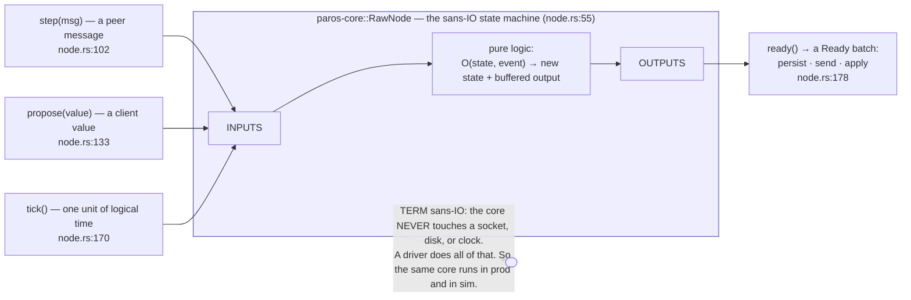
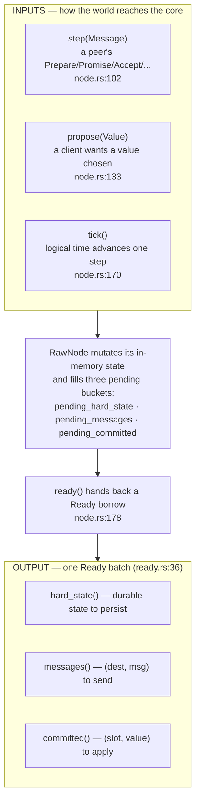
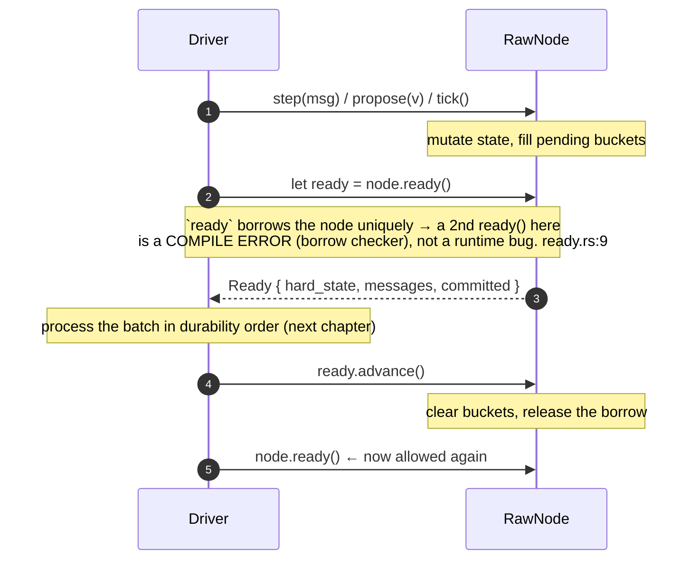
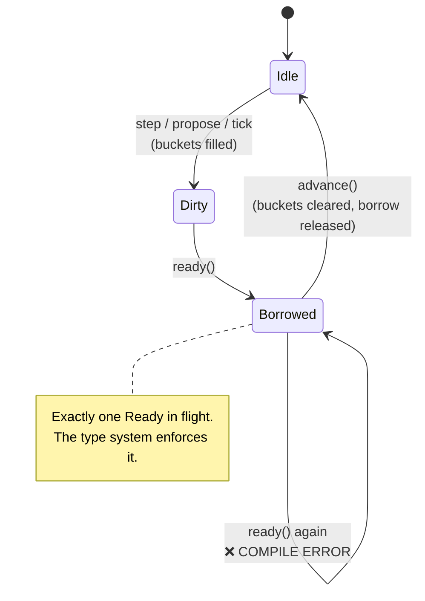
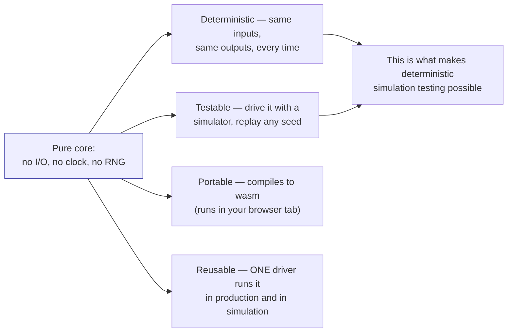

# The sans-IO contract

Most consensus bugs are not in the algorithm — they are in the *plumbing* around
it: a reply sent before its state was on disk, a timer that fired at the wrong
moment, a test that passes because it never reproduces the real schedule. paros's
answer is **sans-IO**: the protocol lives in a pure state machine that does **no
I/O, has no clock, and no randomness**. It only transforms inputs into outputs.

## Three inputs, one output

Everything that can happen to a node enters through three methods, and everything
the node wants done leaves through one:

> **TERM — `Ready`.** A `Ready` is one batch of side effects the driver must
> perform. **TERM — `advance()`.** Calling `advance()` acknowledges the batch,
> clears the buckets, and unlocks the next `ready()`.

## The ready / advance handshake — a compile-time gate

The trick that makes this safe: `ready()` returns a value that **holds the node's
unique `&mut` borrow**. You cannot call `ready()` again until you consume the first
one with `advance()`. A second `ready()` before `advance()` is a **compile error**
— not a runtime panic. (etcd-raft, the inspiration, only panics at runtime;
`paros-core/src/ready.rs:9` documents the difference.)

## Why this shape

The model is etcd-raft's `RawNode`/`Node` split, studied in
`docs/analysis/go-raft/etcd-raft-sans-io-patterns.md`. `RawNode` is the sans-IO
object here; the next chapters cover the durability rule the driver must honour,
and the single driver that wraps the core for both production and simulation.

Next: [persist-before-send](durability.md) — the one ordering rule that keeps
Paxos safe across crashes.
