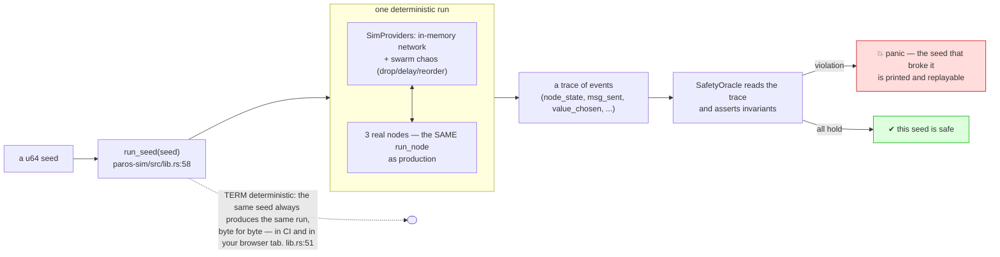
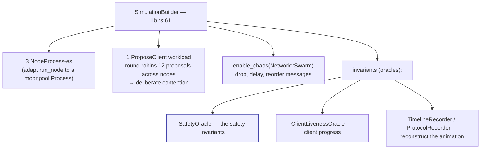
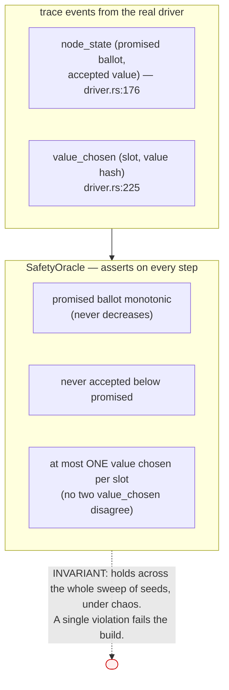
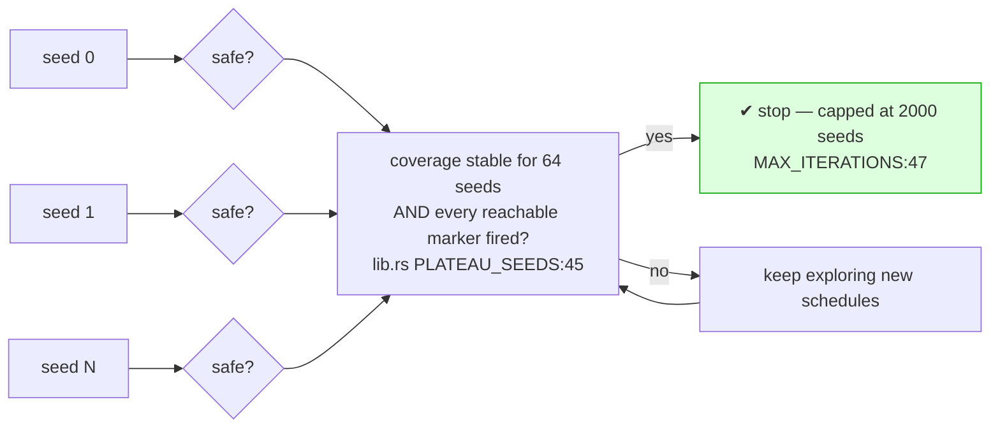
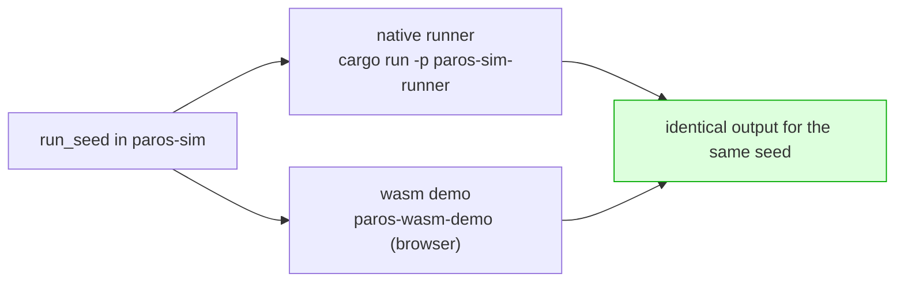

# Deterministic simulation and the safety oracle

How do you trust a consensus implementation? You cannot prove it correct by running
it on a calm network a few times — the bugs live in the unlucky schedules: the
drop, the reorder, the crash at the worst instant. paros's answer is **deterministic
simulation testing** (DST): run the real code against a *simulated* network whose
every event is driven by a seed, and assert the safety invariants on **every step
of every seed**.

## The harness, wired once

The cluster, the workload, the chaos, and the oracles are assembled once in
`run_seed` (`paros-sim/src/lib.rs:58`) and reused by the native runner *and* the
wasm demo.

> **TERM — oracle.** An *oracle* is an observer that reads the run's event trace and
> asserts a property. **TERM — invariant.** A property that must hold on every step
> (`assert_always`), as opposed to one that must merely be *possible*
> (`assert_sometimes` / `assert_reachable`, used to prove the test actually exercises
> interesting states). See `paros-sim/src/oracle.rs:11`.

## What the safety oracle checks

The oracle consumes the same `EV_NODE_STATE` / `EV_CHOSEN` events the driver emits
at its durability boundary (`paros/src/driver.rs:176`, `:225`) and turns the
[four safety invariants](single-decree.md) into runtime assertions.

## From one seed to confidence: the sweep

One seed is one schedule. Confidence comes from sweeping many, and from *knowing
when to stop*: `explore()` runs until coverage plateaus and every `sometimes`/
`reachable` marker has fired (`paros-sim/src/lib.rs:89`).

## The same run, in your browser

Because the core and harness are wasm-safe, `run_seed` compiles to WebAssembly and
runs entirely in a browser tab — the [browser demo](wasm.md) is the *exact* same
simulation CI runs. Append `?dump` to any demo URL to see the raw JSON
`run_seed(seed)` returns; it matches the native runner byte for byte.

Next: see it run — [the browser demo](wasm.md).
