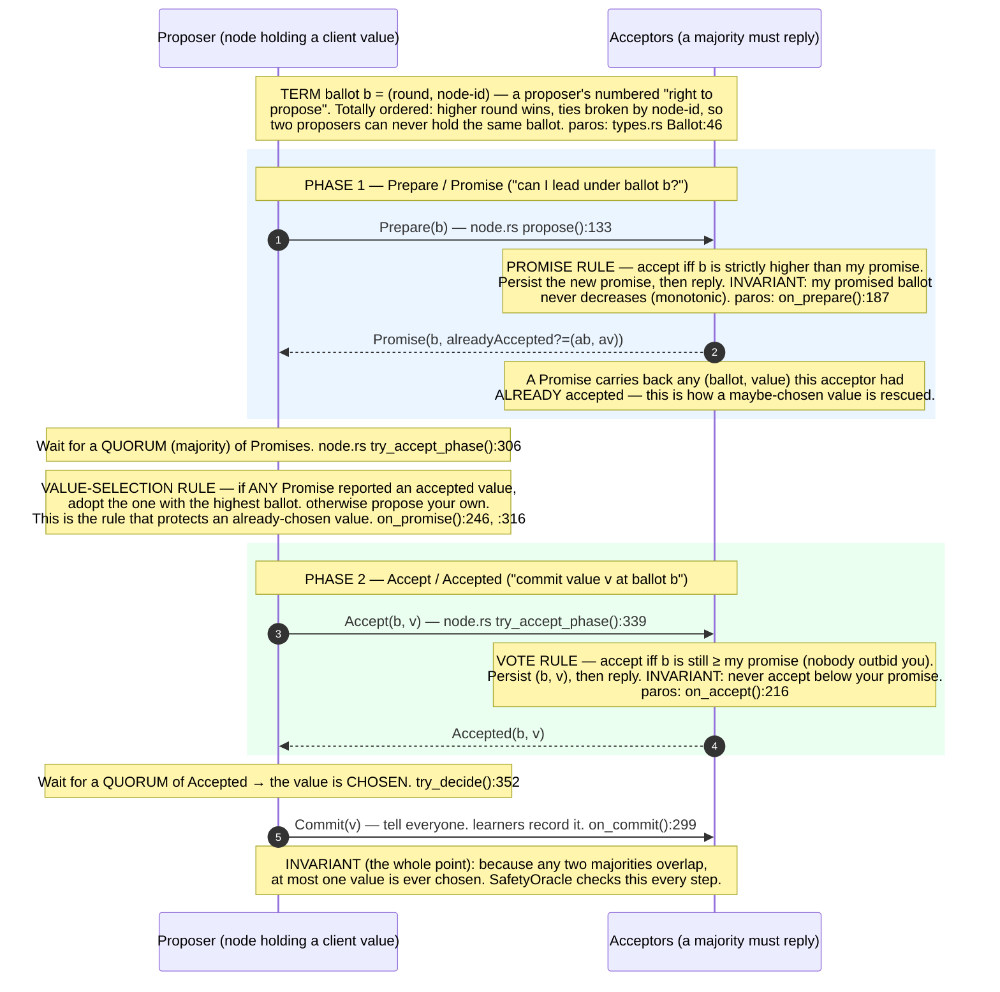
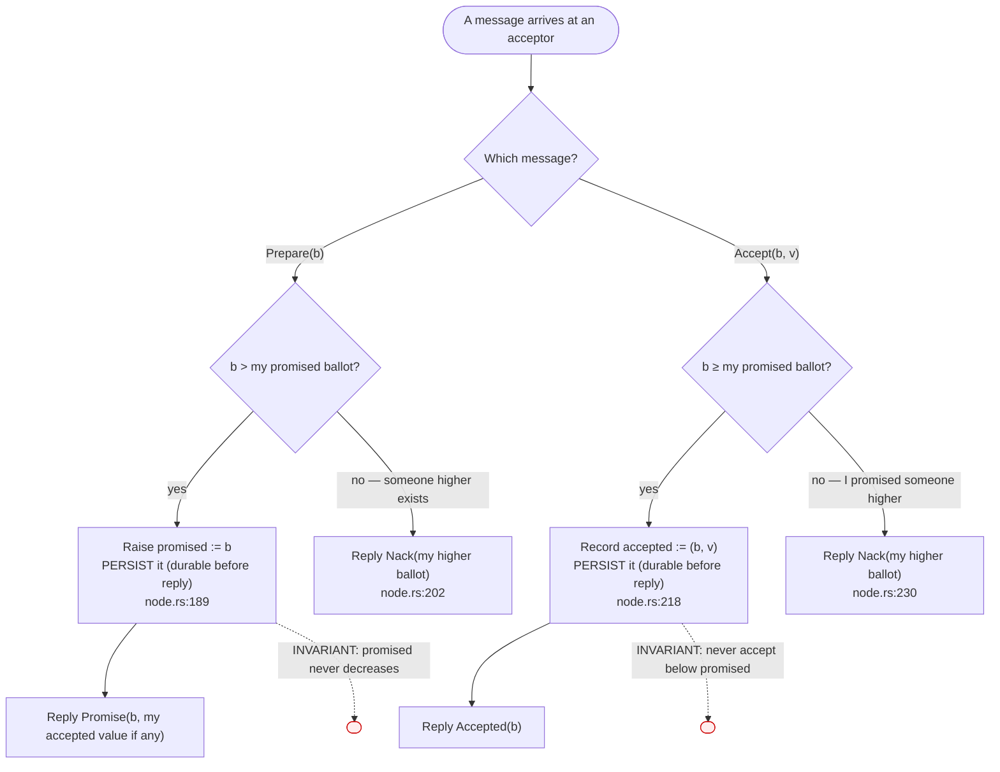
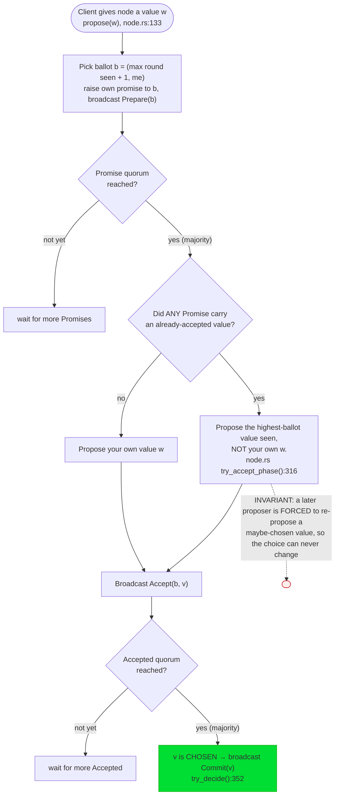
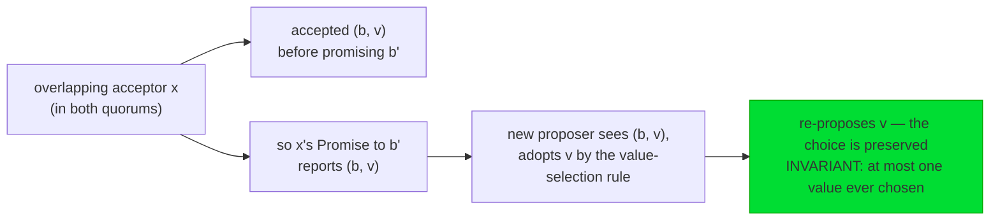
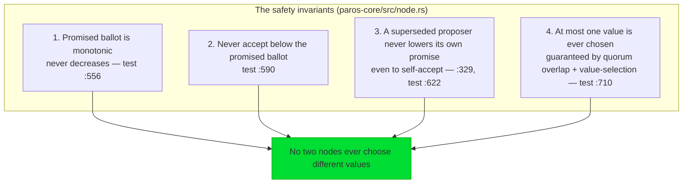

# Single-decree Paxos: the Synod

Single-decree Paxos (Lamport's *Synod*) answers the smallest possible consensus
question: **how does a cluster agree on one value, once, and never disagree?**
Everything else — the replicated log, leaders, reconfiguration — is built on top of
this kernel. paros implements it in `paros-core/src/node.rs`.

The entire algorithm is two round trips. Read this diagram slowly; every term and
every safety rule is annotated where it happens.

## The acceptor: three fields, two rules

An acceptor is the guardian of safety. Its entire durable state is the
[`HardState`](glossary.md) (`paros-core/src/state.rs`): the highest ballot it has
**promised**, and the `(ballot, value)` it has **accepted**. Its behaviour is two
decisions:

> **TERM — promise.** A Promise is a commitment: *"I will not accept anything with
> a ballot lower than `b`."* It does not choose a value; it just locks out stale
> proposers. **TERM — Nack.** A rejection that reports the higher ballot the
> acceptor has already promised, so the loser knows it was outbid. (Stage 2 simply
> abandons the round on a Nack — `on_nack():289`; automatic retry is Stage 3.)

## The proposer: why two phases, and the value-selection rule

Phase 1 is reconnaissance: *grab the ballot and discover any value that might
already be chosen.* Phase 2 is the commit. The subtle, safety-critical step is
**value selection** between them.

### Why value-selection makes Paxos safe (the intuition)

Suppose value `v` was chosen at ballot `b`: a majority `Q` accepted `(b, v)`. Now a
new proposer comes along at a higher ballot `b' > b`. Its Phase-1 quorum `Q'` is
also a majority, so **`Q` and `Q'` overlap** in at least one acceptor `x`. Two
things are true of `x`:

This is exactly the scenario the test `value_selection_adopts_previously_accepted_value`
(`paros-core/src/node.rs:710`) pins down, and what demo **seed 19** animates in
[How Paxos chooses one value](choose-one-value.md).

## The four safety invariants paros guarantees

These are *unconditional* — they hold under any crashes, drops, delays, and
contention, and the `SafetyOracle` asserts them on every step of every simulated
seed.

Next: watch all of this run live in [How Paxos chooses one value](choose-one-value.md),
then see [what happens when things fail](failures.md).
