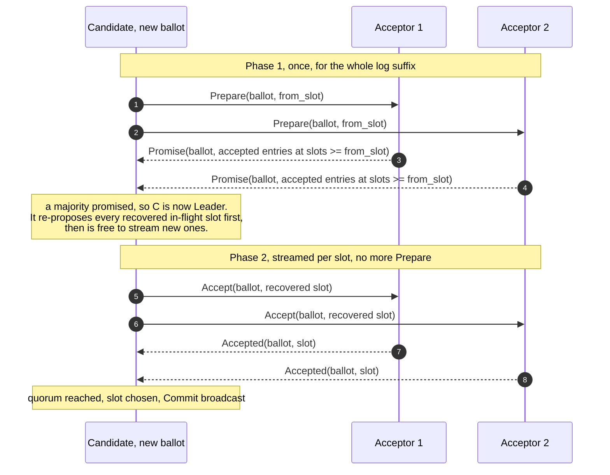
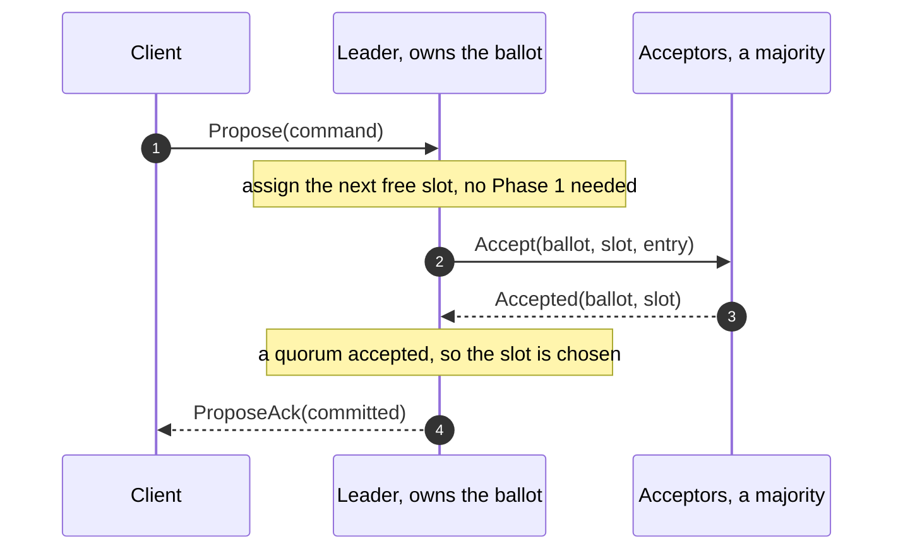
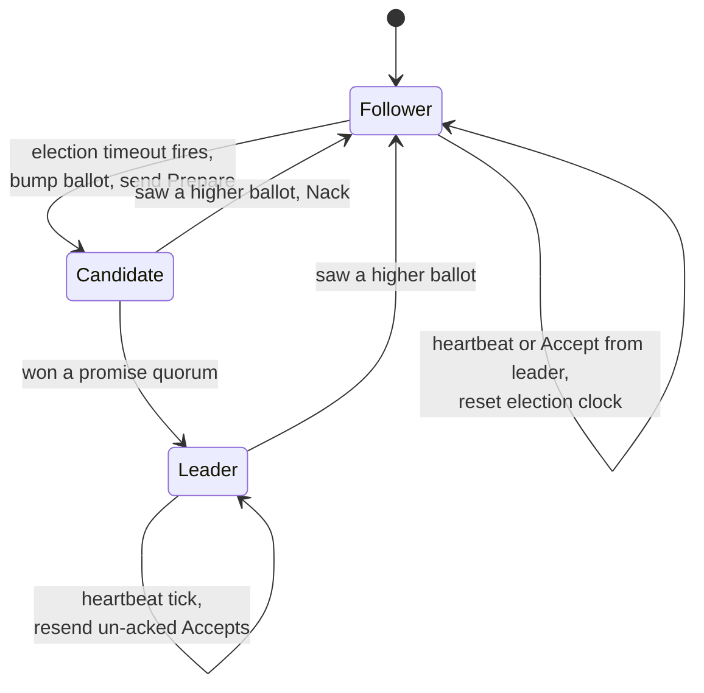

# The stable leader

A log of independent Paxos instances is correct, but naive. If every slot ran its
own Phase 1 and Phase 2, every command would cost two round trips, and competing
proposers would collide on every slot. Multi-Paxos becomes efficient by
electing **one stable leader** that runs Phase 1 a single time and then streams
nothing but Phase 2 for as long as it stays up. This chapter is about that
optimization and the liveness machinery that keeps a single leader in charge.

<!-- toc -->

## Phase 1 once, Phase 2 forever

The key observation: Phase 1 does not mention a value. A Prepare only claims a
ballot and asks what has been accepted. So a proposer can claim a ballot for the
**entire rest of the log** in one message. Lamport describes a new leader doing
exactly this:

> It runs phase 1 for instances 135 to 137 and all instances `> 139` using one
> proposal number, a single short message.

[Paxos Made Live](https://15799.courses.cs.cmu.edu/fall2013/static/papers/paxos_made_live.pdf)
(Google's Chubby experience) names the steady-state win:

> if the coordinator doesn't change between instances, propose messages can be
> omitted. Pick a long-lived coordinator, the **master**.

paros implements this literally. Its `Prepare` carries a `from_slot`, and a single
Prepare covers every slot at or after it:

```rust
Prepare {
    from: NodeId,
    ballot: Ballot,
    from_slot: Slot,   // covers every slot >= from_slot
}
```

The matching `Promise` reports **all** entries the acceptor has accepted in that
suffix, so one exchange tells the new leader everything in flight across the whole
log.

## Becoming leader, and filling the gaps

A node that times out waiting for a leader becomes a `Candidate`, bumps its
ballot, and sends that one Prepare (`on_check_leader` in `node.rs`). When a
majority of Promises arrive it becomes `Leader` (`try_become_leader`). But before
it may stream new commands, it has a duty: the previous leader may have left slots
half-decided, and the value-selection rule (P2c, from
[Why one value is safe](safety.md)) says those must be re-proposed at the new
ballot, not overwritten. The Promises piggybacked exactly the values needed; paros
collects them in the `Election.recovered` map and re-proposes each one through
`start_accept_round` before opening fresh slots.



This is Paxos Made Moderately Complex's scout-then-commander pattern, with the scout
(Phase 1) and commander (Phase 2) folded into the node's own `Candidate` and
`Leader` roles.

## Steady state: two messages per command

Once a node is the stable leader, a client command is cheap. There is no Phase 1:
the leader assigns the next free slot and goes straight to Accept.



One round trip to a majority per command. Lamport notes this is not just fast but
**optimal**: "Phase 2 of Paxos has been shown to have the minimum possible cost of
any fault-tolerant agreement algorithm."

## Holding the lead, and surviving its loss

A leader keeps its position by heartbeating. paros's `Heartbeat` carries the
leader's ballot and its commit index. Receiving it resets a follower's election
clock, and the leader uses its own heartbeat tick to **resend any un-acked
Accepts** so a lagging follower catches up:

```rust
Heartbeat {
    from: NodeId,
    ballot: Ballot,
    commit: Slot,   // the leader's highest contiguous chosen slot
}
```

The commit index on each beat is itself a piggyback: it is attached to a message
the leader already sends, so followers advance their chosen prefix at no extra
cost, and a
follower that fell behind relearns a value it missed when the leader resends the
`Accept`, or when the next election piggybacks it on a `Promise`. That is paros's
catch-up today; there is no dedicated state-transfer RPC yet.

When the leader dies, its heartbeats stop, a follower's election timeout fires,
and the cycle repeats with a higher ballot. The whole life of a node is three
roles:



## Liveness: curing the duel without touching safety

The previous part showed that two proposers can livelock, each preempting the
other forever. Safety never bends during a duel, but progress stalls. The cure is
to stop two nodes from campaigning at the same time, and it lives in the driver,
not the safety core.

Two pieces do it. First, a rejected leader does **not** immediately retry. When an
`Accept` is nacked, paros steps the node down to `Follower` and waits
(`on_nack` / `become_follower`); the in-code comment says plainly that "we do not
immediately re-prepare: that, with the randomized timeout, is the dueling-proposer
livelock fix." Second, the election timeout is **randomized**: the driver draws a
fresh jittered timeout (`draw_election_timeout`) so two followers rarely time out
together. With high probability one node campaigns first, wins its promise quorum,
and the rest fall back to following it. (Classic single-decree Paxos cures the same
duel with exponential backoff on the proposer; paros's randomized election timeout
is the Multi-Paxos equivalent of that idea.)

This is exactly the separation Lamport insists on: leader election is needed only
for **progress**, never for safety. By the FLP result, no purely asynchronous
algorithm can guarantee a leader is elected, which is why the cure uses real time
(timeouts) and randomness. The `LeadershipOracle` and `ProgressOracle` in
`paros-sim` watch that the cluster does in fact make progress (a stable leader
streams several slots, and leadership turns over and recovers) without ever
violating the `SafetyOracle`.

## Optimizations at a glance

Multi-Paxos in practice is the bare protocol plus a set of optimizations. Most of
them are about doing less work in the steady state, and several are just careful
uses of piggybacking. Here is the list, and where paros stands:

| Optimization | What it buys | In paros |
|---|---|---|
| Stable leader (master) | run Phase 1 once, then one round trip per command | yes, the `Leader` role |
| Phase-1 batching | a single `Prepare` claims the whole log suffix | yes, via `from_slot` |
| Piggybacking | ride data on messages already in flight (accepted values on `Promise`, commit index on `Heartbeat`) | yes |
| Pipelining | propose slot `i+1` before slot `i` is chosen | yes, the leader streams `Accept`s |
| Randomized backoff | jittered election timeout plus step-down on `Nack`, to break the proposer duel | yes, `draw_election_timeout` |
| Catch-up | a lagging node relearns missed values by resend and piggyback | partial: heartbeat resend and election recovery, no snapshot transfer yet |
| No-op gap fill | fill a hole with a no-op so the log can advance past a dead leader | not yet: paros re-proposes recovered in-flight slots instead |
| Command batching | pack many client commands into one slot | not yet |
| Leader leases | serve linearizable reads locally for a lease period | not yet |
| Snapshots and truncation | snapshot the state, discard the applied log prefix | not yet |

The "not yet" rows are the roadmap past this part: they are what turns a correct
log into a system you can run for months without the disk filling up.

With a stable leader streaming a log, one question remains: what happens when a
node crashes mid-stream and comes back? That is [Crash and restart
safety](restart-safety.md).
