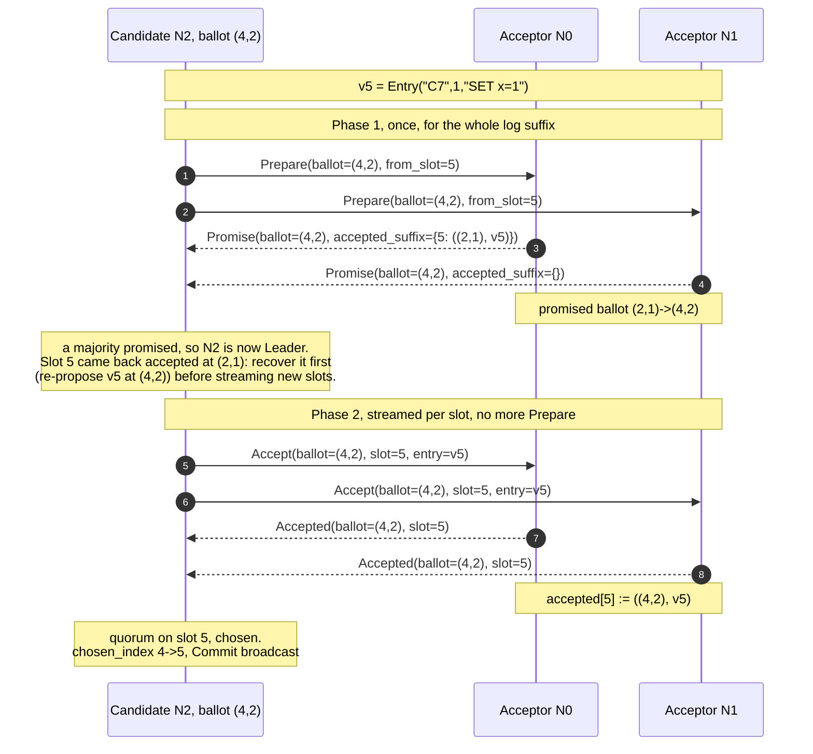
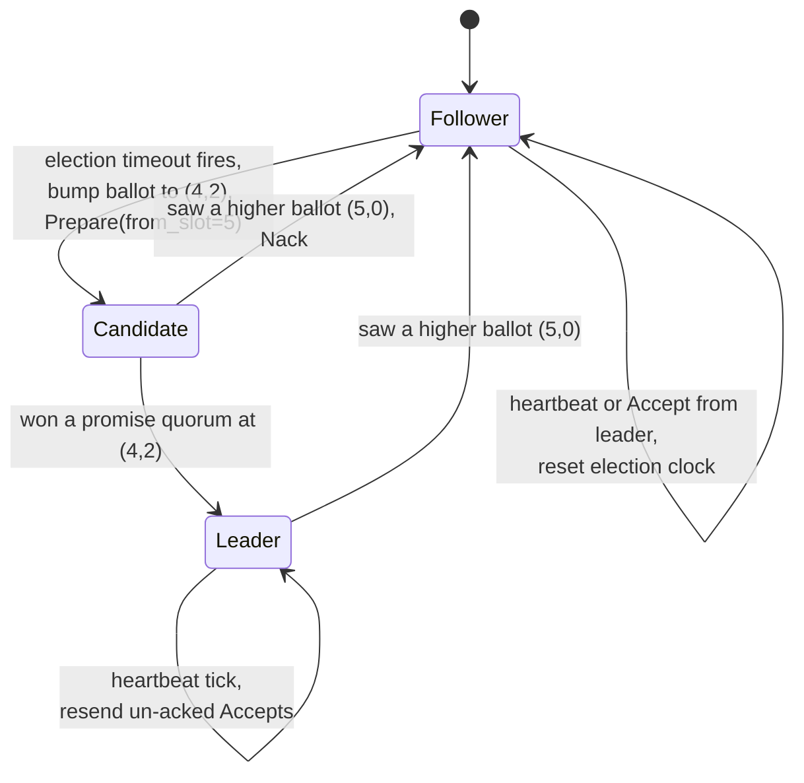

# The stable leader

The log built in the [previous chapter](replicated-log.md) is correct and
unaffordable. Every slot is an independent Paxos instance, so every command pays
Phase 1 *and* Phase 2 — two round trips to a majority — and any node may propose
into any slot, so proposers collide over and over, each preempting the other's
ballot.

Both problems have one cure: elect a single **leader**, let it run Phase 1 once
for the whole rest of the log, and then let it stream nothing but Phase 2 for as
long as it stays up. This chapter is that optimization and its bill. The
optimization is cheap and easy. The bill comes due at **handover**: a new leader
inherits whatever the old one left half-finished, and most of this chapter is
about paying that debt correctly.

<!-- toc -->

## Phase 1 once, Phase 2 forever

The observation that makes a leader possible: **Phase 1 never mentions a value.**
A `Prepare` claims a ballot and asks what has been accepted; it commits the
proposer to nothing. So a proposer can claim a ballot for the entire rest of the
log in a single message. Lamport describes a new leader doing exactly this:

> It runs phase 1 for instances 135 to 137 and all instances `> 139` using one
> proposal number, a single short message.

[Paxos Made Live](https://15799.courses.cs.cmu.edu/fall2013/static/papers/paxos_made_live.pdf)
(Google's Chubby experience) names the steady-state win:

> if the coordinator doesn't change between instances, propose messages can be
> omitted. Pick a long-lived coordinator, the **master**.

paros implements this literally. Its `Prepare` carries a `from_slot`, and one
`Prepare` covers every slot at or after it:

```rust
Prepare {
    from: NodeId,
    ballot: Ballot,
    from_slot: Slot,   // covers every slot >= from_slot
}
```

The matching `Promise` reports **all** entries the acceptor has accepted in that
suffix, so a single exchange tells the new leader everything that was in flight
across the whole log.

## Steady state: one round trip per command

Once a node is the stable leader, a client command is cheap. There is no Phase 1
to run: the leader assigns the next free slot and goes straight to `Accept`. One
round trip to a majority, and the slot is chosen.

It does not even wait for one slot before starting the next. The leader
**pipelines**: it fires the `Accept` for slot 7 while slot 6 is still out, so
several values are in flight at once and `chosen_index` — the highest *contiguous*
chosen slot from the previous chapter — walks forward as quorums land. Remember
this; the hardest bug in this chapter is a direct consequence of it.

```mermaid
sequenceDiagram
    autonumber
    participant Cl as Client C7
    participant N0 as Node 0
    participant N1 as Node 1
    participant N2 as Node 2, leader at ballot (4,2)

    Note over N0,N2: v6 = Entry("C7",2,"SET y=2"), v7 = Entry("C7",3,"SET z=3")
    Note over Cl,N2: Phase 2 only, streamed per slot, no Prepare ever again
    Cl->>N2: Propose(v6)
    N2->>N0: Accept(ballot=(4,2), slot=6, entry=v6)
    N2->>N1: Accept(ballot=(4,2), slot=6, entry=v6)
    Cl->>N2: Propose(v7)
    Note over N2: slot 6 is still out; pipeline slot 7 anyway
    N2->>N0: Accept(ballot=(4,2), slot=7, entry=v7)
    N2->>N1: Accept(ballot=(4,2), slot=7, entry=v7)
    N0-->>N2: Accepted(ballot=(4,2), slot=6)
    N1-->>N2: Accepted(ballot=(4,2), slot=6)
    Note over N2: slot 6 chosen. chosen_index 5->6
    N2-->>Cl: ProposeAck(slot 6 committed)
    N0-->>N2: Accepted(ballot=(4,2), slot=7)
    N1-->>N2: Accepted(ballot=(4,2), slot=7)
    Note over N2: slot 7 chosen. chosen_index 6->7
    N2-->>Cl: ProposeAck(slot 7 committed)

    Note over N0,N2: Heartbeat, carrying the commit index so followers advance
    N2->>N0: Heartbeat(ballot=(4,2), commit=7)
    N2->>N1: Heartbeat(ballot=(4,2), commit=7)
    Note over N0,N1: followers apply the prefix [..., SET y=2, SET z=3]
```

Lamport notes that one round trip is not merely fast but **optimal**: "Phase 2 of
Paxos has been shown to have the minimum possible cost of any fault-tolerant
agreement algorithm." Everything else in this chapter is the price of getting into
that state and staying there.

## Taking over: what a new leader owes the old one

A node that stops hearing from a leader becomes a `Candidate`, bumps its ballot,
and sends that one `Prepare` (`on_check_leader` in `node.rs`). When a majority of
Promises arrive it becomes `Leader` (`try_become_leader`).

It may not start streaming yet. The old leader may have left slots half-decided,
and the value-selection rule — P2c, from [Why one value is safe](safety.md) — says
those must be **re-proposed at the new ballot, never overwritten**. The Promises
piggybacked exactly the values needed: paros collects them into the election's
`recovered` map and re-proposes each through `start_accept_round` before opening a
fresh slot.


```mermaid
sequenceDiagram
    autonumber
    participant C as Candidate N2, ballot (4,2)
    participant A0 as Acceptor N0
    participant A1 as Acceptor N1
    Note over C,A1: v5 = Entry("C7",1,"SET x=1")
    Note over C,A1: Phase 1, once, for the whole log suffix
    C->>A0: Prepare(ballot=(4,2), from_slot=5)
    C->>A1: Prepare(ballot=(4,2), from_slot=5)
    A0-->>C: Promise(ballot=(4,2), accepted_suffix={5: ((2,1), v5)})
    A1-->>C: Promise(ballot=(4,2), accepted_suffix={})
    Note over A0,A1: promised ballot (2,1)->(4,2)
    Note over C: a majority promised, so N2 is now Leader.<br/>Slot 5 came back accepted at (2,1): recover it first<br/>(re-propose v5 at (4,2)) before streaming new slots.
    Note over C,A1: Phase 2, streamed per slot, no more Prepare
    C->>A0: Accept(ballot=(4,2), slot=5, entry=v5)
    C->>A1: Accept(ballot=(4,2), slot=5, entry=v5)
    A0-->>C: Accepted(ballot=(4,2), slot=5)
    A1-->>C: Accepted(ballot=(4,2), slot=5)
    Note over A0,A1: accepted[5] := ((4,2), v5)
    Note over C: quorum on slot 5, chosen.<br/>chosen_index 4->5, Commit broadcast
```

This is Paxos Made Moderately Complex's scout-then-commander pattern, with the
scout (Phase 1) and the commander (Phase 2) folded into the node's own `Candidate`
and `Leader` roles.

## The slots the Promises say nothing about

Recovering what the Promises *reported* is only half the debt, and the other half
is easy to miss, because it is a debt made of **silence**.

Pipelining is what creates it. The old leader had several `Accept`s in flight at
once, so a slot can reach the old leader **alone** while a *later* slot reaches
enough acceptors to be chosen. Now hold an election whose promise quorum excludes
the old leader — which is the usual case, since the old leader crashing is why
there is an election. The earlier slot appears in **no Promise at all**. It is not
chosen, so it is not in the chosen prefix; it was never reported, so it is not in
`recovered`; and `next_slot`, computed as one past the highest slot the quorum did
report, steps straight over it.

Nothing would ever propose that slot again. `propose` only ever hands out
`next_slot`, and a restart recomputes `next_slot` the same way, so the hole
outlives reboots. And a hole is not a local blemish. Because the chosen prefix
advances only contiguously, it stops one below that slot **on every node,
permanently**: higher slots keep getting chosen and never apply, catch-up has
nothing to offer because every node is frozen at the same place, and (as
[Why reads are not free](linearizable-reads.md) will show) reads are fenced above
the hole and stop confirming. One silent slot wedges the cluster forever.

```mermaid
sequenceDiagram
    autonumber
    participant N0 as Node 0, old leader
    participant N1 as Node 1
    participant N2 as Node 2
    Note over N0,N2: chosen_index = 0 everywhere; N0 pipelines slots 1 and 2
    rect rgba(200, 70, 70, 0.25)
        N0->>N1: Accept(slot=1, v1)
        N0->>N2: Accept(slot=1, v1)
        Note over N1,N2: both lost — slot 1 is accepted on N0 only
        N0->>N1: Accept(slot=2, v2)
        N1-->>N0: Accepted(slot=2)
        Note over N0: quorum {N0,N1} on slot 2: chosen
        N0->>N1: Commit(slot=2, v2)
        N0->>N2: Commit(slot=2, v2)
        Note over N0: N0 crashes, losing the volatile proposer map<br/>that was re-sending slot 1
    end
    Note over N1,N2: Election, ballot (2,1), from_slot=1
    N1->>N2: Prepare(ballot=(2,1), from_slot=1)
    N2-->>N1: Promise(accepted_suffix={2: v2})
    Note over N1: recovered = {2}, next_slot = 3.<br/>Slot 1 is in neither chosen nor recovered.
    rect rgba(70, 170, 110, 0.25)
        Note over N1: Gap fill: slot 1 is in first_unchosen()..next_slot<br/>and no Promise reported it, so it is free.
        N1->>N2: Accept(ballot=(2,1), slot=1, Control::Noop)
        N2-->>N1: Accepted(slot=1)
        Note over N1: chosen_index 0 -> 2, the prefix walks past the hole
    end
```

So a new leader has **two** duties, not one: re-propose every slot the quorum
reported, and fill every silent slot in `first_unchosen()..next_slot` with a
`Control::Noop`.

Filling is safe for exactly the reason Phase 1 exists. Any value already chosen at
that slot was accepted by a quorum; that quorum intersects this promise quorum; so
at least one Promise would have carried it. (An acceptor that has truncated the
range answers `Nack` rather than a Promise that under-reports — see
[Truncation and snapshot restore](truncation-and-snapshots.md).) The Promises
carried nothing, so nothing is chosen there, and the slot is genuinely free. The
no-op is an entry like any other — persisted, replicated, truncatable — that
carries no `(client, seq)` and does nothing at apply time except let the prefix
advance.

Note what the crash in the diagram is actually for. A leader re-sends the
`Accept`s for its still-pending slots on every heartbeat, so a slot that merely
lost a few messages is not lost at all: the retry lands and it decides. The hole
needs the leader to **forget**. The `proposer` map is volatile, so a crash or a
step-down drops it, and slot 1 stops being re-sent by anyone.

The core exposes the failure through `RawNode::chosen_gap`, because it is
otherwise invisible from outside: the `Ready` handshake only ever hands the driver
the *contiguous* prefix, so a chosen slot stranded above a hole never surfaces. The
driver reports it every tick through `Audit::chosen_gap`, and the simulation's
audit asserts that **"a quiesced cluster holds no chosen slot above its applied
prefix (an election left an undecided hole)"**. The distinction it draws is the
important one: a gap during chaos is ordinary, and is what pipelining looks like; a
gap that survives quiescence is the wedge.

## Holding the lead, and losing it

A leader keeps its position by heartbeating. paros's `Heartbeat` carries the
leader's ballot, its commit index, and a beat sequence number:

```rust
Heartbeat {
    from: NodeId,
    ballot: Ballot,
    commit: Option<Slot>,   // highest contiguous chosen slot, `None` if nothing
    seq: u64,               // monotone per-ballot beat counter
}
```

Receiving one resets a follower's election clock. The leader also uses its own
heartbeat tick to **re-send any un-acked `Accept`s** (`RawNode::resend_pending`),
so a follower that dropped one catches up without any dedicated repair protocol.
The `commit` field is a piggyback in the sense of
[the value-selection chapter](choose-one-value.md#the-value-selection-rule): it
rides a message the leader was sending anyway, so followers advance their chosen
prefix for free. (`seq` numbers the beats so an ack can be matched to the beat it
answers; it does nothing yet, and [Why reads are not free](linearizable-reads.md)
is where it earns its place.)

Together with election recovery, that is paros's catch-up today: heartbeat re-send,
commit replay, and — once a node falls below the log's floor — snapshot transfer.

> **Why `commit` is an `Option`, not a `Slot`.** A production detail, and a bug
> paros actually shipped. `Slot(0)` is a real log position, so it cannot also
> stand for *no* log position. A watermark that used a bare `Slot(0)` for both made
> a leader that had just chosen its first slot look identical on the wire to a
> leader that had chosen nothing. A follower missing precisely that slot compared
> `Slot(0)` against its own empty prefix, concluded it was not behind, and never
> asked. Every other repair path is shut in that state, so it stayed stale until
> some *second* slot was chosen and the beat finally carried a number that meant
> something. The same reasoning is why `HardState.chosen_index` is an `Option`.

When a leader dies its heartbeats stop, a follower's election timeout fires, and
the cycle repeats at a higher ballot. The whole life of a node is three roles:


```mermaid
stateDiagram-v2
    direction TB
    [*] --> Follower
    Follower --> Candidate: election timeout fires,<br/>bump ballot to (4,2), Prepare(from_slot=5)
    Candidate --> Leader: won a promise quorum at (4,2)
    Candidate --> Follower: saw a higher ballot (5,0), Nack
    Leader --> Follower: saw a higher ballot (5,0)
    Leader --> Leader: heartbeat tick,<br/>resend un-acked Accepts
    Follower --> Follower: heartbeat or Accept from leader,<br/>reset election clock
```

## Liveness: curing the duel without touching safety

Part one left a loose end. Two proposers can preempt each other forever, each
ballot invalidating the other's, so nothing is ever chosen. Safety never bends
during a duel — no two values are chosen, because none is — but progress stops.

The cure is to stop two nodes from campaigning at the same time, and it lives in
the **driver**, not the safety core. Two pieces do it:

1. **A rejected leader does not immediately retry.** When an `Accept` is nacked,
   paros steps the node down to `Follower` and waits (`on_nack` /
   `become_follower`). The comment in the core says it plainly: "we do **not**
   immediately re-prepare: that (with the randomized timeout) is the
   dueling-proposer livelock fix."
2. **The election timeout is randomized.** The driver draws a fresh jittered
   timeout (`draw_election_timeout`, in `crates/paros/src/driver.rs` — never in the
   zero-dep core) so two followers rarely fire together. With high probability one
   node campaigns first, wins its promise quorum, and the rest fall in behind it.

Classic single-decree Paxos cures the same duel with exponential backoff on the
proposer; the randomized election timeout is the Multi-Paxos version of that idea.

This is the separation Lamport insists on: leader election is needed for
**progress**, never for safety. By the FLP result no purely asynchronous algorithm
can guarantee a leader is elected at all, which is why the cure has to reach for
real time and randomness — and why it is safe to keep it entirely outside the
state machine that decides values. The simulation watches both halves separately:
that **"at most one value is ever chosen for a slot"** never breaks, and that the
cluster nevertheless gets somewhere — **"a stable leader streams several slots"**,
**"the chosen prefix advances under a stable leader"**, and **"leadership turns
over and the cluster recovers"**.

## Optimizations at a glance

Multi-Paxos in practice is the bare protocol plus a set of optimizations, most of
them about doing less work in the steady state, and several of them just careful
uses of piggybacking. Here is the list, and where paros stands:

| Optimization | What it buys | In paros |
|---|---|---|
| Stable leader (master) | run Phase 1 once, then one round trip per command | yes, the `Leader` role |
| Phase-1 batching | a single `Prepare` claims the whole log suffix | yes, via `from_slot` |
| Piggybacking | ride data on messages already in flight (accepted values on `Promise`, commit index on `Heartbeat`) | yes |
| Pipelining | propose slot `i+1` before slot `i` is chosen | yes, the leader streams `Accept`s |
| Randomized backoff | jittered election timeout plus step-down on `Nack`, to break the proposer duel | yes, `draw_election_timeout` |
| Catch-up | a lagging node relearns missed values by resend and piggyback | yes: heartbeat resend, election recovery, commit-replay catch-up, *and* snapshot transfer once it falls below the floor |
| No-op gap fill | fill a hole with a no-op so the log can advance past a dead leader | yes: recovered slots are re-proposed, and every slot the promise quorum reported nothing for is filled with a `Control::Noop` |
| Command batching | pack many client commands into one slot | not yet |
| Read-index reads | linearizable reads with no log write, one heartbeat-ack round | yes: see [Why reads are not free](linearizable-reads.md) |
| Leader leases | serve linearizable reads locally for a lease period, skipping even the ack round | not yet |
| Truncation and snapshots | discard the applied log prefix; snapshot the state | yes: a leader-decided `Truncate` control command (one cluster-wide floor), plus opaque snapshot transfer for below-floor recovery — see [Truncation and snapshot restore](truncation-and-snapshots.md) |

The "not yet" rows are the roadmap past this part: they are what turns a correct
log into a system you can run for months without the disk filling up.

A stable leader streaming a pipelined log is the shape of the running system. The
next three chapters each break it in one specific way and repair it: a node
[crashes and comes back](restart-safety.md), a disk
[runs out of room](truncation-and-snapshots.md), and a client
[asks to read](linearizable-reads.md).
