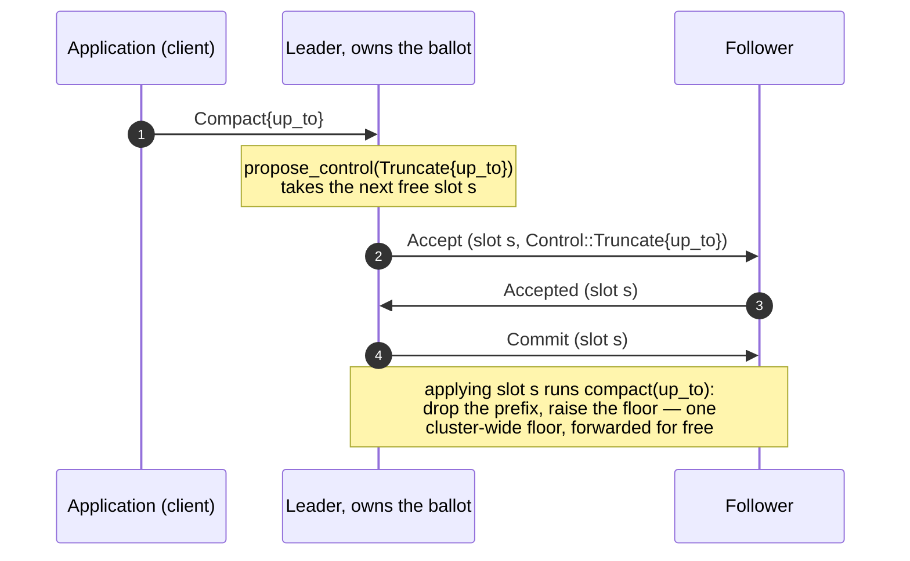
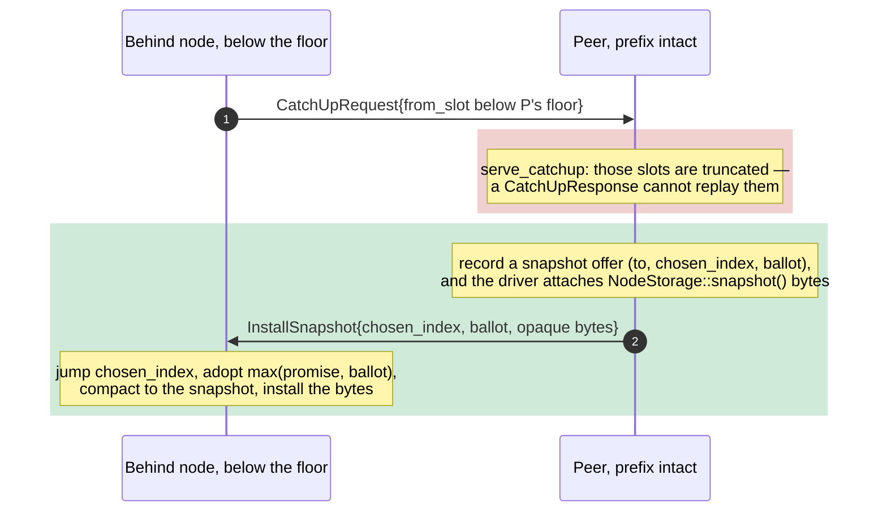

# Truncation and snapshot restore

A replicated log that only ever grows is a disk that eventually fills. So a real
system must **truncate**: throw away the prefix everyone has already applied. But
throwing entries away creates a new hazard. A node that was *offline* while the
cluster moved on comes back needing slots that no longer exist anywhere. Catch-up
can replay a value a peer still holds; it cannot replay one that has been deleted.
That node is stranded.

This chapter is the two halves of the answer: how paros decides to truncate, and
how it rescues the node that truncation strands.

<!-- toc -->

## The rule that never bends: bytes are opaque

paros never looks inside a value. It orders and replicates `Vec<u8>` it does not
understand; the *application* is what turns a chosen slot into state. So paros
cannot "compact the state" — it has no idea what the state is. What it owns is the
**log**, and everything below is about dropping a prefix of the log while keeping
the bytes sealed.

## Truncation is a decision, not a side-channel

The naive way to truncate is to let each node prune its own log whenever it likes.
That works until two nodes disagree about how far they have pruned, and a lagging
node's `Prepare` lands on a peer that threw away exactly the slot it is asking
about. paros instead makes truncation a **fact the cluster agrees on**, by putting
it *through consensus* like any other command.

A decided slot holds a `Command`, which is one of two things:

```
enum Command { User(Entry), Control(Control) }
enum Control { Truncate { up_to: Slot } }
```

`User` is the opaque client value. `Control` is paros's own metadata. The
acceptors and the replication path never tell them apart — to them a slot just
holds a value, exactly as Compartmentalized Paxos treats a `Noop`. Only the
**apply** step, when a node executes a slot, interprets a control command.

So a truncation flows like this: the application asks the leader (the `Compact`
RPC), the leader proposes it (`RawNode::propose_control`), and every node prunes
*when it applies that slot*, off the hot path.



Because the `Truncate` rides ordinary Accept/Commit/catch-up, it reaches every
node the same way a client value does — the leader does not need a separate
broadcast, and a node that is behind simply truncates later, when it finally
applies that slot. The prefix it drops is always within its own chosen prefix, so
nothing undecided is ever lost.

## The node truncation strands

Now the hazard. A node crashes (its disk survives — a clean restart, not a wiped
disk). While it is gone, the cluster keeps committing *and* keeps truncating past
its position. It comes back with a chosen index of, say, 2, while every live peer
has a floor of 11: the slots it needs, 3 through 10, have been deleted everywhere.

Its acceptors correctly refuse to serve a `CatchUpRequest` for a slot below their
floor — those entries are gone, and pretending otherwise is how two values get
chosen for one slot (the safety bug the [floor guards](stable-leader.md) exist to
prevent). So catch-up gives it nothing. It is stuck **below the floor**, and no
amount of replay will move it.

## Snapshot transfer: ship the state paros will not read

The fix is the one piece of state transfer paros does perform. When a peer sees a
catch-up request that falls below its floor, instead of serving nothing it offers
a **snapshot**: the opaque application state at its chosen prefix, which the
*application* produced (`NodeStorage::snapshot()` — the same hook a backup would
use) and which paros ships without ever interpreting.



The design keeps the pure core free of application state. `serve_catchup` only
records *who* needs a snapshot and *up to where* (`Ready::snapshot_offers`); the
**driver**, which owns storage, fills in the bytes and sends the message. On the
receiving side the core's `on_install_snapshot` jumps the chosen prefix and — the
load-bearing line — adopts `max(promise, ballot)`. It **never lowers** its
promised ballot: a snapshot restores the log, not a promise, so a node must not
forget a higher ballot it already promised. That is why a node whose disk was
*wiped* (it lost the promise itself) is a different, harder problem, left to the
disk-fault stage.

## Proven, not asserted

Truncation makes the below-floor node *reachable*, and reaching it is how the two
mechanisms were proven. The sweep widens the attrition recovery window so a
crashed node stays down long enough for the cluster to truncate past it, and the
`ConvergenceOracle` — which used to *exempt* a below-floor node as unrecoverable —
now demands it converge like any other. A new `SnapshotOracle` asserts the
recovery path actually fires (`EV_SNAPSHOT_INSTALLED`), and the `SafetyOracle`
keeps watching that no node's promise ever decreases.

That sweep found two bugs before a human did, both fixed here:

- The simulation's durable-storage fake *overwrote* the promised ballot on an
  install instead of taking the max, so a snapshot carrying a lower server ballot
  quietly **regressed the promise** — the exact safety property the doctrine turns
  on. (The real `MemStorage` was already correct; the fake had drifted from it.)
- A node can install *two* snapshots in a single batch when two peers both serve
  it, so the no-gaps oracle had to track the *set* of snapshot landings, not just
  the latest, or it flagged the first install as a bad forward jump.

The sweep drives nodes below a peer's floor and watches them recover through an
`InstallSnapshot`, and it saturates with the snapshot reachables firing — so the
path is not just present but exercised, on every run rather than on one pinned
seed. In the common random run a below-floor node is often
still healed by catch-up from a peer that truncated less aggressively — snapshot
transfer is the accelerator that becomes *load-bearing* once every peer has
truncated past it, which is exactly when nothing else can help.
