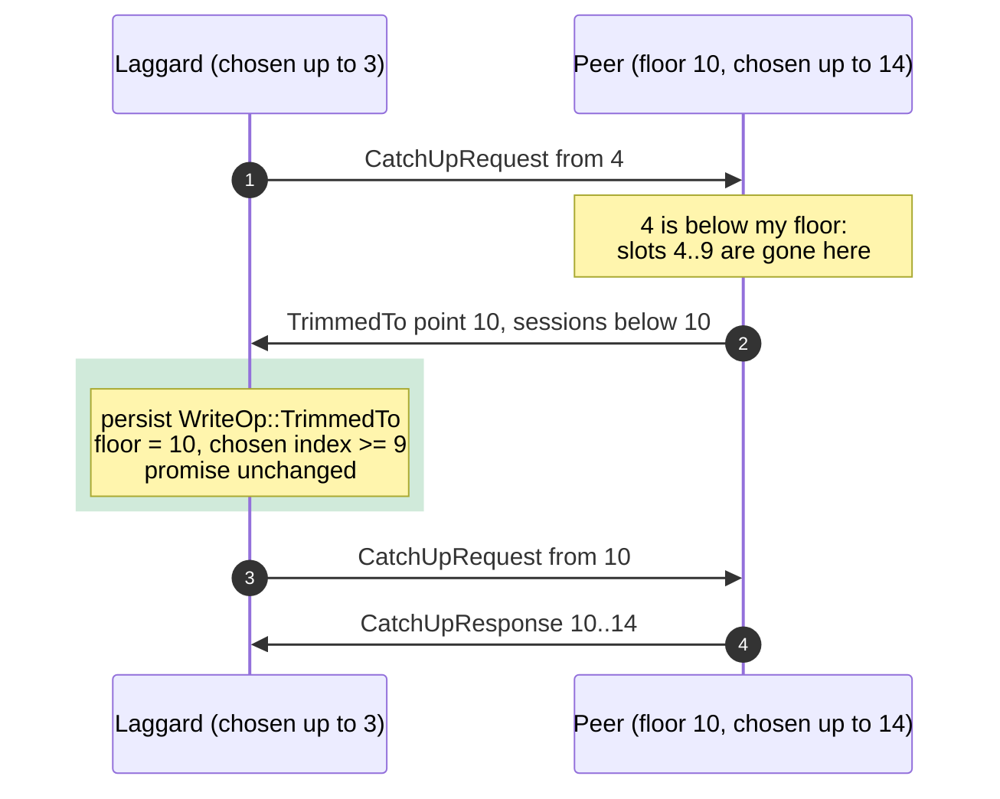

# Truncation and the trim point

A log that only grows fills the disk, so a real system must **truncate**: it
deletes a prefix that the cluster has already chosen. Deletion makes a second
problem. A node that was down comes back and needs slots that no disk still holds.
Catch-up replays a value that a peer still holds, and it cannot replay a value
that every node deleted. That node is **stranded**. This chapter states the two
halves of the answer: how the cluster decides to truncate, and how the node that
truncation strands gets back on its feet — by jumping over the prefix it missed,
not by receiving a copy of it.

> **Play it.** Two Act III levels, one half each.
>
> - [`act3/truncate-by-consensus`](play/#act3/truncate-by-consensus) — ask the
>   leader to trim, and watch each node move its floor as its walk reaches the
>   decided slot.
> - [`act3/the-stranded-node`](play/#act3/the-stranded-node) — strand a node below
>   the floor, bring it back, and state the promise it holds afterwards.

<!-- toc -->

## paros owns a log, not an application

paros does not read a value: it orders and replicates bytes that it does not
understand. paros is a **journal** (`Append`, `Read`, `CheckTail`, `Trim`), and
the application is one of its *clients*. A client reads the log with `Read`,
folds what it reads into its own state, and keeps that state wherever it likes.
So paros cannot compact the application's state, because it neither holds nor
understands it; the application owns its state and its compaction. What paros
owns is its **log**, and truncation drops a prefix of that log with the bytes
sealed.

That split is why paros ships no snapshots. A snapshot is a copy of the
application's state, and paros has no application state to copy. A client that
wants to drop a prefix first makes sure its own state covers it — it folded
those entries, or checkpointed what it built from them — and then asks paros to
trim. From then on, the entries below the trim point exist only inside whatever
the clients made of them.

## Truncation is a decision, not a side-channel

Each node can prune its own log whenever it wants to. That method fails as soon as
two nodes disagree about how far they pruned. A `Prepare` lands on a peer that
deleted the exact slot in the question, and the peer reports "nothing accepted
here" when the truth is "I no longer know". Two values can then be chosen for one
slot. So paros makes the floor a **decided value**.

A decided slot holds a `Command` (`crates/paros-core/src/types.rs`), which is
either a `User(Entry)` with the client's opaque bytes or one of paros's own
`Control` commands: `Truncate{up_to}` and the `Noop` gap filler. The acceptors
and the replication path do not tell the two variants apart, exactly as
Compartmentalized Paxos treats a `Noop`. Only the **learner's walk** reads a
control command. A client asks the leader to trim with the `Trim` RPC; the
leader proposes `Control::Truncate { up_to }` into the next slot, and a
non-leader redirects the client, as it does for an append. There is no other
precondition: the client decides when its own state covers the prefix.

One decision therefore gives one cluster-wide floor, forwarded by ordinary
replication. Every node truncates lazily, when its contiguous chosen walk
reaches the `Truncate` slot: it drops every slot at or below `up_to` and its
floor becomes `up_to + 1`. The drop is clamped to the node's own chosen prefix,
so a node never drops a slot that is not yet chosen. A node that is behind
truncates later, at the same place in the same log, and so lands on the same
floor.

Two things survive the drop. The node's **promise** is a scalar beside the log,
never inside it. And the at-most-once ledger — which `(client, seq)` was
decided at which slot — is **sealed** durably in the same write
(`WriteOp::Truncate`'s `sealed`), so a restarted node still suppresses a
duplicate of an identity whose slot it no longer holds.

## The node below the floor, and the trim-point jump

A node crashes with its disk intact while the cluster keeps deciding and
truncating past its position. When it comes back it sends a `CatchUpRequest`
from where its chosen prefix stopped, and that slot is below every peer's floor.
A peer cannot answer with a `CatchUpResponse`: the entries are gone, and a peer
that pretended to replay a truncated range would tell the same lie the
[floor guards](stable-leader.md) exist to prevent.

The peer answers with where its retained log starts instead:
`Message::TrimmedTo { from, point, sessions }`. `point` is the peer's floor, its
first retained slot; `sessions` is the sealed ledger for the slots below it.
There is nothing more to say. Everything below a trim point is chosen — the trim
was itself decided, and it only ever drops chosen slots — so the laggard does
not need the values, only the fact that they exist and are settled.

```mermaid
sequenceDiagram
    autonumber
    participant L as Laggard (chosen up to 3)
    participant P as Peer (floor 10, chosen up to 14)
    L->>P: CatchUpRequest from 4
    Note over P: 4 is below my floor:<br/>slots 4..9 are gone here
    P->>L: TrimmedTo point 10, sessions below 10
    rect rgba(70, 170, 110, 0.25)
    Note over L: persist WriteOp::TrimmedTo<br/>floor = 10, chosen index >= 9<br/>promise unchanged
    end
    L->>P: CatchUpRequest from 10
    P->>L: CatchUpResponse 10..14
```

The receiver persists `WriteOp::TrimmedTo { point, sessions }`
(`LogStorage::trimmed_to`), drops whatever it still holds below `point`, sets its
floor to `point` and its chosen index to at least `point - 1`, and merges the
sealed ledger. It then asks again from `point`, and ordinary commit-replay
catch-up brings it the rest of the log. A `point` at or below its own floor
teaches it nothing and is ignored. The replica tier does the same jump
(`ReplicaNode`, which persists the same `WriteOp::TrimmedTo`).

What the laggard lost is lost for everyone: the entries below the trim point
are gone from every disk in the cluster, not just from its own. A reader who
asks for a range that starts below the trim point — through any node — gets a
`trimmed_to` answer (`ReadAck.trimmed_to`, the core's `LogRead::Trimmed`) naming
the first slot it may start at. That is exactly why the client's trim is its
own decision: a client trims only what it no longer needs to read.

One line in that path carries the safety: the jump **does not touch the
promise**. `TrimmedTo` carries no ballot, and the receiver's promise stays what
it was. A trim point is a fact about the log; it says nothing about promises,
and the peer that sent it does not know what this node has sworn. The same rule
covers a harder case: a node that lost the promise itself (a wiped disk) cannot
be healed by a trim jump, because a trim jump restores no promise. That node
never rejoins; see [the wiped node](beyond-multi-paxos.md#the-wiped-node).

## Where this lives in paros

| Protocol name | Symbol |
|---|---|
| The truncation command | `Control::Truncate` (`types.rs`) |
| The client's request | the `Trim` RPC, `ColocatedNode::propose_control` |
| The local prefix drop | `ColocatedNode::compact`, `WriteOp::Truncate` |
| The answer below the floor | `serve_catchup`, `Message::TrimmedTo` (`node/catch_up.rs`) |
| The jump | `ColocatedNode::on_trimmed_to`, `Replica::trim_to`, `Acceptor::trim_to` |
| The durable jump | `WriteOp::TrimmedTo`, `LogStorage::trimmed_to` |
| A read below the floor | `LogRead::Trimmed`, `ReadAck.trimmed_to` |

## Proven, not asserted

Truncation makes the below-floor node *reachable*, and reaching it is how these
rules were proven. The sweep widens the attrition recovery window, so a crashed
node stays down long enough for the cluster to truncate past it. The convergence
claim — **"every node converges to the cluster's chosen prefix at the end of the
settle tail"** — demands that such a node converges like any other.
**"A below-floor node recovers by jumping to a peer's trim point"** proves that
the recovery path fires (and **"replica: a replica below the floor jumps to the
trim point"** that a replica takes it too), **"journal read: a read below the trim
point is refused"** proves a reader meets the trim point, and **"a node's promised
ballot never decreases"** watches the promise (`crates/paros-sim/src/audit/`).

The application lives where it lives in production: in the client. The
simulation's chain client reads the journal and folds every user entry into its
own `ChainState` (`crates/paros-sim/src/chain_workload/fold.rs`), and the audit
checks that every client folds the same entry to the same state. A fold needs
every entry from the start, so the harness keeps a shared **trim fence**: every
trim a client asks for is clamped below the cursor of every client still
folding, the way a real application would trim only what it had already
consumed.

In an ordinary run a peer that truncated less aggressively often heals the
below-floor node by catch-up. The trim-point jump becomes load-bearing once no
such peer is left.
