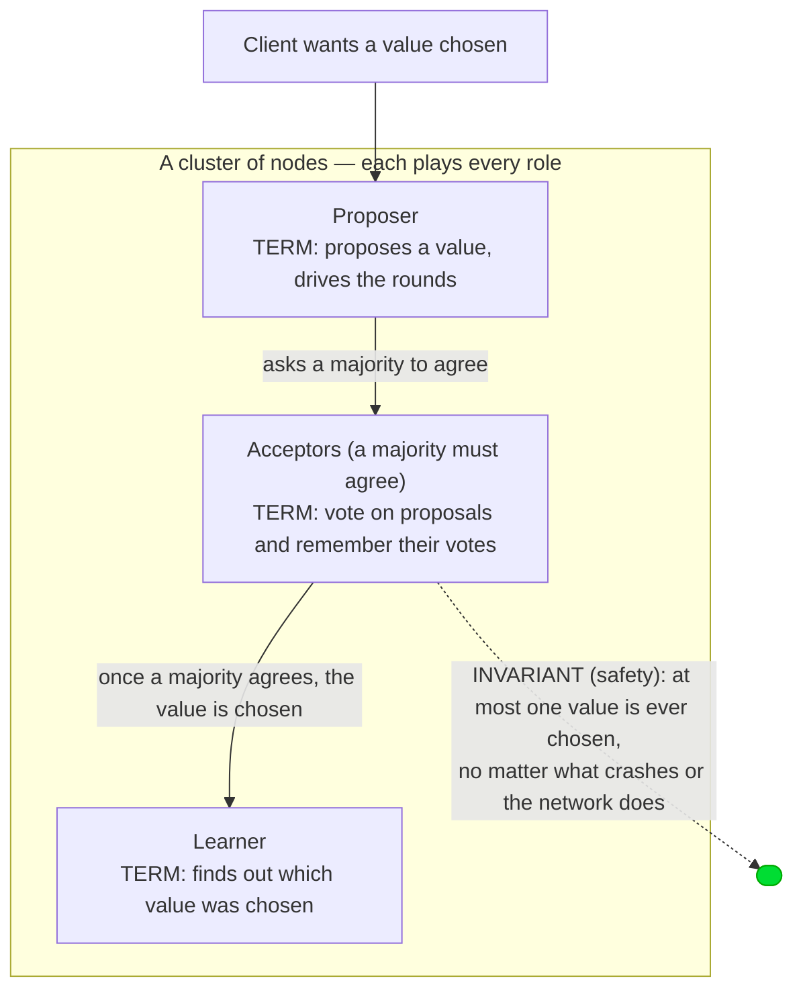
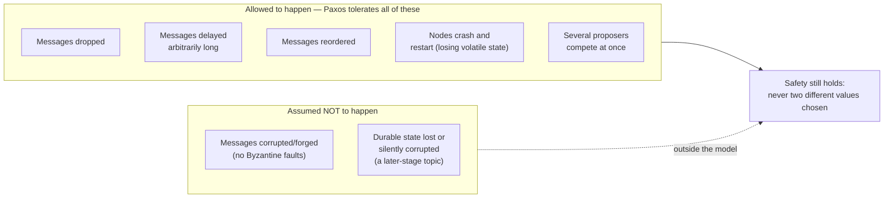
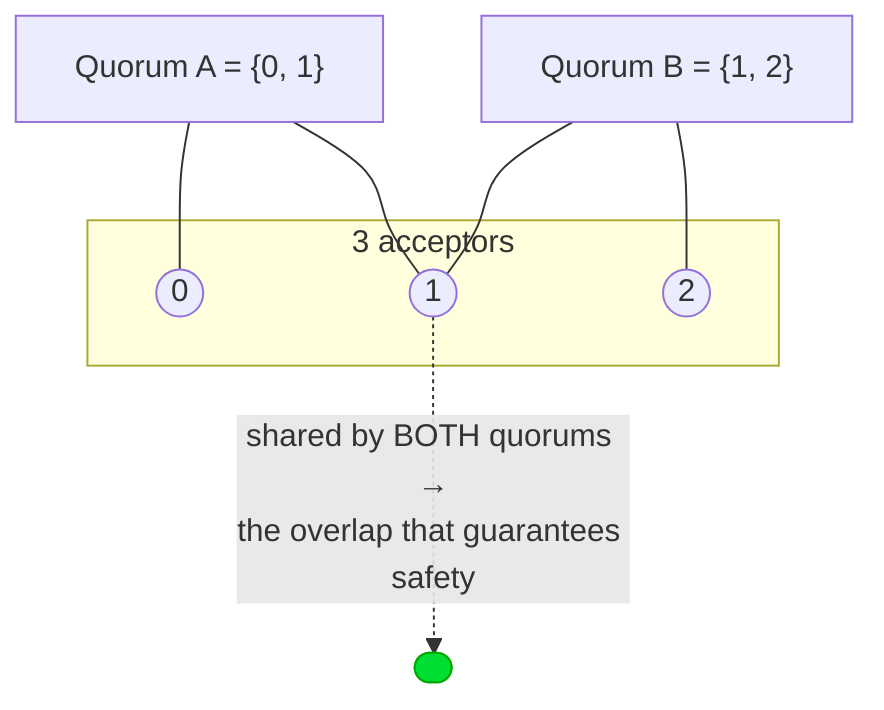
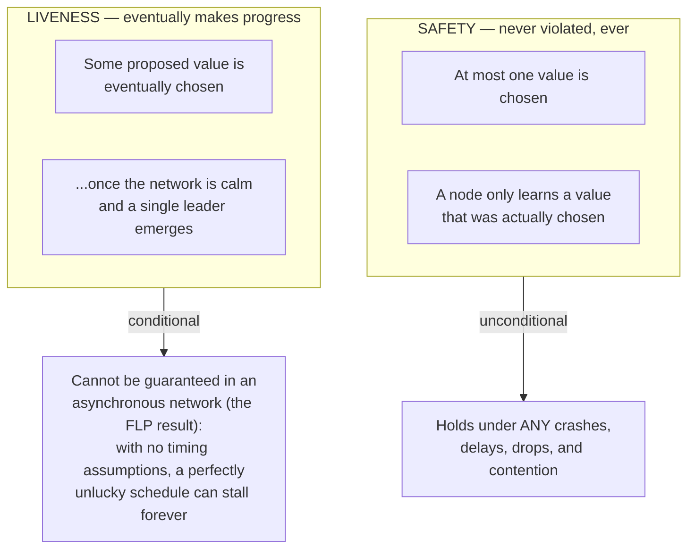

# Why consensus?

A distributed system is a set of machines that must **agree** — on who holds a
lock, on the next command to apply, on a single chosen value — even though
machines crash and the network drops, delays, and reorders messages. Paxos is the
algorithm that lets a cluster agree **safely** under exactly those conditions.

The whole problem, and the one rule that solves it, in one picture:

Every paros node plays **all three roles at once** (see
`paros-core/src/node.rs`): it is a proposer when a client hands it a value, an
acceptor when a peer asks it to vote, and a learner when it hears a value was
chosen.

## The model: what can go wrong

Paxos assumes a deliberately harsh world. Naming the failures up front makes the
algorithm's choices obvious later.

> **TERM — quorum.** A *quorum* is any **majority** of the nodes (2 of 3, 3 of 5).
> The single most important fact in all of Paxos: **any two majorities overlap in
> at least one node.** That one shared node is what makes disagreement impossible —
> it cannot vote for two conflicting things.

## The two properties

Consensus is judged on two properties, and Paxos treats them very differently.

> **The FLP impossibility, in one line.** In a purely asynchronous network you
> *cannot* guarantee both safety and liveness with even one possible crash. Paxos's
> answer: **never compromise safety**, and recover liveness in practice with
> timeouts and leader election. paros makes this split concrete — the safety kernel
> (Stage 2) has *zero* timing logic and is still always safe; the
> [dueling-proposer livelock](failures.md) is a *liveness* gap, cured later by
> randomized timeouts, never needed for safety.

## Where this lands in paros

| Concept | In the code |
|---|---|
| Node plays all three roles | `paros-core/src/node.rs` (`RawNode`) |
| Quorum = majority | `paros-core/src/node.rs` `quorum()` — `peers.len() / 2 + 1` |
| The one safety property | asserted every step by the `SafetyOracle`, `paros-sim/src/oracle.rs` |

Next: how a single value actually gets chosen — the
[single-decree Synod algorithm](single-decree.md).
